# TRACELOG: plan of execution to submission

**Prepared** 26 September 2026 · **Project** TRACELOG, SIH 2026, PS 26156 (NTRO, theme Blockchain & Cybersecurity) ·
**Baseline** `main` at `bda4551`, 302 tests passing

This plan takes TRACELOG from where it is today to a finished submission: the code work that is
left, in the order that makes the demo strongest, then the deliverables the evaluators ask for. Every
task has a finish line that can be checked by running something, and says who does it.

**Timing assumption.** Day 1 is Sunday 27 September. The submission date is not settled here, so
everything is written in days; if the date is earlier, cut from the bottom of the list (the stretch
work in phase F first, then phase C), never from the verification in phase D.

---

## 1. Where the project stands

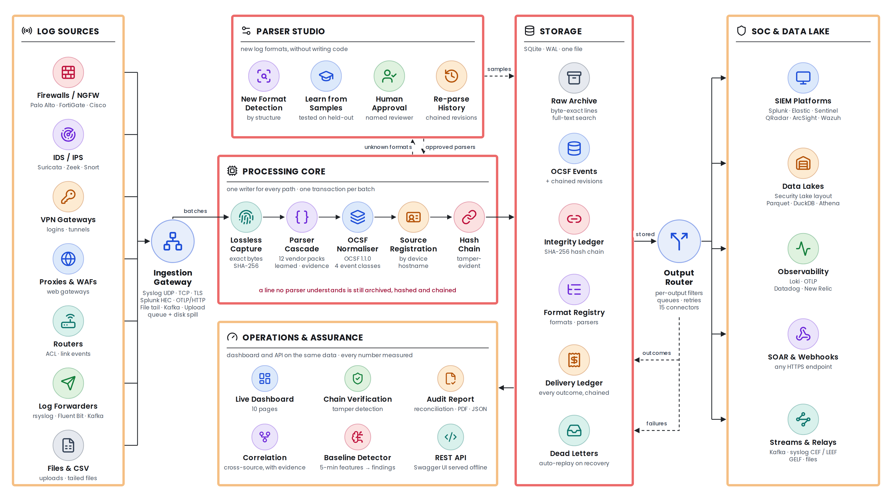

| PS expected outcome | Verdict | What is still missing |
|---|---|---|
| (a) Preserve complete raw event data | Met | — |
| (b) Extract source-specific attributes | Met, coverage gaps | Packs for Cisco FTD 430002/430003, WatchGuard, Cisco IOS, ModSecurity, Squid |
| (c) Normalise into a common taxonomy | Met | Four OCSF classes only |
| (d) Traceability, normalised ↔ original | Met | Chain not signed or anchored outside the database (phase C) |
| (e) Plug-and-play onboarding | Met | Parser Studio's "Generate & Test" tab stores parsers that are never applied (A1) |
| (f) Unified visibility | Met | Correlation analysis (RCA) is weak: see below (A2–A4) |
| (g) SIEM and data lake integration | Met | Kafka commits offsets before storing (C2) |
| (h) AI/ML-ready analytics | Met, on synthetic data | A dashboard page for the detector's flags (A5); a run on real traffic |
| (i) Reduced parser effort | Met | — |
| (j) Air-gapped deployment | Met | Re-check after the security changes (B4) |
| (k) Containerised | Met in the build files | The image has never been built end to end (D2) |
| Framework's own security | **Not met** | API token, CORS, XSRF, tamper endpoint, syslog senders (phase B) |
| Blockchain theme | Partial | Signed checkpoints held by the SIEMs (C1) |
| Deliverables | Source code and README in place | LICENSE, two-page architecture PDF, five-slide deck, re-recorded video (phase E) |

**Why RCA is in the plan.** On the synthetic attack day, correlation analysis found the fast port sweep and
nothing else. It always looks at an address's last hour, so the lateral scan and the exfiltration
from earlier in the day were out of reach. It has no rule for failed logins followed by a success,
so 40 failures and a success from one address matched nothing. And it does not follow a chain from
one event to the next. It is the team's third USP and the one a judge is most likely to click.

**Numbers that hold today** (each has a command that reproduces it):

| Claim | Result | Rerun |
|---|---|---|
| Real third-party logs | 17,768 lines, 43 sources: 0 crashes, 0 invalid OCSF events | `python scripts/evaluate_public_samples.py` |
| Formats with no parser | 85 fields correct, 18 left empty, **0 wrong** | `python scripts/evaluate_unseen_formats.py` |
| Throughput, 2 shared vCPUs | 1,818–2,427 events/s per process, 4,739 with two shards | `python scripts/benchmark.py -n 20000 -b 1000 [-w 2]` |
| Baseline detector, synthetic days | 6 of 6 detectable attacks on 3 seeds, 1 false flag a day | `python scripts/evaluate_baseline.py` |
| Tests | 302 passing | `pytest -q` |

---

## 2. The roadmap

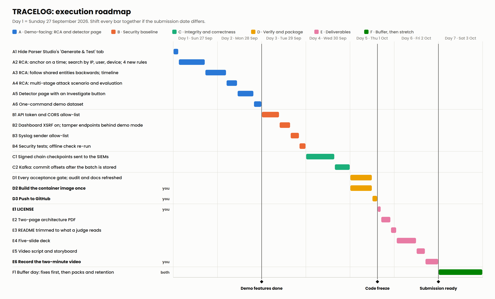

The same schedule as a table is in section 4. Phase A goes first because it changes what the demo
shows. Phase B comes after A because it changes how the dashboard calls the API, so the two sets of
dashboard edits happen once, in order. Phase C is independent and could move earlier. The video is
recorded last, on the build that is submitted.

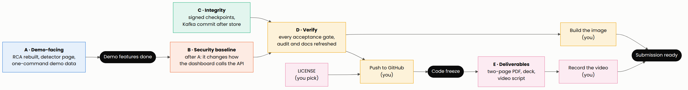

Mermaid source

```mermaid
%%{init: {"theme": "base", "themeVariables": {"fontFamily": "Poppins", "fontSize": "15px", "primaryColor": "#ffffff", "primaryBorderColor": "#898781", "primaryTextColor": "#0b0b0b", "lineColor": "#52514e", "clusterBkg": "#f5f5f2", "clusterBorder": "#c3c2b7", "background": "#fcfcfb", "noteBkgColor": "#f5f5f2", "noteBorderColor": "#c3c2b7", "actorBkg": "#ffffff", "actorBorder": "#898781", "signalColor": "#52514e", "signalTextColor": "#0b0b0b", "labelBoxBkgColor": "#f5f5f2", "labelBoxBorderColor": "#c3c2b7", "sequenceNumberColor": "#ffffff"}, "flowchart": {"curve": "basis", "nodeSpacing": 30, "rankSpacing": 46, "wrappingWidth": 260}}}%%
flowchart LR
  A["<b>A · Demo-facing</b><br/>RCA rebuilt, detector page,<br/>one-command demo data"]
  C["<b>C · Integrity</b><br/>signed checkpoints,<br/>Kafka commit after store"]
  M1(["Demo features done"])
  B["<b>B · Security baseline</b><br/>after A: it changes how<br/>the dashboard calls the API"]
  D["<b>D · Verify</b><br/>every acceptance gate,<br/>audit and docs refreshed"]
  D2["Build the image<br/>(you)"]
  E1["LICENSE<br/>(you pick)"]
  D3["Push to GitHub<br/>(you)"]
  M2(["Code freeze"])
  E["<b>E · Deliverables</b><br/>two-page PDF, deck,<br/>video script"]
  E6["Record the video<br/>(you)"]
  M3(["Submission ready"])
  A --> M1 --> B --> D
  C --> D
  D --> D2
  D --> D3
  E1 --> D3
  D3 --> M2 --> E --> E6 --> M3
  D2 --> M3

  classDef a fill:#e6f0fb,stroke:#2a78d6,color:#0b0b0b
  classDef b fill:#fdebe3,stroke:#eb6834,color:#0b0b0b
  classDef c fill:#e2f5ee,stroke:#1baf7a,color:#0b0b0b
  classDef d fill:#fdf2d9,stroke:#eda100,color:#0b0b0b
  classDef e fill:#fcebf2,stroke:#e87ba4,color:#0b0b0b
  classDef m fill:#0b0b0b,stroke:#0b0b0b,color:#ffffff
  class A a
  class B b
  class C c
  class D,D2,D3 d
  class E,E1,E6 e
  class M1,M2,M3 m
```

---

## 3. What each phase builds

### Phase A: the demo-facing work (days 1–2, about 10 hours)

**A1. Hide Parser Studio's "Generate & Test" tab.** It saves parsers that the pipeline never applies.
The learn → review → approve path elsewhere in Parser Studio is the one that works, and it stays.

**A2–A4. Rebuild correlation analysis (RCA)** so that it starts from something on screen, looks at the right time,
knows the common attack patterns, and follows them back to where they began.

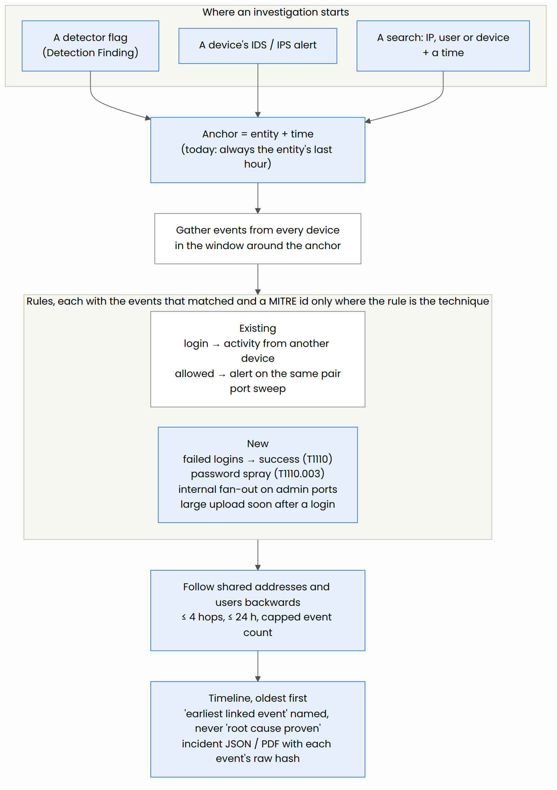

Mermaid source

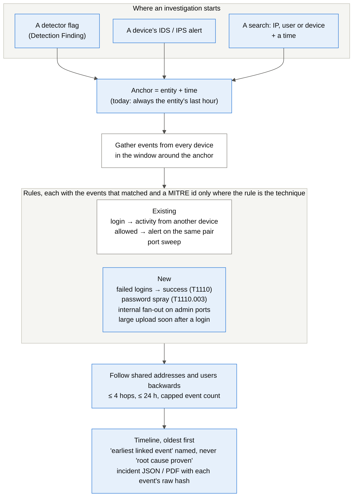

The four new rules, each with its threshold as a named constant fixed before the evaluation runs:

| Rule | Matches when | MITRE |
|---|---|---|
| Failed logins, then a success | at least N failed logins from one source or for one user, then a success, within 10 minutes | T1110 Brute Force |
| Password spray | one source, failed logins for at least N different users, within 10 minutes | T1110.003 |
| Internal fan-out on admin ports | one internal address reaching at least N internal hosts on 22, 445, 3389 or 5985, within 5 minutes | none; the rule describes behaviour, not a technique |
| Large upload after a login | an address sends at least X MB within 60 minutes of a successful login that used or was given that address | none, for the same reason |

A4 adds one multi-stage attack to the synthetic day, whose steps are linked only by shared addresses
and a user name. The chain RCA should rebuild from the last step (planned scenario; times illustrative):

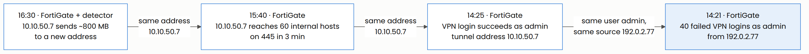

Mermaid source

```mermaid
%%{init: {"theme": "base", "themeVariables": {"fontFamily": "Poppins", "fontSize": "15px", "primaryColor": "#ffffff", "primaryBorderColor": "#898781", "primaryTextColor": "#0b0b0b", "lineColor": "#52514e", "clusterBkg": "#f5f5f2", "clusterBorder": "#c3c2b7", "background": "#fcfcfb", "noteBkgColor": "#f5f5f2", "noteBorderColor": "#c3c2b7", "actorBkg": "#ffffff", "actorBorder": "#898781", "signalColor": "#52514e", "signalTextColor": "#0b0b0b", "labelBoxBkgColor": "#f5f5f2", "labelBoxBorderColor": "#c3c2b7", "sequenceNumberColor": "#ffffff"}, "flowchart": {"curve": "basis", "nodeSpacing": 30, "rankSpacing": 46, "wrappingWidth": 260}}}%%
flowchart LR
  E1["14:21 · FortiGate<br/>40 failed VPN logins as admin<br/>from 192.0.2.77"]
  E2["14:25 · FortiGate<br/>VPN login succeeds as admin<br/>tunnel address 10.10.50.7"]
  E3["15:40 · FortiGate<br/>10.10.50.7 reaches 60 internal hosts<br/>on 445 in 3 min"]
  E4["16:30 · FortiGate + detector<br/>10.10.50.7 sends ~800 MB<br/>to a new address"]
  E4 -- "same address<br/>10.10.50.7" --> E3
  E3 -- "same address<br/>10.10.50.7" --> E2
  E2 -- "same user admin,<br/>same source 192.0.2.77" --> E1
  classDef ev fill:#ffffff,stroke:#2a78d6,color:#0b0b0b
  classDef start fill:#e6f0fb,stroke:#2a78d6,color:#0b0b0b
  class E2,E3,E4 ev
  class E1 start
```

**A5. Detector page.** A new dashboard page lists the detector's flags with their reasons and evidence,
has a "Run now" button, and gives each flag an Investigate button that opens RCA on that entity at
that time.

**A6. One-command demo data.** `python scripts/demo_data.py` writes the synthetic day, including the
multi-stage attack, through the writer into the running database and runs the detector, so every page
has something true to show in the video.

### Phase B: security baseline (day 3, about 3.5 hours)

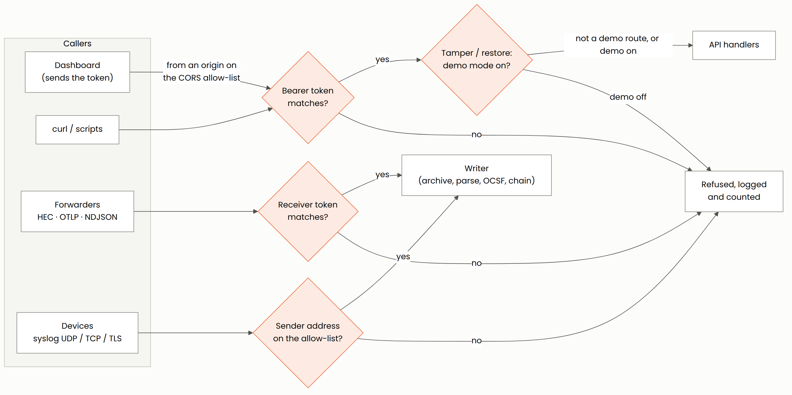

Mermaid source

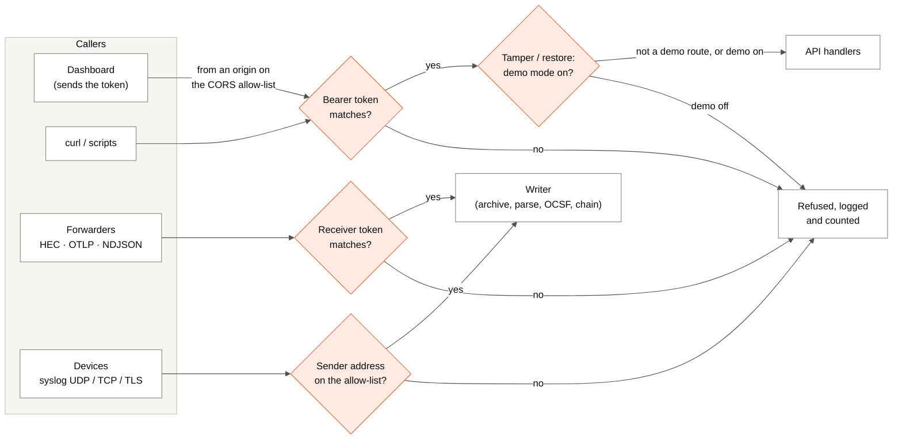

| Task | What changes |
|---|---|
| B1 | Every `/api/*` route needs `Authorization: Bearer <TRACELOG_API_TOKEN>`, except `/health`; the receivers keep their own `TRACELOG_HEC_TOKEN`. The dashboard sends the same token. CORS answers only origins in `TRACELOG_CORS_ORIGINS`. |
| B2 | Streamlit's XSRF protection on (uploads re-tested). The tamper and restore endpoints answer only when `TRACELOG_DEMO_MODE=1`; otherwise the dashboard hides the tamper demo. |
| B3 | Each syslog input can take an `allowed_senders` list of address ranges. Lines from anyone else are refused and counted, and the count is visible on the dashboard. |
| B4 | Tests for each rule above; the offline check re-run (0 requests leave the machine); `SYSTEM_DESIGN.md` §8, the runbook and `.env.example` updated. Tokens come from the environment only and are never committed. |

### Phase C: integrity and correctness (day 4, about 3 hours)

**C1. Signed chain checkpoints.** Today, whoever controls the database can rewrite events and
rebuild a chain that still verifies. A checkpoint every 10,000 events or 5 minutes, signed with the
site's own Ed25519 key and delivered to every SIEM like any event, gives each SIEM a copy that cannot
be changed afterwards.

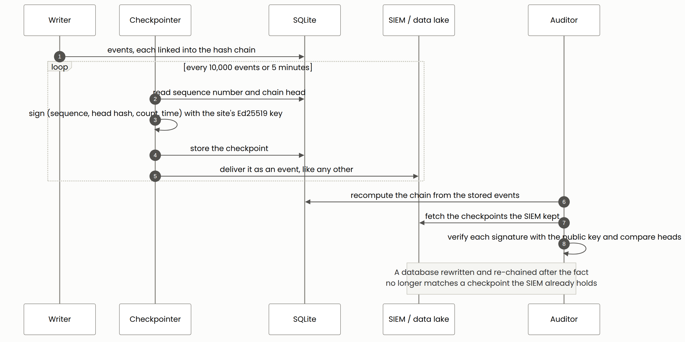

Mermaid source

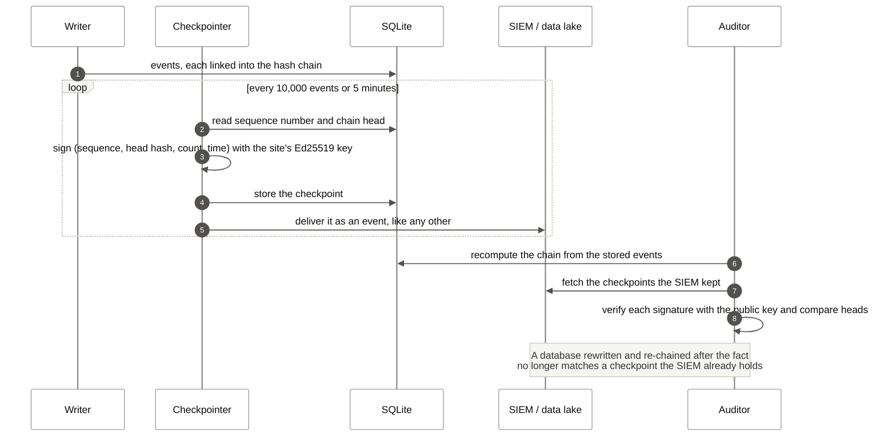

The key is generated on first start into `data/keys/` with owner-only permissions and never
committed. Its public half is in the audit report. The limit, stated in the docs: someone with root
on the machine can sign new checkpoints from then on, but cannot change those the SIEMs already hold.

**C2. Kafka commits after storing.** Offsets are committed only after the batch's database
transaction commits, so a crash in between re-delivers the records instead of losing them.

### Phase D: verify and package (day 5 morning)

Every acceptance gate is run on the final code, and the audit, README and design documents are
refreshed with what the runs report. Two steps are yours: building the image once with
`sh scripts/check_image.sh` on a machine with Docker, and pushing to GitHub after reading
`git log origin/main..main`.

### Phase E: deliverables (days 5–6)

| Deliverable | Plan |
|---|---|
| LICENSE | You choose: MIT (shortest) or Apache-2.0 (adds an explicit patent grant). 5 minutes once chosen. |
| Architecture document, max 2 pages | Page 1: the architecture poster. Page 2: the components, the measured results table, and how to rerun each number. PDF. |
| README | Trimmed to what a judge reads first: what it is, three commands to run it, results, links. The file-by-file blueprint moves to `docs/CODEBASE.md`. |
| Presentation, max 5 slides | 1 the problem and what TRACELOG is · 2 architecture · 3 proof: lossless, traceable, chained and signed · 4 intelligence: detector and RCA chain · 5 results, deployment, what is next |
| Demo video, max 2 minutes | Storyboard below; recorded by you on the final build. |

**Video storyboard**

| Time | On screen | What it proves |
|---|---|---|
| 0:00–0:12 | Title card: many vendor formats in, one OCSF stream out | The problem and the positioning: an adapter layer, not another SIEM |
| 0:12–0:35 | FortiGate, Palo Alto and Suricata lines arrive; the Explorer shows OCSF beside the raw line and its SHA-256 | (a) (b) (c) (d) |
| 0:35–0:52 | An unknown format is detected, a parser learned, approved, history re-parsed | (e) (i) |
| 0:52–1:22 | The detector page shows the exfiltration flag; Investigate; the RCA timeline leads back to the brute force | (f) (h), the RCA USP |
| 1:22–1:40 | One record tampered in demo mode; verification names the sequence number; the SIEM's signed checkpoint disagrees | Blockchain & Cybersecurity theme |
| 1:40–2:00 | Splunk and Elastic receive the same events; reconciliation shows 0 unaccounted; results card; air-gapped, two containers | (g) (j) (k) |

### Phase F: buffer, then stretch (day 7)

The buffer day is for fixing whatever phase D finds. Only after that, in this order: vendor packs
for the products that came out empty on real logs (Cisco FTD 430002/430003, WatchGuard, Cisco IOS,
ModSecurity, Squid); a retention setting (CERT-In asks for 180 days) with an incident export bundle;
a per-hour-of-day baseline so nightly jobs stop looking new; NetFlow/IPFIX; OCSF classes 4002, 4003
and 4004; a sharded runtime measured on multi-core hardware for the billion-events-a-day claim.

---

## 4. Task list

| ID | Task | Owner | Effort | Depends on | Done when |
|---|---|---|---|---|---|
| A1 | Hide "Generate & Test" | Claude | 15 min | — | Tab gone; approve path unchanged; tests pass |
| A2 | RCA: time anchor; IP, user, device; 4 rules | Claude | 3.5 h | — | Each of the 6 detectable synthetic attacks, investigated at its own time, returns its rule with the events that matched; a positive and a negative test per rule |
| A3 | RCA: backward chain and timeline | Claude | 2.5 h | A2 | The path names the shared entity at each hop; bounded to 4 hops, 24 h and a capped number of events; its run time measured |
| A4 | Multi-stage scenario and RCA evaluation | Claude | 1.5 h | A3 | Investigating the exfiltration names the brute force as the earliest linked event; `docs/RCA_EVALUATION.md` generated; misses reported, not tuned away |
| A5 | Detector page with Investigate | Claude | 1.5 h | A2 | Every figure read from the API; covered by `test_dashboard_truth.py` |
| A6 | One-command demo data | Claude | 45 min | A4 | One command, then every page has content |
| B1 | API token, CORS allow-list | Claude | 1.5 h | A5 | Without a token 401, with it 200; a foreign origin gets no CORS header |
| B2 | XSRF on; tamper behind demo mode | Claude | 45 min | B1 | Uploads work with XSRF on; tamper answers 404 unless demo mode is on |
| B3 | Syslog sender allow-list | Claude | 45 min | — | A line from an unlisted sender is refused and counted |
| B4 | Security tests and offline re-check | Claude | 30 min | B1–B3 | 0 external requests with the network cut off; docs updated |
| C1 | Signed chain checkpoints | Claude | 2 h | — | A database edited and fully re-chained passes chain verification but fails at the first checkpoint the SIEM holds |
| C2 | Kafka commit after store | Claude | 1 h | — | A crash between receive and store re-delivers the records (test) |
| D1 | Every gate; audit and docs refreshed | Claude | 2 h | A, B, C | All gates in section 6 pass; numbers updated from the runs |
| D2 | Build the image once | Shakti | 30 min | D1 | `check_image.sh` passes; its output shared |
| D3 | Push to GitHub | Shakti | 10 min | D1, E1 | `origin/main` equals local `main` |
| E1 | LICENSE | Shakti chooses | 5 min | — | File in the repo root |
| E2 | Two-page architecture PDF | Claude | 1.5 h | D1 | Two pages; every number has its rerun command |
| E3 | README trimmed | Claude | 45 min | D1 | A judge reaches the run commands and results in one screen |
| E4 | Five-slide deck | Claude | 3 h | D1 | Five slides; every number traceable to a doc |
| E5 | Video script and storyboard | Claude | 1 h | E4 | Timed to 2:00 |
| E6 | Record the video | Shakti | 2 h | E5, A6 | Under 2 minutes, on the submitted build |

---

## 5. Decisions only you can make

| Decision | Options | Needed by |
|---|---|---|
| Submission date | — | Now: it decides what gets cut |
| LICENSE | MIT or Apache-2.0 | Before D3 |
| API with no token configured | Accept only 127.0.0.1 and say so at startup (easier demos), or refuse to start | Before B1 |
| `Claude outputs/` in the public repository | Keep, or remove from the published history (it holds the audit and rejection-risk notes) | Before D3 |
| Video | Who records, on which machine, voice-over or captions | Before E6 |
| Docker machine | Your laptop, or a teammate's | Before D2 |

---

## 6. Acceptance gates before code freeze

- [ ] `pytest -q` passes, with the new RCA, security and checkpoint tests
- [ ] `python scripts/evaluate_unseen_formats.py` still gives 0 wrong
- [ ] `python scripts/evaluate_public_samples.py` still gives 0 crashes and 0 invalid OCSF events
- [ ] `python scripts/benchmark.py -n 20000 -b 1000` shows no slowdown beyond run-to-run noise, with the hardware stated
- [ ] `python scripts/evaluate_baseline.py` and the new `scripts/evaluate_rca.py` regenerate their reports
- [ ] The offline check: 0 requests leave the machine, every API page still renders
- [ ] Chain verification and checkpoint verification both pass on the demo database
- [ ] `sh scripts/check_image.sh` passes on a machine with Docker
- [ ] No secret, database or key in the repository (`git ls-files` checked)
- [ ] Every number in the README, the PDF and the deck appears in a generated report

## 7. Risks

| Risk | What it would cost | How the plan handles it |
|---|---|---|
| RCA grows past its time box | Days 1–2 run over and push the deliverables | A2–A4 capped at 7.5 hours; rules and thresholds fixed before the evaluation; misses reported |
| Security changes break the dashboard, receivers or demo | A broken video | Phase B lands before recording; demo mode keeps the tamper scene; the full suite and the offline check run after |
| The image never builds | Item (k) stays "in the build files" | D2 on your machine; the fallback demo is `python run_app.py` |
| Judges discount synthetic evidence | Items (h) and RCA look staged | Say "synthetic" on the slide and show the rerun command; the real-log results carry the parsing claims |
| The signing key is lost or leaked | Old checkpoints still verify; new ones need a new key | Key per site, owner-only permissions, never committed; a key change is recorded in the chain |
| Shared-hardware numbers vary | A throughput figure that does not reproduce | Quote ranges with the hardware; rerun the benchmark on your laptop for the deck |
| The submission date is earlier than day 6 | Unfinished deliverables | Cut phase F, then C1 and C2; never skip phase D |

---

## 8. How each task is delivered

Each task is written with its tests and documentation, measured where it makes a claim, committed
with its reasoning, and applied to your folder as a patch whose tree is checked against the
original. Nothing is claimed that a command does not reproduce; a miss is reported as a miss.
