# TRACELOG — workflow, PPT guide, PS mapping, differentiation and tech stack

Conversation export, from the request "explain the current workflow and the entire process in details..." onwards.
SIH 2026 · PS 26156 (NTRO) · exported 22 September 2026.

Contents:

1. [How TRACELOG works end to end](#1-how-tracelog-works-end-to-end)
2. [Guide to the PPT: flowchart, slides, USPs, keywords, tech stack](#2-guide-to-the-ppt-flowchart-slides-usps-keywords-tech-stack)
3. [How the MVP answers the official problem statement](#3-how-the-mvp-answers-the-official-problem-statement)
4. [How TRACELOG stands out from other teams](#4-how-tracelog-stands-out-from-other-teams)
5. [The current tech stack, for the PPT](#5-the-current-tech-stack-for-the-ppt)

---

## 1. How TRACELOG works end to end

> **Request:** explain the current workflow and the entire process in details...

Your question can mean two things, so this covers both: first how TRACELOG works end to end as the code stands now, then where the fixes you just approved stand.

### The workflow at a glance

```
 DEVICES & FORWARDERS            TRACELOG                                              DESTINATIONS
 firewalls, IDS, VPN  ──syslog──►  1 receive ─► 2 ingest batch ─► 3 parse ─► 4 OCSF ─► 7 deliver ──► Splunk, Sentinel,
 rsyslog / Fluent Bit ──HEC─────►     │            │  (one DB          │         │        (per-output     QRadar, Elastic,
 OTel Collector ──OTLP──────────►     │            │   transaction)    │         │         queue, retry,   Wazuh, Loki, OTLP,
 files, Kafka ──────────────────►     │            ▼                   │         ▼         dead letters)   Kafka, files …
                                      │      raw archive + SHA-256     │   5 hash chain         │
                                      │                                ▼                        ▼
                                      │                     6 format registry          8 delivery ledger
                                      │                (formats no parser knows)       + reconciliation
                                      ▼                                ▼                        ▼
                                 disk spool                  9 Parser Studio:           audit report (PDF/JSON)
                                 on bursts                   learn ► review ► approve ► re-parse history
```

### 1. Configure and start

Everything is set in `config/tracelog.yaml`:
- **inputs:** syslog listeners, HTTP receivers, file tails, Kafka;
- **outputs:** the SIEMs and tools to send to;
- **optional static source definitions.**

Secrets are written as `${VAR}` and read from the environment or `.env`, never from the file.

`python run_app.py` starts two processes: the API server on port 8000, which also runs every input and output, and the dashboard on port 8501. `docker compose up` does the same. Compose maps the standard syslog port 514 to 5514 inside the container, so the container never needs root.

### 2. Receive

A device needs nothing installed. It points its syslog at TRACELOG, or an existing forwarder relays to it. TRACELOG accepts:
- **syslog** over UDP, TCP and TLS (RFC 3164 and 5424, with RFC 6587 framing);
- **Splunk HEC** events and raw, for Fluent Bit, Vector and Cribl;
- **OTLP/HTTP** logs, for an OpenTelemetry Collector;
- **a plain HTTP stream** of lines or NDJSON;
- **file tailing**, with offsets saved across restarts;
- **Kafka** topics.

Analysts can also upload a file, post single lines through the API, or load the sample dataset from the Overview page.

Each message becomes an inbound record holding:
- the exact received bytes and the transport;
- the input name, the sender's IP address and the receive time;
- any hints a forwarder attached, such as the original hostname.

Records go into one in-memory ingest queue. If a burst overflows it, the excess is written to a disk spool and replayed later.

### 3. Ingest, one batch at a time

A single worker thread takes batches off the queue. It first decodes each line: UTF-8 if valid, otherwise Latin-1, and the encoding is recorded. It then parses each line (step 4). After that, each batch is written in **one SQLite transaction**, under a lock so two writers never read the same chain head. For every line the transaction:

1. **Identifies the source.** The hostname inside the log names the device, so devices behind a relay stay distinct. If there is no hostname, the sender's address names it. A new device is registered automatically on its first message.
2. **Archives the raw line** in `raw_logs`, with its SHA-256 hash, encoding, transport and sender, and the parser that handled it.
3. **Stores the normalised event** in `normalized_events` (step 5).
4. **Appends the event to the integrity chain** (step 6).
5. **Counts the line under its format** if no vendor pack knew it (step 7).

If parsing fails, the line is still archived, chained and forwarded, as an OCSF Base Event that carries the error. After the commit, the stored events go to the output router (step 8).

### 4. Parse

Parsing runs in `parsing/dispatch.py`. It first splits off the syslog header: priority (facility and severity), timestamp, host, app, message ID and structured data. It then tries four parsers in order.

**a) Vendor packs.** There are 11:
- Palo Alto PAN-OS
- FortiGate
- Cisco ASA/FTD
- Check Point
- Juniper SRX
- Sophos
- SonicWall
- pfSense/OPNsense
- Suricata
- Zeek
- Snort

The first pack that recognises the line parses it. Its output is then checked, because a firmware update can shift a column:
- **One impossible value**, such as a hostname where an IP belongs, is dropped and reported; the rest of the pack's output is kept.
- **Two or more impossible values, or any in a column-position format like PAN-OS CSV,** mean the pack's output is discarded. The line falls through, flagged as drift.

**b) Learned parsers.** These are parsers someone approved in Parser Studio. They are reloaded from the database within 5 seconds of any change, and their values get the same drift check.

**c) CEF and LEEF standard keys.** These formats define their own field names, so they count as a known format.

**d) The generic, evidence-based parser.** It fills a field only when there is evidence for both what it means and that its value is valid. The key name must say it (`srcIP`, `destination-ip`), or the line must give the direction (`a:p -> b:q`, "from … to …").
- Two addresses with no direction are left unassigned and listed.
- When there is no usable device time, the event is flagged as using the arrival time.
- Every event records its evidence: `verified: false`, plus a confidence and a reason for each field.

### 5. Normalise to OCSF 1.1.0

The normaliser maps parsed fields to an OCSF class:
- Network Activity 4001
- Authentication 3002
- Detection Finding 2004
- Base Event 0

It also fills in activity, severity (with syslog's 0 = emergency … 7 = debug scale handled correctly), time, endpoints, protocol, user and finding. Nothing is thrown away. Every field the device sent that has no OCSF slot is kept under `unmapped`, along with the parser used, the evidence, the transport and the sender.

This internal record is what gets hash-chained. Anything that leaves TRACELOG (outputs, the OCSF export, the Explorer view) goes through `to_ocsf()` first. That produces strict OCSF: epoch-millisecond time, `type_uid`, `finding_info` and observables, and it is checked by a validator.

### 6. Hash chain (chain of custody)

Every event gets a sequence number and a record hash:

`SHA-256(previous hash : sequence : raw line's hash : event JSON)`

Verification checks four things:
- the raw line still matches its hash;
- sequence numbers have no gaps;
- each record links to the previous one;
- each record's hash recomputes correctly.

Editing, reordering or deleting a record in the middle of the chain is caught. The Integrity page verifies the chain and has a controlled tampering demo.

### 7. Format registry: lines no parser knows

Every line the generic or a learned parser handles gets a **format ID**, a hash of its structure and never its values.
- **key=value, JSON, CEF, LEEF:** kind, delimiter, app and key names.
- **CSV:** column count.
- **Free text:** tokens with values masked, such as `<IP>`, `<N>` and `<ACTION>`.

The registry counts lines per format and records which devices send it and when. It keeps up to 200 sample lines. Text formats that differ in exactly one word, such as a username, are merged into one. A known device whose pack started failing is flagged as "format changed".

### 8. Deliver

Each output has its own queue and thread, so a slow SIEM never holds up ingestion or the other outputs. Per output, TRACELOG:
- applies its filters (OCSF class, minimum severity, source);
- batches events and sends them in the destination's wire format (HEC, Logs Ingestion API, LEEF, CEF, GELF, OTLP, bulk, and so on);
- retries with exponential backoff.

When an event still can't be delivered, it goes to a dead-letter file with the reason. The kinds are undeliverable, queue full, and rejected by the destination.
- Undeliverable and queue-full events are re-sent automatically when the destination recovers.
- Rejected events wait until someone fixes the cause and presses **Re-send**.
- A re-send resumes from its saved position after a crash.
- Elasticsearch, OpenSearch and Wazuh use the event ID as the document ID, so a repeat creates no duplicate.

Every outcome of every event at every output is written to a separate hash-chained **delivery ledger**: delivered, re-sent, filtered out, dead-lettered, or delivered through another output. At startup, events an output still owed with no recorded outcome are sent again from the archive.

### 9. Reconcile and audit

For each output, reconciliation checks:

**owed = delivered + delivered via another output + filtered out + waiting in dead letters + in flight + unaccounted**

"Unaccounted" must be 0. It also verifies both chains, and that archived lines, events, re-parse revisions and chain records add up. **Generate audit report** produces a PDF and JSON containing:
- the verdict and the chain-of-custody checks;
- the per-output reconciliation and the outage and re-send timeline;
- a fingerprint that can be checked against TRACELOG later.

### 10. Parser Studio: from unknown format to trusted parser

1. **Detect.** The **New log formats** tab lists each unknown format with its line count, samples, devices and first/last seen, plus how its lines are parsed today.
2. **Learn.** TRACELOG splits the samples 70/30 and profiles every part of the line across the 70%. It looks at what each part always is (IP, port, protocol, action, time), the word before it ("from", "port", `src=`) and how its values are spread. It proposes a field for each part, with a confidence and a reason. Proposals that rest on position alone are marked **needs review**. The proposal is tested on the held-out 30% with the same code production uses, and compared with the generic parser.
3. **Review and approve.** A named person confirms or changes each flagged field. The gate refuses approval until:
   - every flagged field is confirmed or changed;
   - at least 90% of held-out lines are recognised and parse cleanly;
   - there are no disagreements with values the generic parser proved.
4. **Live.** Within seconds, new lines of that format are parsed by the approved parser, marked verified and stamped with the approver's name.
5. **Re-parse history.** Past lines are parsed again from the archive. Each result is added to the chain as a new event naming the one it replaces. The original is never altered: it stays in the chain and is marked superseded. Revisions are sent to the outputs, and reconciliation counts them.

### 11. Dashboard

| Page | What it shows |
|---|---|
| Overview | Measured numbers: events, sources, share read by a known parser, OCSF conformance, chain count; a banner for new formats |
| Sources | Registered devices |
| Parser Studio | New formats and review |
| Processing Pipeline | The count at each stage, which parser read what, and lines no parser could classify |
| Log Explorer | The raw line beside its OCSF event |
| Integrity & Lineage | Chain verification and the tampering demo |
| Correlation & RCA | Events linked by shared entities and time, with facts kept apart from inferences |
| Schema Explorer | The OCSF classes and field mappings |
| Connectors | Live status, reconcile and audit, setup guides, export |

### Where the fixes stand

This round is done in my working copy but **hasn't reached your SIH26 folder yet**. All 137 tests pass (the other 111 of the earlier 242 only tested the archived code).
- **Measured numbers:** Overview and Processing Pipeline now show measured numbers only.
- **OCSF export:** the export and the Explorer show valid OCSF.
- **Dates:** the Cisco ASA sample events are no longer dated 1900.
- **Classification:** CEF and LEEF count as known formats, and unknown traffic with addresses is Network Activity.
- **Name:** TRACELOG is the only name used.
- **Old app archived:** the second app (`api/`, `core/`, `ingest/`, `rca/`, `storage/`, `ui/`, `samples/`) is saved unchanged on a branch called `archive/legacy-app`.

Still to do: the short README, the 2-page architecture document, and applying the commits to your folder. I'll also create the archive branch there; pushing it to GitHub is up to you. The security gaps from the review are the next group and are not touched yet: no login, open log receivers, an unkeyed chain, the long-line slowdown, and the telemetry call.

Shall I carry on with the README and architecture document? Much of this explanation can go straight into the architecture document.

---

## 2. Guide to the PPT: flowchart, slides, USPs, keywords, tech stack

> **Request:** give me the details of the technical section so that we can design a flow chart for the entire end to end solution and we can reflect our deep understanding on the ppt...also suggest keywords and other things that will make our ppt stand out...evaluate our USPs and argue them as the best...give info on how we solve the problems addressed by the official PS. Basically give us a detailed guide on making the ppt for the asked solution of this PS. Explain the tech stack and all the things that we might use to make this production ready

This guide covers what the deck needs: how TRACELOG answers the problem statement, a flowchart you can paste into a diagram tool, slide-by-slide content, the case for each USP, keywords, and the production tech stack. It also flags where other teams are ahead and what to fix before you present, so every claim in the deck holds up. A judge who opens the repo or watches the demo should find proof for each one.

Three things I relied on:
- **Slide count:** your brief says the technical presentation is at most 5 slides. SIH's usual idea template has a title slide plus 5 content slides. Check the official template on the portal.
- **Problem statement:** I couldn't find the official PS 26156 text online. I worked from your scope: a lossless, vendor-agnostic framework for perimeter device logs, analytics-ready for SIEMs, deployable air-gapped in a container. Paste the exact PS bullets and I'll match the wording line by line.
- **Theme:** other teams' public repos list this PS under the "Blockchain & Cybersecurity" theme. That means judges will look closely at tamper-evidence and ledgers.

### 2.1 What the PS asks and how TRACELOG answers it

| The PS needs | TRACELOG's answer | Proof you can show |
|---|---|---|
| Lossless handling | Every raw line is stored before it is interpreted, with its SHA-256 hash and encoding. Every field the device sent that has no OCSF slot is kept under `unmapped`. A line that fails to parse is still stored and forwarded. | Log Explorer shows the raw line next to its OCSF event. |
| Vendor-agnostic, any source | 11 vendor parsers; CEF and LEEF read by their standard keys; an evidence-based generic parser for everything else; 6 ways to receive logs. | Connectors page setup guides; the vendor parser test suite. |
| Standardised, analytics-ready output | OCSF 1.1.0 for Network Activity, Authentication, Detection Finding and Base Event, checked by a validator before anything leaves. | Overview "OCSF conformance", measured, currently 100%. |
| New or unknown formats | Unknown lines are grouped as formats. A parser is learned from many lines, a named person approves it, and past lines are re-parsed. | Unseen formats went from 21 wrong fields to 0. Learned parsers got 2,200 of 2,200 fields right on generated lines. |
| Integrity and tamper-evidence | Every event is hash-chained. A second hash chain records every delivery outcome. Both are verified, and the audit report carries a fingerprint. | Integrity page tampering demo; the audit PDF. |
| Feeds existing SIEMs without disturbing them | 15 output types reaching Splunk, Sentinel, QRadar, Elastic, Wazuh and more, with no agent on devices. | Connectors: Live status and "Send test event". |
| Nothing lost in delivery | Retries, dead letters, automatic re-send on recovery, and reconciliation with "unaccounted" required to be 0. | Reconcile & audit tab. |
| Air-gapped, containerised | No cloud calls in the pipeline; Docker Compose. | `docker compose up`. There are two leaks to fix first (section 2.7). |

### 2.2 The technical section: flowchart specification

#### Full flowchart

Use this for the architecture document or a backup slide. Paste it into mermaid.live, or into draw.io via Arrange › Insert › Mermaid.

```mermaid
flowchart LR
  subgraph SRC["Log sources (no agent)"]
    D1["Firewalls / NGFW<br/>PAN-OS · FortiGate · ASA/FTD · Check Point · SRX · Sophos · SonicWall · pfSense"]
    D2["IDS / NSM<br/>Suricata · Snort · Zeek"]
    D3["Forwarders<br/>rsyslog · syslog-ng · Fluent Bit · Vector · Cribl · OTel · Logstash"]
    D4["Files · Kafka"]
  end
  subgraph RCV["1 · Receive"]
    R1["Syslog UDP / TCP / TLS<br/>RFC 3164 · 5424 · 6587 · 5425"]
    R2["Splunk HEC · OTLP/HTTP · HTTP stream"]
    R3["File tail · Kafka consumer"]
    RQ[("Ingest queue")]
    RS[("Disk spool")]
  end
  subgraph ING["2 · Ingest: one transaction per batch"]
    I1["Decode bytes, record encoding"]
    I2["Identify device: in-log hostname, else sender IP; auto-register"]
    I3[("Raw archive + SHA-256")]
  end
  subgraph PRS["3 · Parse: empty rather than wrong"]
    P0["Split syslog header: PRI, time, host, app"]
    P1{"Vendor parser claims line?"}
    PV{"Values valid?"}
    P2{"Approved learned parser matches?"}
    PL{"Values valid?"}
    P3["Evidence-based generic parser<br/>CEF/LEEF keys · key name + valid value · arrows"]
  end
  subgraph NRM["4 · Normalise"]
    N1["OCSF 1.1.0: class · activity · severity · time · endpoints"]
    N2["unmapped: all other fields + evidence per field"]
  end
  subgraph INT["5 · Chain of custody"]
    H1[("Hash chain<br/>SHA-256(prev : seq : raw hash : event)")]
  end
  subgraph REG["6 · New formats"]
    F1["Structure fingerprint → format ID"]
    F2[("Format registry: lines · samples · devices · drift")]
  end
  subgraph STU["7 · Parser Studio: human in the loop"]
    L1["Learn from samples<br/>70 / 30 held-out test"]
    L2{"Positional fields confirmed?<br/>≥90% clean · no disagreement"}
    L3["Approve → live in 5 s"]
    L4["Re-parse history → chained revisions"]
  end
  subgraph DLV["8 · Deliver: one queue per output"]
    O1["Filter · batch · wire format"]
    O2{"Accepted?"}
    O3["Retry with backoff"]
    O4[("Dead letters<br/>undeliverable · queue full · rejected")]
    O5["Auto re-send on recovery · or on request"]
  end
  subgraph ASR["9 · Assurance"]
    A1[("Delivery ledger: hash-chained outcomes")]
    A2["Reconcile: owed = delivered + filtered + dead letters + in flight + unaccounted = 0"]
    A3["Audit report PDF / JSON + fingerprint"]
  end
  subgraph DST["Destinations"]
    X1["Splunk · Sentinel · QRadar · ArcSight"]
    X2["Elastic · OpenSearch · Wazuh · Graylog · Loki"]
    X3["OTLP · Datadog · New Relic · SOAR webhook"]
    X4["Kafka · NDJSON · Parquet"]
  end

  D1 & D2 --> R1
  D3 --> R1 & R2
  D4 --> R3
  R1 & R2 & R3 --> RQ
  RQ -. burst .-> RS -. replay .-> RQ
  RQ --> I1 --> I2 --> I3 --> P0 --> P1
  P1 -- yes --> PV
  PV -- "yes (one odd value dropped)" --> N1
  PV -- "no: format drifted" --> P2
  P1 -- no --> P2
  P2 -- yes --> PL
  PL -- yes --> N1
  PL -- "no: drifted" --> P3
  P2 -- no --> P3 --> N1
  N1 --> N2 --> H1 --> O1 --> O2
  P3 --> F1 --> F2 --> L1 --> L2
  L2 -- "no: edit fields" --> L1
  L2 -- yes --> L3
  L3 -. loads .-> P2
  L3 --> L4 --> H1
  O2 -- yes --> X1 & X2 & X3 & X4
  O2 -- no --> O3 --> O2
  O3 -- "retries exhausted" --> O4 --> O5 --> O1
  O2 --> A1
  O4 --> A1
  A1 --> A2
  H1 --> A2
  A2 --> A3
```



#### Slide version

Keep 8 boxes on the main line and one loop under each end:

**Sources → Receive → Archive raw + hash → Parse (3 tiers) → OCSF 1.1.0 → Hash chain → Deliver (per output) → SIEMs**

- **Loop under Parse:** New formats → Learn → Human approves → Live parser → Re-parse history.
- **Loop under Deliver:** Retry → Dead letters → Auto re-send → Reconciliation → Audit report.

Colour the three trust mechanisms one colour: the hash chain, the human approval gate, and reconciliation. That makes the "three guarantees" story visible at a glance.

#### Nodes judges will probe, and the one-liner for each

- **Parse:** "Three tiers: vendor parser, then a learned parser a person approved, then an evidence-only parser. Every tier's output is checked; impossible values mean drift, not data."
- **Hash chain:** "Each record hashes the previous one, so edits, reordering or deletion inside the chain are caught." Signed checkpoints are needed before you claim full tamper-proofing (section 2.7).
- **Reconciliation:** "For every output, every stored event is either delivered, filtered out, waiting in dead letters or in flight. Unaccounted must be zero."

### 2.3 Slide-by-slide plan (5 content slides)

**Slide 1 — The problem and our answer.**
- One line: *"TRACELOG sits between perimeter devices and your SIEM: every line kept, every field proven, every delivery accounted for."*
- Three pain points:
  - dozens of vendor formats;
  - parsers that silently extract wrong fields when a format is new or changes after an update;
  - no proof that what the SIEM received is complete and unaltered.
- One visual: "13 unseen formats: 21 wrong fields → 0".

**Slide 2 — Architecture.**
- The slide-version flowchart, with the three guarantees highlighted.
- Standards along the bottom: OCSF 1.1.0, RFC 5424/3164/6587/5425, CEF, LEEF, Splunk HEC, OTLP.

**Slide 3 — USPs with proof.**
- Three pillars (section 2.4).
- Each pillar gets one measured number and one screenshot: the New log formats review, the Reconcile & audit tab, and the tampering demo.

**Slide 4 — Tech stack, deployment and feasibility.**
- The current stack (section 2.6), the air-gapped deployment and the measured numbers:
  - about 2,000 lines/s per worker for known formats, about 1,200 for unknown;
  - 920 of 920 events reconciled in a live run;
  - 137 automated tests.
- Why it works air-gapped: no cloud calls in the pipeline, one container, no GPU or LLM needed.

**Slide 5 — Impact, production roadmap and differentiation.**
- Impact, using Low/Medium/High language:
  - fewer false alerts from mis-parsed fields;
  - new devices onboarded in minutes, not a parser-writing project;
  - an evidence trail good enough for investigations.
- Roadmap to production (section 2.6).
- A small comparison table (section 2.4).

If your template has a separate title slide, it carries the PS ID, title, theme, team and institute.

### 2.4 The USPs, ranked, and how to argue them

**USP 1 — Delivery accountability, end to end. This is your strongest and most distinctive claim.**
- **What it is:** every outcome of every event at every output goes into a hash-chained delivery ledger. Failed events become dead letters with a reason and are re-sent automatically when the destination comes back. Reconciliation proves unaccounted = 0, and you can download an audit report with a fingerprint.
- **Why it wins:** the public repos from other PS 26156 teams I reviewed all focus on ingest-side integrity: lossless storage, hash or Merkle chains, OCSF mapping. None of them mentions proving what reached the SIEM. General log pipelines route and transform, but don't prove per-event delivery out of the box.
- **Argument:** "Integrity that stops at our database is half a chain of custody. We prove the evidence reached the analyst's tool, complete."
- **Demo it:** stop a destination, send logs, show the dead letters, restart it, show the automatic re-send and the reconciliation balancing.

**USP 2 — Never confidently wrong, and learns new formats with a human gate.**
- **What it is:**
  - fields are filled only when there is evidence, with a reason attached to each;
  - new formats are detected as groups of lines;
  - a parser is learned from hundreds of lines and tested on lines it never saw;
  - a named person must confirm fields that rest on position alone;
  - history is then re-parsed as chained revisions, so nothing is overwritten.
- **Why it wins:** other teams use LLM- or SLM-drafted parsers. Argue that for NTRO a deterministic, explainable learner beats an LLM:
  - no hallucinated mappings;
  - no GPU or model weights inside an air-gapped network;
  - every field can be traced to a reason.
- **Numbers:**
  - on 13 formats TRACELOG has no parser for: 21 wrong fields → 0; correct fields 31 → 83 (85 in the pending update);
  - learned parsers: 2,200 of 2,200 fields right on generated lines.
- **Argument:** "A wrong source IP is worse than a missing one, because the SIEM acts on it. We measured zero wrong fields."

**USP 3 — Chain of custody from raw line to SIEM.**
- **What it is:** the raw line and its hash, the event chain, re-parses kept as revisions, the delivery ledger and the audit fingerprint.
- **Honest caveat:** another team already has Ed25519-signed checkpoints and Merkle proofs (RFC 6962). Until you add signed checkpoints, present this as supporting evidence, not your lead claim. With them, it becomes a strong fit for a "Blockchain & Cybersecurity" theme: an append-only ledger without the cost of a blockchain.

**USP 4 — Plug-and-play on both sides. Use this as your feasibility proof.**
- 11 vendor parsers plus CEF/LEEF, 6 forwarders and 15 output types.
- Devices register themselves, even behind relays, and setup guides give the exact commands.
- When a firmware update changes a device's format, TRACELOG flags it instead of producing garbage.

**Comparison table for slide 5.**
Rows:
- lossless raw archive;
- field-level evidence;
- unseen-format error rate;
- human-gated parser learning;
- re-parse history;
- delivery reconciliation;
- audit report;
- air-gapped without an LLM.

Columns: "Typical log pipeline", "Typical LLM-assisted approach", "TRACELOG". Compare against approach types, not named teams.

**Where others are ahead, and your answer:**

| Their strength | Your answer |
|---|---|
| A single Rust binary at about 13k events/s | "Our bottleneck is one writer on SQLite, not parsing. The production design scales out horizontally" (section 2.6). Benchmark before you present. |
| A newer OCSF version (1.5 or 1.9) | "Our OCSF mapping is one versioned layer; upgrading means changing the mapping tables, not the pipeline." |
| Signed checkpoints | Add them (section 2.7). |

### 2.5 Keywords and what makes a deck stand out

**Keywords to use, only where the demo backs them:**

| Area | Keywords |
|---|---|
| Evidence and integrity | chain of custody, tamper-evident, append-only ledger, forensic readiness, provenance, lineage, evidentiary integrity |
| Data quality | precision over recall, zero wrong fields, explainable parsing, field-level confidence, schema drift detection, held-out validation, human-in-the-loop, deterministic |
| Delivery | at-least-once delivery, idempotent writes, dead-letter queue, backpressure, crash recovery, reconciliation, zero unaccounted events |
| Interoperability | OCSF 1.1.0, RFC 5424/3164/6587/5425, CEF, LEEF, Splunk HEC, OTLP, SIEM-agnostic, vendor-neutral, agentless |
| Deployment | air-gapped, offline-first, sovereign and self-hosted, containerised, no vendor lock-in |
| Compliance hooks | CERT-In directions of April 2022 (180-day log retention in India), ISO/IEC 27001:2022 control 8.15 (Logging), NIST SP 800-92 (log management), DPDP Act 2023 (masking personal data is a roadmap item) |

Avoid words you can't demo: AI-powered, blockchain (unless you add signed checkpoints), real-time ML, zero-trust, "enterprise-grade".

**What makes it stand out:**
- **Measured numbers everywhere:** every number on a slide should also be on the dashboard. Judges trust numbers they can check.
- **A before/after strip:** the same WatchGuard line parsed by a naive parser (source and destination swapped) versus TRACELOG (verified, with the reason per field).
- **A failure demo:** kill a SIEM, then show nothing lost and "unaccounted: 0". Few teams will show failure handling.
- **The audit PDF as a physical artifact:** a thumbnail on the slide and a QR code to the sample PDF.
- **Standards badges** along the architecture slide.
- **A "60-second judge path"** in the README and on slide 4: clone, `docker compose up`, load samples, open these 5 screens.
- **QR codes** to the repo and the 2-minute video.

### 2.6 Tech stack: now and for production

| Layer | Now | Production target | Why |
|---|---|---|---|
| Collection | Python asyncio listeners for syslog, HEC, OTLP, file and Kafka | Same, plus optional Vector or Fluent Bit at remote sites | Distant sites buffer locally |
| Buffer | In-memory queue plus disk spool | Kafka or Redpanda between receiving and parsing | Survives restarts; lets you scale out |
| Parse / normalise | Python vendor parsers, generic parser, learned parsers | Same logic run by several stateless workers; RE2 regex engine; cap on line length | No catastrophic regex slowdowns; linear scaling |
| Raw archive | SQLite | Object storage (MinIO) with write-once locking, compressed daily segments | Cheap retention; tamper-resistant storage |
| Event store | SQLite (WAL) | ClickHouse or OpenSearch for search; Parquet for the data lake; Postgres for metadata | High event volumes and fast queries |
| Integrity | SHA-256 chain plus delivery ledger | Ed25519-signed checkpoints and Merkle tree proofs (RFC 6962), keys in an HSM or TPM, chain heads exported off-box | Detects even a full rewrite of the chain; independent proof |
| API security | None yet | OIDC (e.g. Keycloak) with roles (viewer, operator, approver); mTLS or tokens for receivers; audit log of admin actions | Essential for NTRO judges |
| UI | Streamlit and Plotly | Streamlit is fine for the MVP; React later | — |
| Observability of TRACELOG itself | Health endpoint, dashboard | Prometheus metrics, structured logs, readiness probes | Operators can monitor it |
| Deployment | Docker Compose | Helm on Kubernetes; offline image bundle (`docker save` plus a wheelhouse); SBOM (Syft); image signing (cosign); vulnerability scan (Trivy) | Air-gap installs you can audit |
| Quality | 137 tests | CI pipeline; load tests; fuzzing the parsers (atheris); pinned dependency lock file | — |
| Retention | None | Hot/warm/cold tiers, partitioned by day, 180-day default (CERT-In) | Bounded storage; compliance |

For scale, tell judges: parsing is stateless and scales horizontally. Each worker shard keeps its own chain, and a signed Merkle root over the shard heads keeps a single proof.

### 2.7 Fix these before the PPT, so every claim is true

1. **Deliver the current round.** The measured dashboard numbers, the valid OCSF export, the date fix, a single name, and the archived second app are done in my copy but not yet in your SIH26 folder. The README and the 2-page architecture document are still to write.
2. **Close the obvious security gaps:**
   - add an API token or login;
   - allow the tampering demo only in demo mode;
   - require tokens on the log receivers;
   - cap the line length that gets parsed (one 64 KB line currently stalls ingestion for about 42 s);
   - turn off Streamlit's usage statistics, and serve the API docs page locally for air-gap.
3. **Add signed chain checkpoints.** This is what lets you claim tamper-proof and fits the Blockchain & Cybersecurity theme.
4. **Run one benchmark.** Put the events-per-second figure on slide 4, then record the 2-minute video after the fixes.

**Likely questions and short answers:**

| Question | Answer |
|---|---|
| Why not Logstash or Cribl? | "They route logs. We prove delivery and parse accuracy, and keep a chain of custody." |
| Why no LLM? | "Deterministic and explainable, no GPU in an air-gapped network, zero wrong fields measured." |
| What if an attacker gets into the database? | Signed checkpoints kept off-box. |
| How long does onboarding a new device take? | "Point its syslog at us; if the format is unknown, learn and approve a parser in minutes." |
| What exactly is lossless? | "Raw line, hash, encoding and every field the device sent." |

I can turn this into a shared doc, or build the 5-slide deck directly, and then finish the README, the architecture document and the delivery to your folder.

Sources:
- [D3v4nshPat3l/ULPF](https://github.com/D3v4nshPat3l/ULPF)
- [adityaaman-2120/EKAM](https://github.com/adityaaman-2120/EKAM)
- [Karthik-Sethu-Raman/ulpf](https://github.com/Karthik-Sethu-Raman/ulpf)
- [adarshasus1620-collab/universal-log-preprocessing-framework](https://github.com/adarshasus1620-collab/universal-log-preprocessing-framework)
- [SIH 2026 PPT submission template (tharsan1305)](https://github.com/tharsan1305/SIH-2026/blob/main/SIH2026_PPT_Submission_Template.md)
- [SIH 2026 PPT template guide (thenewviews)](https://thenewviews.com/sih-2026-ppt-template/)
- [SIH2026 IDEA Presentation Format (Scribd)](https://www.scribd.com/presentation/1077930858/SIH2026-IDEA-Presentation-Format)

---

## 3. How the MVP answers the official problem statement

> **Request:** the official problem statement (below), and: how does our current mvp solve all the things that it has asked for

<details>
<summary>Official problem statement 26156, as shared</summary>

**Problem Statement Title:** Universal Log Pre-processing Framework

**Background.** Modern enterprises generate massive volumes of logs from a wide range of sources, including network devices, servers, operating systems, applications, databases, cloud services, containers, endpoint security tools, identity and access management systems, IoT devices, and other hardware and software platforms. These logs are produced in diverse formats such as Syslog, JSON, XML, CSV, CEF, LEEF, proprietary vendor formats, and application-specific schemas.

The diversity of log structures creates significant challenges in centralized monitoring, security operations, compliance reporting, incident investigation, and threat analytics. Security teams often spend substantial effort developing source-specific parsers and normalization rules before the data can be effectively utilized by SIEM, data lake, or machine learning platforms.

As organizations adopt hybrid, multi-cloud, and AI-driven environments, the need for a universal and extensible log standard that can accommodate both current and future data sources have become increasingly critical.

**Detailed Description.** Design and develop a Universal Log Pre-processing Framework (ULPF) capable of ingesting, parsing, normalizing, and standardizing logs and events generated by any hardware or software system.

The framework should support diverse event sources while preserving the original event data for forensic and compliance purposes. It should transform heterogeneous logs into a unified schema that enables consistent analytics, correlation, visualization, threat hunting, anomaly detection, and machine learning applications.

The framework must be scalable, extensible, vendor-agnostic, and suitable for deployment in Big Data environments handling billions of events per day.

**Expected Solutions.** This solution should cover universal event schema and processing framework that enables:

- a) Preserve complete raw event data without information loss.
- b) Extract and parse source-specific attributes.
- c) Normalize fields into a common event taxonomy.
- d) Maintain traceability between normalized and original events.
- e) Plug-and-play on boarding of new log sources.
- f) Unified visibility across enterprise environments.
- g) Efficient SIEM and Data Lake integration.
- h) AI/ML-ready security and operational analytics.
- i) Reduced parser development effort.
- j) The solution shall be deployable in an air-gapped network.
- k) Solution may be packaged in a container for making it platform independent.

**Current Scope.** Build a framework that converts any perimeter network device-generated log or event—regardless of source, format, vendor, or technology into a standardized, lossless, analytics-ready representation for next-generation SIEM and cybersecurity platforms.

**Expected Solution/Deliverables for Evaluation:** Source Code Link (GitHub/Drive Link) · Readme with Setup Instructions · Architecture Document (Max 2 Pages) · Demo Video (Max 2 Minutes) · Technical Presentation (Max 5 Slides)

**Organization / Department:** National Technical Research Organisation (NTRO) · **Category:** Software · **Theme:** Blockchain & Cybersecurity · **Contact:** nciipc.gov.in, helpdesk1@nciipc.gov.in

</details>

Your MVP clearly meets 5 of the 11 expected outcomes: parsing, traceability, plug-and-play onboarding, SIEM and data lake integration, and less parser-writing effort. The other 6 are partly met, mainly on lossless strictness, format breadth, scale and air-gap hygiene. I checked XML, CSV and JSON handling against the code today and reused the audit results.

One caveat: the fixes from this round (measured dashboard numbers, valid OCSF export, date fix, one name, legacy app archived) are in my working copy. They are not in your SIH26 folder yet, and the table assumes they will be.

### 3.1 Expected solutions (a) to (k)

| PS ask | Status | How TRACELOG does it | What's missing, and the fix |
|---|---|---|---|
| **a) Keep complete raw data, no loss** | Partly | Every line is archived before interpretation, with SHA-256, encoding, transport, sender and receive time. Every field without an OCSF slot is kept under `unmapped`. A line that fails to parse is still stored, chained and forwarded. | Not strictly byte-exact: trailing CR/LF is stripped, the hash is over re-encoded text, the API path trims whitespace, file upload replaces bad bytes, and HEC JSON is re-serialised. **Fix:** store the exact received bytes and hash those. |
| **b) Extract source-specific attributes** | Met | 11 vendor parsers read native fields: PAN-OS, FortiGate, Cisco ASA/FTD, Check Point, Juniper SRX, Sophos, SonicWall, pfSense/OPNsense, Suricata, Zeek, Snort. Vendor field names are kept in `vendor_fields`. | — |
| **c) Normalise into a common taxonomy** | Partly | OCSF 1.1.0 with class, activity, severity and type IDs, checked by a validator. The dashboard's conformance figure (measured, currently 100%) comes from the pending update. | Only 4 OCSF classes: Network Activity, Authentication, Detection Finding, Base Event. WAF and proxy logs should be HTTP Activity (4002), DNS logs DNS Activity (4003). **Fix:** add those classes. |
| **d) Traceability, normalised to original** | Met | Every OCSF event carries the raw line's ID and SHA-256, a sequence number and optionally the raw line. Log Explorer shows raw and OCSF side by side. A re-parsed event names the event it replaces. Every event is hash-chained, and every delivery outcome is chained per event ID. | Chain checkpoints aren't signed yet; add them (below). |
| **e) Plug-and-play onboarding** | Met | A device just points its syslog at TRACELOG and registers itself by hostname, even behind relays. Setup guides give exact commands for 11 vendors and 6 forwarders. Unknown formats appear in Parser Studio, where a parser is learned, approved and goes live without a restart. | Adding a new destination needs a restart (minor). |
| **f) Unified visibility** | Met for perimeter | All devices land in one OCSF shape and show on one dashboard: Overview, Log Explorer, Correlation, Integrity, Connectors. The same events go to any SIEM. | — |
| **g) SIEM and data lake integration** | Met | 15 output types: Splunk HEC, Sentinel, QRadar, ArcSight/CEF, Elastic, OpenSearch, Wazuh, Graylog, Loki, OTLP, Datadog, New Relic, webhook, Kafka, NDJSON, Parquet (partitioned by class and day). Each output has its own queue, batching, retries, dead letters with automatic re-send, a delivery ledger and reconciliation. | — |
| **h) AI/ML-ready analytics** | Partly | One typed schema with numeric IDs, epoch times and consistent endpoint fields. Each event records how trustworthy its parse is: verified or not, plus a confidence per field. Parquet output feeds data science tools. | No anomaly detection or feature pipeline built. The PS only asks for ML-ready output; say so. |
| **i) Less parser development effort** | Met | The generic parser needs no code: on 13 formats with no parser it got 0 wrong fields (21 before), 83 correct (85 in the pending update). Parser Studio learns a parser from samples with a human approval gate: 2,200 of 2,200 fields right on generated lines. | Headerless CSV still needs a learned parser; a header row isn't used yet. |
| **j) Air-gapped deployment** | Partly | Nothing in the pipeline calls the internet, and no LLM or GPU is used. | Streamlit tries to send usage stats (seen in the browser console). The `/docs` page loads from a CDN. No offline install bundle is documented. **Fix:** switch the stats off, serve docs locally, document `docker save` plus a package bundle. |
| **k) Containerised** | Met | Dockerfile and Docker Compose, with syslog on 514, TLS on 6514, API on 8000, dashboard on 8501. | No `.dockerignore`, so `.env` and the database would be copied into the image. It also runs as root. Easy fixes. |

### 3.2 The rest of the problem statement

| PS text | How TRACELOG answers | What's missing |
|---|---|---|
| "Any perimeter network device, regardless of source, format, vendor" (current scope) | Vendor parsers, CEF/LEEF standard keys, the generic parser, learned parsers, and detection of formats that change after a firmware update. | **XML isn't parsed.** I ran a Windows-style XML event through it: it was misread as key=value and no addresses were extracted. **NetFlow/IPFIX** (binary flow records from routers) isn't received at all. There are no dedicated parsers for routers (Cisco IOS), WAFs (F5, Imperva) or proxies (Squid); they fall back to the generic parser. |
| Syslog, JSON, XML, CSV, CEF, LEEF, proprietary | Syslog, JSON, CSV/TSV, CEF, LEEF, key=value, free text and vendor formats are covered. | XML (above). |
| "Billions of events per day, Big Data" | Batched ingestion, per-output queues and a disk spool on bursts. | About 2,000 lines/s on one worker, which is under 175 million a day. Billions a day means roughly 12,000 to 120,000 per second. **Fix:** stateless parse workers behind Kafka, ClickHouse or Parquet storage, one chain per shard with a signed root, and a real benchmark. |
| Forensics and compliance | Raw archive, hash chain, tampering demo, and the audit report PDF with a fingerprint. | No retention policy. CERT-In requires 180 days. |
| Correlation, threat hunting | The Correlation & RCA page links events by shared entities and time, and keeps observed facts apart from inferences. | Its confidence scores are constants. Present it as a demonstration of correlation-ready data, not as analytics. |
| **Theme: Blockchain & Cybersecurity** | Two append-only hash chains: one for events, one for delivery outcomes. | Anyone with database access can rewrite a chain consistently, and it isn't signed. **Fix:** signed checkpoints stored off the box. With those, the ledger claim fits the theme. |

### 3.3 Deliverables

| Deliverable | State |
|---|---|
| Source code link | Ready once the pending commits are applied and you push. The old parallel app stays on `archive/legacy-app`. |
| README with setup | Exists, but needs the short rewrite I was doing when you stopped me. The current one has a personal Windows path in its quickstart. |
| Architecture document (max 2 pages) | Not written yet. |
| Demo video (max 2 min) | The one in "Claude outputs" predates these fixes. Re-record after them. |
| Technical presentation (max 5 slides) | The guide in section 2 covers it. |

### 3.4 What to close first

1. Apply the pending commits, then write the README and the 2-page architecture document.
2. Add an XML parser and store exact bytes for lossless. Both are small and turn two explicit PS asks into clear wins.
3. Fix air-gap and container hygiene: stats off, local API docs, an offline bundle, `.dockerignore`, a non-root user.
4. Add signed chain checkpoints for the theme. Add HTTP Activity and DNS classes for WAF, proxy and DNS logs.
5. Run a benchmark and put a scale-out plan on slide 5. Add NetFlow/IPFIX input if time allows; it's the biggest remaining gap in perimeter coverage.

---

## 4. How TRACELOG stands out from other teams

> **Request:** how does our project or planned approach stand out from others

From the public GitHub repos of other PS 26156 teams I could read, most teams now share the same baseline. The baseline is SHA-256 or Merkle hashing, OCSF output, template mining (Drain) for unknown formats, a local LLM or small language model drafting parsers with human approval, and a Docker setup. TRACELOG stands out on two things almost nobody else covers: proving what reached the SIEM, and measuring wrong fields rather than "parse success". Some teams are clearly ahead on throughput and on the cryptographic strength of their integrity chain. Those are the two gaps to close.

This is based on what their READMEs claim, not verified code, and the strongest teams may keep their repos private.

### 4.1 Where TRACELOG sits among published approaches

| | TRACELOG | D3v4nsh ULPF | EKAM | AegisLog | Your-Voldemort ULPF | kumarshivam ULPF | pratikdebroy |
|---|---|---|---|---|---|---|---|
| Unknown formats | Statistical learner, no LLM; held-out test; named approver must confirm fields that rest on position | Drain + deterministic or LLM drafts, human approval | YAML packs, hot reload | Drain3 + local SLM, confidence below 0.60 goes to review | Local LLM (qwen2.5:3b) proposes mappings, human approval | Deterministic structure inference, human preview | Templates, then structure, then local SLM/RAG |
| Integrity | Unsigned SHA-256 chain for events, plus a second chain of delivery outcomes | BLAKE3, **Ed25519-signed checkpoints, RFC 6962 Merkle proofs** | Merkle chain, signed ledger | Not stated | SHA-256 chain (Certificate Transparency style) | Per-log SHA-256 | Merkle tree |
| SIEM / data lake outputs | **15 native output types** | Not stated | DuckDB, Parquet, ClickHouse | DuckDB | OCSF plus CERT-In report drafts | Parquet, JSON, CSV; no SIEM | OCSF output |
| Proof of delivery (dead letters, re-send, reconciliation) | **Yes, with audit report** | No | No | No | No | No | No |
| Measures *wrong* fields | **Yes: 0 wrong on 13 unseen formats** | Coverage 99.88% of 32.4M records | Not stated | "100% parsing success" | Not stated | Not stated | Checks IP, port and protocol values |
| Re-parse history | Chained revisions, sent on to SIEMs | Evidence vault | Yes, reprocessing | Not stated | Replay of unrecognised lines | Not stated | Not stated |
| Throughput | ~2,000 lines/s **measured end to end** | **13,290/s measured** (Rust) | Not stated | Claims ≥35,000/s | 196/s measured | Claims >1M/s | <1 ms per event on known formats |
| OCSF version | 1.1.0 | 1.9 | 1.5 | 1.1 + ECS | — | — | 4001 only |
| Extras | Format-drift detection on known vendor parsers | Single static binary | Bronze/silver storage tiers | Confidence scoring | CERT-In compliance profile, "schema drift firewall" | IsolationForest anomaly detection | — |

### 4.2 What stands out

**1. You prove what reached the SIEM.** Every other team stops at their own database. TRACELOG:
- delivers natively to 15 output types (Splunk, Sentinel, QRadar and the rest);
- keeps failures as dead letters and re-sends them automatically when the destination recovers;
- records every outcome in a hash-chained delivery ledger;
- proves for each output that no event is unaccounted for;
- produces an audit PDF.

This answers PS item (g), "Efficient SIEM and Data Lake integration", and the forensic purpose of the PS. Nobody else has it. **Lead with this.**

**2. You measure the dangerous error, not a flattering one.** "100% parse success" and "99.88% coverage" count fields filled, not fields filled correctly. A parser that swaps source and destination scores 100% on those metrics. Your metric is wrong fields: 21 wrong fields became 0 on 13 formats with no parser. When a line doesn't say which address is the source, TRACELOG leaves both unassigned rather than guess.

Pitch line: *"Everyone reports how much they parse. We report how often we're wrong, and it's zero."* Ask judges to question other teams' numbers the same way.

**3. Deterministic learning, with the review aimed where it matters.** Four of the six teams compared use a local LLM or small language model. For NTRO you can argue that no LLM is better:
- no gigabytes of model weights to ship into an air-gapped network;
- no GPU needed;
- no hallucinated mappings;
- the same input always gives the same parser;
- every field has a stated reason.

Your review gate is also sharper than a confidence threshold. It flags exactly the fields that rest on position alone, and a named person must confirm them. It also rejects any parser that contradicts a value the generic parser proved.

**4. Fixes to history reach the SIEM.** Others can replay or reprocess. Your re-parses become new chained events that name the event they replace, are sent downstream and are accounted for in reconciliation. That keeps the SIEM consistent, not just your own database.

**5. Plug-and-play that works with real devices.**
- 11 vendor parsers, checked against public vendor sample logs.
- Exact setup commands for each vendor and for 6 forwarders.
- Devices register themselves by the hostname in their logs, even behind relays.
- When a firmware update changes a known vendor's format, TRACELOG flags it instead of emitting garbage.

### 4.3 Where others are ahead, and how to answer

- **Throughput.** 13,290/s measured in Rust against your ~2,000/s. Your figure includes durable storage, the hash chain and the delivery ledger for every event; parse-only figures aren't comparable. Before the deck, run a benchmark and show the scale-out design: stateless parse workers behind Kafka, one chain per shard with a signed root. Question any claim above 1M/s.
- **Integrity crypto.** Signed checkpoints and Merkle proofs beat an unsigned chain, and the theme is Blockchain & Cybersecurity. **This must be closed before evaluation.** You can close it better than they did (next section).
- **OCSF version.** Two teams target 1.5 or 1.9. Answer: "The OCSF mapping is one versioned layer; the pipeline doesn't change." Upgrading, or at least validating against a newer schema, would remove the question.
- **Evaluation scale.** One team reports results on 32.4M real records; yours are 13 formats plus generated lines. Run your parsers on a large public dataset and report correct / missed / wrong.
- **Indian compliance angle.** One team has a CERT-In profile. You could add a 180-day retention policy and a CERT-In-style incident export on top of the audit report.

### 4.4 The planned moves that would make you clearly the best

1. **Use the SIEM as an external witness.**
   - Sign each chain checkpoint (Ed25519) and send it to every configured output as an ordinary event.
   - Every Splunk, Sentinel or Elastic instance then holds signed copies of your chain heads.
   - Anyone can check TRACELOG's database against them, and an attacker with database access can't rewrite history unnoticed.

   Nobody else can do this, because nobody else has the delivery layer. It turns your strongest feature into a theme-fitting integrity story.
2. **Store exact bytes and add an XML parser.** This makes PS item (a) literally true and covers a format the PS names.
3. **Publish one honest benchmark** plus a scale-out architecture diagram.
4. **Add the HTTP Activity and DNS Activity classes and NetFlow/IPFIX input**, so WAF, proxy and router logs are covered as the current scope asks.

### 4.5 One-line positioning for the deck

*"Other frameworks parse logs. TRACELOG gives you evidence: every line kept, every field proven or left empty, every delivery accounted for, and the chain witnessed by your own SIEM."*

Sources:
- [D3v4nshPat3l/ULPF](https://github.com/D3v4nshPat3l/ULPF)
- [adityaaman-2120/EKAM](https://github.com/adityaaman-2120/EKAM)
- [Vaibhav007-star (AegisLog)](https://github.com/Vaibhav007-star/Universal-Log-Pre-processing-Framework)
- [Your-Voldemort/Universal-Log-Pre-processing-Framework](https://github.com/Your-Voldemort/Universal-Log-Pre-processing-Framework)
- [kumarshivam9956474717-debug/ULPF](https://github.com/kumarshivam9956474717-debug/ULPF)
- [pratikdebroy/Adaptive-Universal-Pre-procession-logger](https://github.com/pratikdebroy/Adaptive-Universal-Pre-procession-logger)
- [Karthik-Sethu-Raman/ulpf](https://github.com/Karthik-Sethu-Raman/ulpf)
- [adarshasus1620-collab/universal-log-preprocessing-framework](https://github.com/adarshasus1620-collab/universal-log-preprocessing-framework)
- [tantech2904-ctrl/SIH](https://github.com/tantech2904-ctrl/SIH)

---

## 5. The current tech stack, for the PPT

> **Request:** we plan on making the ppt now...give me the detailed info on the current tech stack followed in this project...make it keyword sound but don't make it unrealistic

Below is TRACELOG's tech stack as the code runs today, written so you can lift it straight into the slides. Every line is something a judge can verify in the repo. Anything planned but not built is kept in its own section at the end.

### 5.1 Slide version (fits one slide)

**Core:** Python 3.10+ · FastAPI + Uvicorn (ASGI) · Pydantic v2 · asyncio network listeners
**Standards:** OCSF 1.1.0 · Syslog RFC 3164 / 5424 / 6587 / 5425 (TLS) · CEF · LEEF · Splunk HEC · OTLP/HTTP · GELF
**Storage & integrity:** SQLite (WAL mode) · SHA-256 per raw line · SHA-256 hash chain over every event · hash-chained delivery ledger
**Integrations:** 6 input types · 11 vendor parsers + CEF/LEEF · 15 output types
**Dashboard & reports:** Streamlit + Plotly · audit report PDF (ReportLab) and JSON
**Deployment & quality:** Docker + Docker Compose · runs air-gapped with no LLM or GPU · 137 automated tests (pytest) with mock SIEM servers

### 5.2 Detailed stack, layer by layer

| Layer | Technology | What it does in TRACELOG | Keywords for the slide |
|---|---|---|---|
| Language & runtime | Python 3.10+ (container: python:3.11-slim) | The whole pipeline; about 12,800 lines in `backend/` and `frontend/` | Pure-Python, single codebase |
| API server | FastAPI on Uvicorn (ASGI) | REST API, receivers and auto-generated OpenAPI docs; also runs every input and output | ASGI, OpenAPI 3, typed endpoints |
| Data models & config | Pydantic v2, pydantic-settings, PyYAML | Validated models for events, parsers, sources and connector config; `config/tracelog.yaml` with `${ENV}` secrets | Schema-validated config, secrets never in files |
| Syslog input | asyncio UDP/TCP servers; Python `ssl` for TLS 1.2+, optional client certificates | RFC 3164 and 5424 parsing; RFC 6587 framing (octet-counting and newline); RFC 5425 syslog over TLS | Agentless, mutual TLS capable |
| HTTP receivers | FastAPI routes; gzip/deflate decoding | Splunk HEC (`/services/collector/event`, `/raw`), OTLP/HTTP logs (`/v1/logs`), NDJSON/line stream | Works with Fluent Bit, Vector, Cribl, OTel Collector, Logstash |
| File & Kafka input | File tailer with saved offsets and rotation handling; kafka-python-ng consumer | Reads rsyslog per-host files, Suricata `eve.json`, Kafka topics | Resumable, rotation-safe |
| Buffering | In-memory ingest queue plus a disk spool (NDJSON), replayed later | Absorbs bursts instead of dropping lines | Backpressure, burst spooling |
| Parsing | Pure-Python vendor parsers; syslog header splitter; evidence-based generic parser; `ipaddress` validation | 11 vendor parsers (PAN-OS, FortiGate, Cisco ASA/FTD, Check Point, Juniper SRX, Sophos, SonicWall, pfSense/OPNsense, Suricata, Zeek, Snort); CEF/LEEF by their standard keys | Deterministic, explainable, per-field confidence and reason |
| Drift guard | Value validation for IPs, ports and protocols on every parser's output | Detects a changed vendor format and refuses to pass it on misaligned | Schema drift detection |
| Format detection | Structure fingerprints (values masked); merging of text formats that differ in one word (Drain-style) | Groups unknown lines into formats with counts, samples, devices, first/last seen | Template mining, format registry |
| Learning | Statistical profiling (Python `statistics`); 70/30 held-out validation; hot-reloaded parser specs | Proposes field mappings from hundreds of samples; a named reviewer must confirm fields that rest on position; live within 5 s | Human-in-the-loop, held-out testing, no LLM |
| Normalisation | Pydantic OCSF event model, strict `to_ocsf()` exporter and validator | OCSF 1.1.0 classes: Network Activity 4001, Authentication 3002, Detection Finding 2004, Base Event 0; every other field kept in `unmapped` | Unified taxonomy, lossless `unmapped` |
| Storage | SQLite in WAL mode; 14 tables | Raw archive, normalised events, integrity chain, delivery ledger, format registry, re-parse revisions | Embedded, zero-ops, ACID transactions |
| Integrity | `hashlib` SHA-256; canonical JSON (sorted keys) | Per-line raw hash; chain `SHA-256(prev : seq : raw hash : event)`; verification finds edits, gaps and reordering | Tamper-evident, append-only, chain of custody |
| Re-parse history | Chained revision events | Past lines re-parsed with a new parser become new chained events that name the event they replace | Non-destructive history, provenance |
| HTTP outputs | httpx (keep-alive, TLS verification, client certificates) | Splunk HEC; Microsoft Sentinel (Logs Ingestion API, Entra ID OAuth); Elasticsearch, OpenSearch and Wazuh indexer bulk API; Grafana Loki; OTLP; Datadog; New Relic; SOAR webhook | Native wire formats |
| Syslog & stream outputs | Sockets (UDP/TCP/TLS), Kafka producer | CEF, LEEF 2.0 and JSON over RFC 5424 (QRadar, ArcSight, Wazuh); GELF (Graylog); Kafka | SIEM-agnostic |
| Data lake outputs | NDJSON files; Apache Parquet via pyarrow (optional) | Parquet partitioned by OCSF class and day | Data-lake and ML-ready |
| Delivery guarantees | Per-output queues and threads; retries with exponential backoff; dead-letter store; replay jobs | Automatic re-send when the destination recovers; crash-safe resume; Elasticsearch `_id` = event ID, so no duplicates | At-least-once, idempotent writes, dead-letter queue |
| Assurance | Hash-chained delivery ledger; reconciliation engine; ReportLab | Checks owed = delivered + filtered + waiting + in flight + unaccounted (= 0); audit report PDF/JSON with a SHA-256 fingerprint | Provable delivery, audit-ready |
| Dashboard | Streamlit, Plotly, pandas | 10 pages: Overview (measured metrics), Sources, Parser Studio, Pipeline, Log Explorer, Integrity, Correlation & RCA, Schema, Connectors, Settings | Operator console |
| Testing | pytest; FastAPI TestClient; local mock HTTP, UDP and TCP servers standing in for SIEMs | 137 tests: vendor parsers, 13 formats with no parser, learning and approval, re-parse, delivery, dead letters, reconciliation, audit | Destination behaviour simulated in tests |
| Deployment | Docker, Docker Compose (API and dashboard services, named data volume); `docker-compose.devices.yml` | Syslog on 514 (unprivileged 5514 inside), TLS 6514, API 8000, dashboard 8501; a live Suricata sensor for the demo | Containerised, platform-independent, air-gap deployable |

### 5.3 Numbers you can quote, all measured

| Metric | Figure |
|---|---|
| Ingest throughput, one worker, end to end with storage, chain and ledger | ~2,000 lines/s for known formats, ~1,200 for unknown |
| Cost of the delivery ledger | about 9% of throughput |
| Wrong fields on 13 formats with no parser | 21 → **0** (correct fields 31 → 85) |
| Learned parsers, 100 new generated lines per format | 2,200 of 2,200 fields correct |
| Live run | 920 events, 150 re-parse revisions, 920 of 920 delivered, reconciliation balanced, chain verified |

Also: 15 output types, 6 input types, 11 vendor parsers plus CEF/LEEF, and 137 tests.

### 5.4 Keep these off the slide

- **"Microservices", "Kubernetes", "ClickHouse", "Kafka backbone":** Kafka is an input and output only, not the internal bus.
- **"Billions of events per day":** one worker handles about 170 million a day at the measured rate.
- **"AI-powered", "ML models", "anomaly detection":** the output is ML-ready, but there's no model.
- **"Blockchain", "tamper-proof", "non-repudiation":** the chain is tamper-evident but not yet signed.
- **"Byte-for-byte lossless":** until exact-byte storage is added, say "raw line preserved with SHA-256".
- **"Enterprise-grade", "zero-trust", "100% accuracy".**

### 5.5 Roadmap, labelled as planned

- **Integrity:** Ed25519-signed chain checkpoints, also sent to each SIEM as an external witness.
- **Lossless and coverage:** exact-byte raw storage, an XML parser, OCSF HTTP Activity (4002) and DNS Activity (4003), NetFlow/IPFIX input.
- **Security:** a login with roles; tokens required on the log receivers.
- **Air-gap:** an offline install bundle; Streamlit usage stats turned off.
- **Scale-out:** stateless parse workers behind Kafka or Redpanda, ClickHouse or Parquet storage, one chain per shard with a signed root.
- **Retention:** a 180-day policy, matching the CERT-In rule.

One thing before you finalise: the latest changes are still only in my working copy, not your SIH26 folder. These are the measured dashboard, the valid OCSF export, the single TRACELOG name, and the old app moved to a branch. The 137-test figure and the "85 correct" number depend on them.
