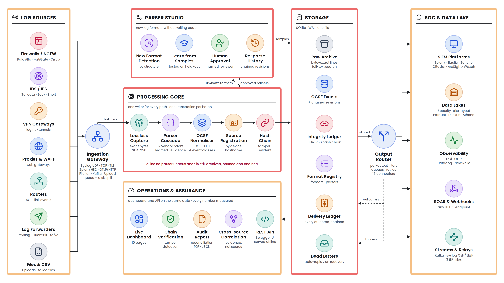

# TRACELOG — Universal Log Pre-processing Framework
### Enterprise Perimeter Telemetry Ingestion, OCSF Normalization, Cryptographic Lineage & Cross-Source Root Cause Analysis

**Start here:** [Architecture, two pages with the diagram](docs/ARCHITECTURE.md) ·
[System design](docs/SYSTEM_DESIGN.md) · [End-to-end flow of one log line](docs/END_TO_END_FLOW.md) ·
[Run it on a new machine](docs/RUNBOOK.md) · [Results on real logs](docs/PUBLIC_SAMPLES.md) ·
[Analytics and ML](docs/ML_DATA.md)



---

## 📑 Table of Contents
1. [Executive Overview & Philosophy](#1-executive-overview--philosophy)
2. [High-Level Architecture & End-to-End Connectivity](#2-high-level-architecture--end-to-end-connectivity)
3. [File-by-File Technical Blueprint (What Every File Does)](#3-file-by-file-technical-blueprint)
   - [Backend Core (`backend/`)](#backend-core)
   - [Data Models (`backend/models/`)](#data-models)
   - [REST API Layer (`backend/api/`)](#rest-api-layer)
   - [Core Services Engine (`backend/services/`)](#core-services-engine)
   - [Frontend Operations Center (`frontend/`)](#frontend-operations-center)
   - [Dashboard Views (`frontend/views/`)](#dashboard-views)
   - [Data & Sample Datasets (`data/`)](#data--sample-datasets)
   - [Automated Test Suite (`tests/`)](#automated-test-suite)
   - [Root Operational Scripts](#root-operational-scripts)
4. [Page-by-Page Dashboard Guide (What Every Page Does)](#4-page-by-page-dashboard-guide)
5. [The Three Core USPs (Deep Dive & Mechanics)](#5-the-three-core-usps)
   - [USP 1: Zero-Touch Parser Generation & Approval Lifecycle](#usp-1-zero-touch-parser-generation)
   - [USP 2: Chain-of-Custody Cryptographic Integrity & Tamper Demo](#usp-2-chain-of-custody-cryptographic-integrity)
   - [USP 3: Cross-Source Root Cause Analysis (RCA) & Fact vs. Inference](#usp-3-cross-source-root-cause-analysis)
6. [Database Schema & SQLite Storage Architecture](#6-database-schema--sqlite-storage-architecture)
7. [REST API Reference Matrix](#7-rest-api-reference-matrix)
8. [Installation, Startup & Verification Guide](#8-installation-startup--verification-guide)
9. [Plug-and-Play Connectors: Log Sources → TRACELOG → SIEM / Observability](#9-plug-and-play-connectors)
10. [Log Formats TRACELOG Has Never Seen: Detect, Learn, Approve, Re-parse](#10-log-formats-tracelog-has-never-seen)
11. [Measured Performance](#11-measured-performance)
12. [Tested on Real, Third-Party Logs](#12-tested-on-real-third-party-logs)
13. [AI/ML-Ready Analytics](#13-aiml-ready-analytics)
14. [Evidence for Audits, Courts and CERT-In](#14-evidence-for-audits-courts-and-cert-in)

---

## 1. Executive Overview & Philosophy

Modern enterprise security operations centers (SOCs) ingest massive volumes of perimeter logs originating from heterogeneous appliances—Palo Alto Networks NGFWs, Cisco ASA firewalls, Fortinet SSL-VPN gateways, Suricata/Snort IDS/IPS engines, and perimeter routers. These logs arrive in radically different formats (CEF, LEEF, RFC 3164/5424 Syslog, Key-Value pairs, and raw JSON), making unified cross-device analysis nearly impossible without high-latency manual preprocessing.

**TRACELOG (Universal Log Pre-processing Framework)** solves this fundamental challenge through three foundational tenets:
1. **Lossless Preservation**: The exact raw payload is preserved verbatim with an immutable SHA-256 hash before any normalization occurs.
2. **Deterministic OCSF Normalization**: Events are mapped to standard Open Cybersecurity Schema Framework (OCSF v1.1.0) classes (`Network Activity 4001`, `Authentication 3002`, `Detection Finding 2004`, and `Base Event 0` for anything unrecognised).
3. **Provable Cryptographic Lineage**: A transaction-safe SHA-256 hash-chain guarantees that any record alteration, deletion, or reordering is immediately flagged.
4. **Plug-and-Play Connectivity**: Devices stream in over syslog (UDP/TCP/TLS), Splunk HEC, OTLP, files or Kafka with no agent, and normalised OCSF events stream out to Splunk, Sentinel, QRadar, Elastic, Wazuh, Graylog, Grafana Loki, Datadog, New Relic, OTLP backends and data lakes at the same time (see [section 9](#9-plug-and-play-connectors)).
5. **Autonomous Operational Workflows**: Zero-touch parser candidate generation and deterministic cross-source correlation connect disparate security events into an evidence-linked incident timeline.

---

## 2. High-Level Architecture & End-to-End Connectivity

```
 ┌─────────────────────────────────────────────────────────────────────────────┐
 │                         STREAMLIT OPERATIONS CENTER                         │
 │  Port 8501 · follows the system light or dark setting · 10 pages            │
 └──────────────────────────────────────┬──────────────────────────────────────┘
                                        │ HTTP REST / Fallback
                                        ▼
 ┌─────────────────────────────────────────────────────────────────────────────┐
 │                           FASTAPI REST GATEWAY                              │
 │  Port 8000 · OpenAPI /docs · Pydantic Validation · CORS Enabled             │
 └───────┬──────────────┬──────────────┬──────────────┬─────────────┬──────────┘
         │              │              │              │             │
         ▼              ▼              ▼              ▼             ▼
   ┌───────────┐  ┌───────────┐  ┌───────────┐  ┌───────────┐ ┌───────────┐
   │ Ingestion │  │  Parsers  │  │   OCSF    │  │ Integrity │ │    RCA    │
   │ Pipeline  │  │ Studio    │  │ Normalizer│  │  Ledger   │ │Engine     │
   └─────┬─────┘  └─────┬─────┘  └─────┬─────┘  └─────┬─────┘ └─────┬─────┘
         │              │              │              │             │
         └──────────────┴──────────────┼──────────────┴─────────────┘
                                       │ SQL Transactions (WAL)
                                       ▼
 ┌─────────────────────────────────────────────────────────────────────────────┐
 │                       SQLITE STORAGE ENGINE (ulpf.db)                       │
 │  sources · raw_logs · normalized_events · integrity_ledger · incidents      │
 └─────────────────────────────────────────────────────────────────────────────┘
```

### End-to-End Dataflow:
1. **Ingestion**: Devices stream logs in over syslog UDP/TCP/TLS, the Splunk HEC and OTLP receivers, file tailing or Kafka (see [section 9](#9-plug-and-play-connectors)); analysts can also use `POST /api/ingest/single`, `POST /api/ingest/batch`, or file upload.
2. **Raw Archival**: `IngestionPipeline` generates an immutable `raw_id`, computes `SHA-256(raw_text)`, and writes the raw record to `raw_logs`.
3. **Format Detection & Parsing**: `FormatDetector` inspects the line structure, routing it to `CEFParser`, `LEEFParser`, `SyslogParser`, `KVParser`, or `JSONParser`.
4. **OCSF v1.1.0 Normalization**: `OCSFNormalizer` transforms vendor-specific attributes (`src`, `spt`, `dst`, `dpt`, `act`, `usrName`) into canonical OCSF fields with standardized categories, severities, and timestamps.
5. **Cryptographic Chaining**: `IntegrityLedger` retrieves the latest block under an active SQLite write lock, calculates the canonical record hash linking to `prev_hash`, and appends the entry to `integrity_ledger`.
6. **Query & Investigation**: The Streamlit frontend calls `/api/events`, `/api/integrity/verify`, and `/api/correlation/run` via `APIClient` to present interactive operational dashboards.

---

## 3. File-by-File Technical Blueprint

Every source file in ULPF has a modular, dedicated responsibility. Below is the comprehensive directory blueprint:

### Backend Core

#### `backend/main.py`
- **Role**: Application entrypoint for the FastAPI REST service.
- **Responsibilities**:
  - Instantiates `FastAPI(title="Universal Log Pre-processing Framework")`.
  - Configures `CORSMiddleware` to allow cross-origin requests from the Streamlit UI.
  - Mounts 8 modular routers under the `/api` prefix: `sources`, `ingestion`, `parsers`, `events`, `integrity`, `correlation`, `analytics`, and `export`.
  - Exposes the `/health` endpoint reporting database status, WAL mode, version, and environment.
  - Includes a `__main__` execution block to start `uvicorn` on `127.0.0.1:8000`.

#### `backend/config.py`
- **Role**: Central configuration management using Pydantic Settings.
- **Responsibilities**:
  - Defines `Settings` inheriting from `BaseSettings` with `SettingsConfigDict(env_file=".env")`.
  - Specifies paths for `DATA_DIR` and `DB_PATH` (`data/ulpf.db`).
  - Configures `BACKEND_HOST`, `BACKEND_PORT` (8000), `FRONTEND_PORT` (8501), and `ENVIRONMENT` (`local`).
  - Contains optional placeholders for cloud LLM API keys (`OPENAI_API_KEY`, `ANTHROPIC_API_KEY`, `GEMINI_API_KEY`), ensuring 100% offline air-gapped operation when empty.

---

### Data Models (`backend/models/`)

#### `backend/models/source.py`
- **Role**: Pydantic schemas for log source appliances.
- **Classes**:
  - `SourceBase`: Fields for `name`, `vendor`, `product`, `format_type`, `category`, `description`, `is_active`.
  - `SourceCreate`: Input validation schema for registering new appliances.
  - `Source`: Complete database entity including `id` (UUID), `created_at` (ISO 8601), `event_count`, and `last_event_at`.

#### `backend/models/event.py`
- **Role**: Pydantic schema enforcing OCSF v1.1.0 specification compliance.
- **Classes**:
  - `ProductMetadata`: Appliance identification (`vendor_name`, `name`, `version`).
  - `RawRef`: Cryptographic traceability link (`raw_id`, `raw_hash`).
  - `Metadata`: Base event metadata (`version="1.1.0"`, `sequence_num`, `product`, `raw_ref`).
  - `Endpoint`: Network endpoint structure (`ip`, `port`, `hostname`, `mac`).
  - `ConnectionInfo`: Transport layer details (`protocol_name`, `protocol_num`, `direction`).
  - `Traffic`: Metric counters (`bytes_in`, `bytes_out`, `packets`).
  - `User`: Identity metadata (`name`, `domain`, `type`).
  - `Finding`: Security finding / alert details (`title`, `desc`, `uid`, `types`).
  - `OCSFEvent`: The master normalized event record supporting Class 4001 (Network Activity), Class 3002 (Authentication), Class 2004 (Detection Finding) and Class 0 (Base Event). Contains `unmapped` dictionary for preserving vendor-specific attributes.
  - `RawLogRecord`: Schema for the raw, pre-parsed log storage table.

#### `backend/models/parser.py`
- **Role**: Data structures governing the Zero-Touch Parser Generation lifecycle (USP 1).
- **Classes**:
  - `FieldMapping`: Defines a mapping from source token to target OCSF dot-notation (e.g. `src -> src_endpoint.ip`).
  - `ParserRule`: Concrete parsing instructions (`format_type`, `regex_pattern`, `mappings`).
  - `ParserTestCase`: Individual sample execution result (`sample_log`, `passed`, `extracted_fields`, `error_message`).
  - `ParserValidationResult`: Test suite scorecard (`total_samples`, `passed_samples`, `accuracy_score`, `unmapped_fields`, `validation_errors`).
  - `ParserCandidate`: Full parser candidate schema tracking `status` (`candidate`, `approved`, `rejected`), `tested` boolean, and approval audit stamps.

#### `backend/models/integrity.py`
- **Role**: Models supporting the Chain-of-Custody Integrity Ledger (USP 2).
- **Classes**:
  - `LedgerEntry`: Structure of a cryptographic ledger block (`sequence_num`, `event_id`, `raw_id`, `raw_hash`, `record_hash`, `prev_hash`, `timestamp`).
  - `VerificationIssue`: Detailed discrepancy report for corrupted blocks (`issue_type`, `description`, `expected`, `actual`).
  - `IntegrityVerificationResult`: Complete audit report (`is_valid`, `total_records`, `verified_records`, `failed_records`, `first_corrupted_seq`, `issues`, `verification_time_ms`).
  - `TamperRecordRequest` / `TamperRecordResponse`: Payload structures for the controlled tampering demonstration.

#### `backend/models/correlation.py`
- **Role**: Models for Cross-Source Root Cause Analysis (USP 3).
- **Classes**:
  - `ObservedFact`: Hard telemetric facts logged directly by appliances, anchored with `raw_hash` references.
  - `InferredRelationship`: A correlation rule that matched (login then activity, allowed connection then alert, port sweep), with the shared addresses, the time gap, the evidence list and a rationale that says what the evidence does not prove. No confidence score: nothing measures one.
  - `IncidentSummary`: Cross-source correlation result (`incident_id`, `title`, `severity` — the highest a device reported, `start_time`, `end_time`, `entities`, `observed_facts`, `inferred_relationships`, `mitre_tactics`, `recommendations`).

---

### REST API Layer (`backend/api/`)

#### `backend/api/sources.py`
- **Routes**:
  - `GET /api/sources`: Retrieves all registered perimeter appliances with event counts and status.
  - `POST /api/sources`: Registers a new source appliance with input validation.
  - `GET /api/sources/{id}`: Fetches specific source metadata.
  - `DELETE /api/sources/{id}`: Deletes an appliance configuration.

#### `backend/api/ingestion.py`
- **Routes**:
  - `POST /api/ingest/single`: Ingests, parses, normalizes, and chains a single raw log string.
  - `POST /api/ingest/batch`: Ingests an array of log lines sequentially.
  - `POST /api/ingest/file`: Accepts multipart log file uploads (`.log`, `.txt`, `.json`).
  - `POST /api/ingest/seed-samples`: Automatically initializes 4 perimeter sources (Palo Alto, Cisco, Fortinet, Suricata) and ingests the coordinated multi-stage synthetic breach dataset.

#### `backend/api/parsers.py`
- **Routes**:
  - `GET /api/parsers`: Lists all parsers in the registry (candidates and approved).
  - `POST /api/parsers/generate`: Generates a candidate parser from sample lines in `candidate` status.
  - `POST /api/parsers/{id}/test`: Executes the candidate parser against test samples, generating validation scores.
  - `POST /api/parsers/{id}/approve`: **Governance Gate**: Approves a tested parser. Blocks approval if untested or if pass count is zero.
  - `POST /api/parsers/{id}/reject`: Flags a candidate parser as rejected.

#### `backend/api/events.py`
- **Routes**:
  - `GET /api/events`: Advanced event exploration endpoint supporting full-text search, IP filtering, severity filters, source filters, and pagination.
  - `GET /api/events/{id}`: Retrieves complete event record including raw payload, raw SHA-256 hash, normalized OCSF JSON, and hash-chain pointers.

#### `backend/api/integrity.py`
- **Routes**:
  - `GET /api/integrity/verify`: Executes full cryptographic audit across all ledger records, checking raw preimages, chain pointers, and sequence continuity.
  - `GET /api/integrity/ledger`: Returns recent ledger blocks.
  - `POST /api/integrity/tamper`: Controlled demo endpoint that mutates a specific field in SQLite and creates an audit backup.
  - `POST /api/integrity/restore`: Restores a tampered record back to its verified state from the backup table.

#### `backend/api/correlation.py`
- **Routes**:
  - `POST /api/correlation/run`: Executes cross-source correlation on a pivot IP or across all perimeter events, returning an `IncidentSummary`.
  - `GET /api/correlation/incidents`: Lists historical correlated incidents.
  - `GET /api/correlation/incidents/{id}`: Fetches a specific incident summary.

#### `backend/api/analytics.py`
- **Routes**:
  - `GET /api/analytics/overview`: Calculates operational metrics: total events, active sources, parser count, approved parsers, events by category, events by source, and events by severity.
  - `GET /api/analytics/activity?hours=24`: What happened in the newest hours of stored events, for the overview dashboard: events and denials per time slot, detections, events by source, class and severity, and the most denied addresses. The window ends at the newest event, so an imported day still shows.

#### `backend/api/export.py`
- **Routes**:
  - `GET /api/export/ocsf-json`: Streams normalized events as a downloadable OCSF JSON array file.
  - `GET /api/export/csv`: Streams normalized telemetry as a flattened CSV file with raw hashes.

---

### Core Services Engine (`backend/services/`)

#### Storage
- **`backend/services/storage/db.py`**:
  - Manages SQLite connection lifecycle and schema migrations.
  - Enables Write-Ahead Logging (`PRAGMA journal_mode=WAL;`), synchronous normal mode, and foreign keys for high concurrency.
  - Creates 7 core tables: `sources`, `parsers`, `raw_logs`, `normalized_events`, `integrity_ledger`, `incidents`, and `audit_tamper_backup`.
  - Also `checkpoints` (signed Merkle roots over runs of chain records), `tracelog_meta` (the archive's log id, which the witnesses know it by) and `audit_rewrite_backup` (for the history-rewrite demonstration); see [`docs/EVIDENCE.md`](docs/EVIDENCE.md).

#### Format Parsers (`backend/services/parsing/`)
- **`cef_parser.py`**: Parses ArcSight CEF strings (`CEF:Version|Vendor|Product|Version|ClassID|Name|Severity|Extension`). Handles quoted values, escaped characters, and embedded syslog envelopes.
- **`leef_parser.py`**: Parses IBM QRadar LEEF 1.0/2.0 headers and tab-separated or custom-delimited extensions.
- **`syslog_parser.py`**: Implements dual parsing for RFC 3164 (BSD syslog `<PRI>Mmm dd hh:mm:ss hostname tag[pid]: msg`) and RFC 5424 (IETF structured syslog). Calculates facility and severity from numeric PRI.
- **`kv_parser.py`**: Robust key-value parser using regex pattern `([a-zA-Z0-9_.-]+)=(?:"([^"]*)"|'([^']*)'|([^\s,;]+))`.
- **`json_parser.py`**: Fast single-line JSON parser for Suricata EVE and cloud firewall telemetry.
- **`detector.py` (`FormatDetector`)**: High-speed format classifier that examines incoming log lines and selects the appropriate parser.

#### Normalization
- **`backend/services/normalization/ocsf_normalizer.py`**:
  - Maps heterogeneous log attributes to the standardized OCSF v1.1.0 schema.
  - Dynamic class assignment: Maps network connections to `Class 4001`, VPN/logons to `Class 3002`, and IDS alerts/threats to `Class 2004`.
  - Severity mapping: Translates vendor-specific levels (e.g. numeric 1-10, "emerg", "crit", "warn", "info") to standard OCSF 1-5 scale (`Informational`, `Low`, `Medium`, `High`, `Critical`).
  - Timestamp parser: Normalizes ISO 8601, BSD syslog dates, and Unix epoch timestamps into UTC ISO strings and millisecond epochs.
  - Residual capture: Any field not explicitly mapped to standard OCSF attributes is preserved in the `unmapped` dictionary.

#### Cryptographic Integrity (USP 2)
- **`backend/services/integrity/hasher.py`**:
  - `hash_raw_bytes(raw_data)`: Computes SHA-256 of the raw payload bytes.
  - `canonical_json(data)`: Serializes dictionaries with sorted keys, no whitespace (`separators=(',', ':')`), and UTF-8 encoding.
  - `compute_record_hash(...)`: Computes chained block hash: $\text{SHA256}(\text{prev\_hash} : \text{seq\_num} : \text{raw\_hash} : \text{canonical\_json})$.
- **`backend/services/integrity/ledger.py`**:
  - `append_event(...)`: Atomically writes the ledger record under an exclusive transaction, enforcing monotonic sequence numbers.
  - `verify_chain()`: Exhaustive cryptographic verifier checking:
    1. Raw payload preimage integrity: $\text{SHA256}(\text{raw\_text}) == \text{raw\_hash}$.
    2. Sequence continuity: $\text{seq\_num}_{i} == \text{seq\_num}_{i-1} + 1$ (detects deletions and insertions).
    3. Chain continuity: $\text{prev\_hash}_{i} == \text{record\_hash}_{i-1}$ (detects reordering).
    4. Record hash integrity: Recomputed hash matches stored hash (detects in-place modification).
  - `simulate_tampering(...)`: Demonstrates tamper detection by deliberately altering a record in SQLite and saving a backup.
  - `restore_tampered_record(...)`: Restores the original record from backup.

#### Zero-Touch Parser Generation (USP 1)
- **`backend/services/parser_generation/generator.py`**:
  - Analyzes sample logs, identifies delimiters, extracts IP/port tokens, and synthesizes a candidate `ParserRule`.
  - Sets parser status to `candidate` and `tested = False`.
- **`backend/services/parser_generation/tester.py`**:
  - Tests the candidate against multiple sample lines, compiling an accuracy scorecard, pass/fail results, and unmapped field lists.

#### Cross-Source RCA (USP 3)
- **`backend/services/correlation/engine.py`**:
  - Temporal multi-device correlation across sliding windows (e.g. 15-30 minutes).
  - Tracks shared entities (`src_ip`, `dst_ip`, `user_name`).
  - Categorizes findings into **Observed Facts** (verifiable telemetric records with raw hashes) and **Inferred Relationships** (rules that matched, each with the evidence that made it match).
  - Identifies attack progression: VPN Authentication $\rightarrow$ Internal Scanning $\rightarrow$ Exploit Signature $\rightarrow$ Firewall Quarantine.

#### Ingestion Pipeline
- **`backend/services/ingestion/pipeline.py`**:
  - Master pipeline orchestrator connecting Raw Storage $\rightarrow$ Parsing $\rightarrow$ Normalization $\rightarrow$ Integrity Chaining $\rightarrow$ Source Counter Updates within atomic SQLite transactions.

---

#### Vendor Packs (`backend/services/vendors/`)
- `envelope.py` splits the syslog header (RFC 3164 / 5424, structured data) from the message; one module per vendor (`paloalto.py`, `fortinet.py`, `cisco.py`, `checkpoint.py`, `juniper.py`, `sophos.py`, `sonicwall.py`, `pfsense.py`, `ids.py` for Suricata, Zeek and Snort) maps native fields to OCSF classes and activities. `parsing/dispatch.py` tries the packs first and falls back to the generic CEF / LEEF / syslog / key=value / JSON parsers.

#### Connectors (`backend/connectors/`)
- `config.py`: loads `config/tracelog.yaml` (path from `TRACELOG_CONFIG`) and fills `${VAR}` from the environment or `.env`.
- `inputs/syslog.py`: asyncio syslog listeners for UDP, TCP and TLS with RFC 6587 framing. `inputs/pollers.py`: file tailing with rotation handling and saved offsets, and a Kafka consumer.
- `engine.py`: the ingest queue, disk spool for bursts, batch worker and output router, started and stopped with the API server.
- `outputs/`: one sink per destination family (`http_sinks.py`, `stream_sinks.py`, `file_sinks.py`) sharing queues, retries, dead-letter files and filters from `base.py`; wire formats (CEF, LEEF 2.0, GELF, OTLP, RFC 5424) in `formats.py`.
- `guides.py`: the per-vendor and per-destination setup guides shown on the Connectors page and generated into `docs/CONNECTORS.md`.
- `backend/services/integrity/delivery_ledger.py`: the hash-chained record of every delivery outcome per output; `reconcile.py` computes the reconciliation and the audit report data; `audit_pdf.py` renders the PDF; `backend/api/audit.py` serves them.
- `backend/services/ingestion/stream.py`: lossless batched ingestion for streamed logs with source auto-registration. `backend/services/normalization/ocsf_export.py`: the strict OCSF 1.1.0 event every output sends, plus a validator. `backend/api/receivers.py`: the HEC, OTLP and stream receivers. `backend/api/connectors.py`: status, test and flush endpoints.

### Dashboard (`frontend/`)

#### `frontend/app.py`
- The Streamlit entry point: page setup, the stylesheet, the logo, and the navigation. Each page has its own
  address (`/log-explorer`, `/integrity` …) through `st.navigation`, grouped as Workspace, Security, Data and
  System. The sidebar ends with the API status.

#### `frontend/api_client.py`
- Calls the API over HTTP. When the API does not answer and `DASHBOARD_DIRECT_MODE` is on (one laptop, no
  containers) it runs the same backend function in its own process; in the containers it says the API is down
  instead of becoming a second writer.

#### `frontend/ui.py`
- Page headers, tiles, number formats and the charts: time series with a detections lane, bar lists, a
  part-to-whole bar, device lanes, sparklines and tables, all built as HTML and inline SVG. No chart library is
  loaded (Plotly alone was 4 MB of JavaScript on the first page), and hover read-outs are plain CSS. Every
  value that can come from a log line is escaped before it is placed in HTML.

#### `frontend/assets/theme.css`, `frontend/assets/logo.svg`, `frontend/static/fonts/`
- One stylesheet with light and dark values that follow the operating system (`prefers-color-scheme`),
  matching the two Streamlit themes in `.streamlit/config.toml`. Surfaces are translucent over a fixed purple
  gradient; real backdrop blur is used only where content passes underneath (menus, dialogs, the sidebar on
  narrow screens), since over a smooth gradient it changes nothing and costs a repaint on every scroll.
- IBM Plex Sans and IBM Plex Mono are served with the dashboard (SIL Open Font License, `OFL.txt`), so it
  needs no font host.

#### `.streamlit/config.toml`
- The light and dark themes, the bundled fonts, static file serving, no usage statistics, and no toolbar menu,
  so the theme cannot be switched away from the system setting.

---

### Dashboard pages (`frontend/views/`)

#### `overview_page.py`
- One screen, no scrolling on a laptop: events stored, share read by a known parser, OCSF checks passed,
  integrity chain, detections and formats without a parser; then, for the chosen time range (1 h to all),
  events and denials over time with detections marked, sources and event classes, the newest detections and
  the most denied addresses. The range ends at the newest stored event. The page refreshes every 30 s.

#### `sources_page.py`
- Sources with their event counts, the network inputs, a form to add a source, and a box to send one line
  through the pipeline and see its hash and OCSF class.

#### `parser_studio_page.py`, `new_formats_panel.py`
- New log formats grouped by structure, learning a parser from one, reviewing each field, approval with the
  reviewer's name, and re-parsing past lines. A second tab proposes a parser from pasted samples.

#### `pipeline_page.py`
- The six stages (receive, archive, parse, normalize, chain, deliver) with measured counts, the parsers used,
  and the lines no parser could classify.

#### `explorer_page.py`
- Search and filters over stored events; select a row to see its raw line and SHA-256 beside the OCSF event
  the outputs send.

#### `integrity_page.py`
- Chain verification with its result and timing, the tamper test (change a record, verify, restore) and the
  newest chain records, on one screen.

#### `correlation_page.py`
- Events from several devices that share an address: a timeline with one lane per device, the observed facts
  and the rules that linked them, each with its evidence.

#### `schema_page.py`
- The OCSF classes and fields TRACELOG writes, and an event normalized live from a raw line.

#### `integrations_page.py`
- Connectors: live inputs and outputs with a test event per output, the accounting of every event at every
  output with the audit report, setup for devices and destinations, and OCSF downloads.

#### `settings_page.py`
- How the installation is set up, the rules that always apply, and deleting all stored events (one laptop only).

---

### Data & Sample Datasets (`data/`)

- **`data/ulpf.db`**: Local SQLite database storing all persistent tables with active WAL journal.
- **`data/samples/palo_alto_traffic.log`**: Synthetic Palo Alto Networks PAN-OS CEF traffic flows and threat drops.
- **`data/samples/cisco_asa_firewall.log`**: Synthetic Cisco ASA syslog messages (`%ASA-6-302013`, `%ASA-4-106023`).
- **`data/samples/fortinet_vpn.log`**: Synthetic FortiGate SSL-VPN authentication and session logs in Key-Value format.
- **`data/samples/suricata_ids.json`**: Synthetic Suricata EVE JSON intrusion detection alert lines.
- **`data/samples/multi_source_incident.log`**: Chronologically coordinated multi-stage perimeter security incident sequence connecting VPN, ASA, PAN-OS, and Suricata.
- **`data/samples/malformed_logs.log`**: Corrupted headers and invalid timestamps for testing error resilience.

---

### Automated Test Suite (`tests/`)

- **`tests/test_parsers.py`**: Unit tests verifying deterministic parsing across CEF, LEEF, RFC 3164 Syslog, RFC 5424 Syslog, KV pairs, and JSON.
- **`tests/test_normalization.py`**: Tests verifying OCSF Class 4001, 3002, and 2004 normalization, severity mappings, and residual field preservation.
- **`tests/test_integrity_chain.py`**: Cryptographic tests verifying canonical JSON serialization, hash-chain calculation, modification detection, and deletion/reordering detection.
- **`tests/test_parser_generation.py`**: Tests candidate parser synthesis, validation testing against sample batches, and error scoring.
- **`tests/test_correlation_rca.py`**: End-to-end test verifying multi-device correlation, temporal ordering, and fact-vs-inference classification.
- **`tests/test_api_endpoints.py`**: Integration tests using FastAPI `TestClient` covering all REST endpoints.
- **`tests/test_ml.py`**: The analytics row (nulls, types, lineage), window features that never see a later window, the baseline's flags and minimums, and a synthetic day end to end: attacks become chained, valid Detection Findings whose evidence resolves to archived lines, written once.

---

### Root Operational Scripts

- **`run_app.py`**: Single-command Python launcher that starts both the FastAPI backend (`:8000`) and the Streamlit dashboard (`:8501`) concurrently.
- **`requirements.txt`**: Consolidated, tested Python dependencies.
- **`.env.example`**: Environment variable template for ports, database path, and optional LLM keys.
- **`Dockerfile`**: Two-stage build: wheels are built with a compiler, the runtime stage has none, runs as an unprivileged `tracelog` user with the code read-only, one process per container, and a health check. **`.dockerignore`** keeps `.env`, databases, `.git`, venvs, tests and notes out of the image; `scripts/check_image.py` (or `sh scripts/check_image.sh`) builds the image and proves it, from Linux, macOS or Windows.
- **`scripts/run_all_checks.py`**: runs every test, evaluation and benchmark on the machine it is on and writes one summary with the hardware beside every number; `--compare` puts two machines side by side (docs/RUNBOOK.md §6).
- **`scripts/export_features.py`**, **`scripts/run_baseline.py`**, **`scripts/evaluate_baseline.py`**: export window features, run the baseline detector once, and evaluate it on synthetic days with injected attacks (`scripts/synthetic_network.py`); see [`docs/ML_DATA.md`](docs/ML_DATA.md).
- **`docker-compose.yml`**: TRACELOG as five services in their own containers (gateway, collector, query, detector, dashboard; [docs/SERVICES.md](docs/SERVICES.md)), each with a read-only root filesystem, all capabilities dropped and no privilege escalation. Only the collector writes the archive; the query service and the detector open it read-only.

---

## 4. Page-by-Page Dashboard Guide

| Page | What it is for | What you do there | API calls |
| :--- | :--- | :--- | :--- |
| **Overview** | Everything that needs a glance, on one screen | Pick a time range. Use **Load sample data** on an empty archive. Follow a tile's link to the page behind it. | `GET /api/analytics/overview`<br>`GET /api/analytics/activity`<br>`POST /api/ingest/seed-samples` |
| **Sources** | Devices and inputs | Add a source by hand. Send one line through the pipeline and see its hash and OCSF class. | `GET /api/sources`<br>`POST /api/sources`<br>`POST /api/ingest/single` |
| **Parser Studio** | Parsers for formats nobody wrote one for | Pick a new format, **Learn a parser**, confirm the fields that need review, **Approve & apply**, **Re-parse past lines**. | `GET /api/formats`<br>`POST /api/formats/{id}/learn`<br>`POST /api/formats/parsers/{id}/approve` |
| **Pipeline** | Where each line is | Check the counts at each of the six stages. Send a malformed line. | `GET /api/analytics/overview`<br>`GET /api/analytics/unparsed` |
| **Log Explorer** | Finding events | Search, filter, then select a row to see its raw line beside its OCSF event. **Evidence bundle** exports that event or the events shown. | `GET /api/events`<br>`GET /api/events/{id}`<br>`GET /api/evidence/bundle.zip` |
| **Integrity** | Proof that nothing changed | **Verify the chain** and **Check the checkpoints** (signed Merkle roots, and what the witnesses signed). Demonstrations: **Change the record** (the chain catches it) and **Rewrite history** as an insider with the server's keys (only the witnesses catch it), each with a restore. | `GET /api/integrity/verify`<br>`GET /api/integrity/checkpoints`<br>`POST /api/integrity/checkpoints/seal`<br>`POST /api/integrity/tamper`<br>`POST /api/integrity/rewrite` |
| **Correlation** | Following one address across devices | Enter an address, select **Correlate**, read the device timeline, the facts and the rules that linked them. Export the incident's **Evidence bundle**, or a **CERT-In report draft**. | `POST /api/correlation/run`<br>`GET /api/evidence/bundle.zip`<br>`GET /api/compliance/certin/report.pdf` |
| **Schema** | The OCSF classes and fields | Browse the classes and fields; see an event normalized live. | Local reference |
| **Connectors** | Inputs, outputs and accounting | Check live counters, send a test event, **Generate audit report**, copy device or destination setup, download OCSF. | `GET /api/connectors`<br>`GET /api/audit/reconcile`<br>`GET /api/audit/report.pdf` |
| **Settings** | How this installation is set up | Read the settings, the checkpoint and witness setup and the CERT-In retention status; delete all stored events on a single laptop (not in CERT-In mode). | `GET /api/compliance/certin/status`; direct database access (single laptop only) |

---

## 5. The Three Core USPs

### USP 1: Zero-Touch Parser Generation
Conventional SIEMs require tedious manual regex authoring or brittle Grok patterns when a new device format is introduced. ULPF introduces an automated, governed lifecycle:

```
  Raw Log Samples
         │
         ▼
┌─────────────────┐
│ Format Detector │ ── Identifies CEF, LEEF, Syslog, KV, JSON
└────────┬────────┘
         │
         ▼
┌─────────────────┐
│ Token Extractor │ ── Mines IPv4/v6, ports, timestamps, actions, severities
└────────┬────────┘
         │
         ▼
┌─────────────────┐
│ Candidate Rule  │ ── Status = "candidate", tested = False (CANNOT be activated)
└────────┬────────┘
         │
         ▼
┌─────────────────┐
│ Validation Gate │ ── Executes against test batch; reports accuracy % & unmapped fields
└────────┬────────┘
         │
         ▼
┌─────────────────┐
│ Governance Gate │ ── Explicit human review promotes candidate to "approved"
└─────────────────┘
```

> **Strict Governance Principle**: ULPF **never** silently approves an untested parser. A candidate parser must pass test execution before promotion to active status.

> **Formats nobody wrote a parser for** are handled end to end in [section 10](#10-log-formats-tracelog-has-never-seen): detected as formats, learned from hundreds of lines, approved by a named reviewer, and applied to past lines as chained revisions.

---

### USP 2: Chain-of-Custody Cryptographic Integrity
To satisfy legal and forensic evidence standards, ULPF implements a transaction-safe SHA-256 hash-chain ledger:

```
Record #1 (Genesis)                                   Record #2
┌──────────────────────────────┐                      ┌──────────────────────────────┐
│ prev_hash: "000...000"       │                      │ prev_hash: Record #1 Hash    │
│ raw_hash:  SHA256(Raw #1)    │ ──── Linked to ────▶ │ raw_hash:  SHA256(Raw #2)    │
│ norm_json: Canonical JSON #1 │                      │ norm_json: Canonical JSON #2 │
│ record_hash: SHA256(...)     │                      │ record_hash: SHA256(...)     │
└──────────────────────────────┘                      └──────────────────────────────┘
```

#### Cryptographic Formulas:
1. **Raw Payload Hash**:
   $$\text{raw\_hash} = \text{SHA256}(\text{raw\_bytes})$$
2. **Canonical JSON Normalization**:
   $$\text{canonical\_json} = \text{json.dumps}(\text{normalized\_dict}, \text{sort\_keys}=\text{True}, \text{separators}=(',', ':'))$$
3. **Chained Record Hash**:
   $$\text{record\_hash} = \text{SHA256}(\text{prev\_hash} : \text{seq\_num} : \text{raw\_hash} : \text{canonical\_json})$$

#### What the Verifier Detects:
- **Payload Modification**: If a stored raw text or normalized field is altered, the recomputed record hash diverges from the stored hash.
- **Record Deletion**: If an attacker deletes a record, the sequence numbers exhibit a gap ($\text{seq}_{i} \neq \text{seq}_{i-1} + 1$).
- **Record Reordering**: If records are swapped, the `prev_hash` pointers break immediately.

#### Beyond the chain: signed checkpoints and witnesses
Someone with write access to the database could change a record *and* recompute every hash after it. So every 1,000 records (and every five minutes) TRACELOG seals the new records under an RFC 9162 Merkle root, signs it with Ed25519 and ML-DSA-65, and sends it to witness services that countersign it and keep a copy. Resealing a changed history needs the collector's keys, and even then the witnesses refuse to sign a different checkpoint with the same number. [Section 14](#14-evidence-for-audits-courts-and-cert-in) and [`docs/EVIDENCE.md`](docs/EVIDENCE.md) have the details and the demonstration.

---

### USP 3: Cross-Source Root Cause Analysis (RCA)
Perimeter defense relies on multiple distinct appliances that each observe only a fraction of an attack lifecycle. ULPF connects these disjoint events into a coherent, evidence-backed narrative:

```
[Fortinet SSL-VPN]       [Cisco ASA Border]       [Suricata IDS]          [Palo Alto NGFW]
  14:00:01 UTC             14:00:15 UTC             14:00:45 UTC            14:00:46 UTC
  Logon Success            Inbound Flow             Exploit Detected        Threat Dropped
  User: contractor_bob     IP: 10.0.1.15            EternalBlue (MS17-010)  SMB RCE Blocked
        │                        │                        │                       │
        └────────────────────────┴────────────────────────┴───────────────────────┘
                                                 │
                                                 ▼
                          Cross-Source Incident Timeline & Graph
```

#### Epistemological Fact vs. Inference Separation:
- **Observed Facts**: Hard telemetric events recorded by the appliance hardware (e.g., "*Palo Alto NGFW logged action 'drop' on 10.0.1.15:49152 -> 192.168.1.50:445*"). Each fact includes its immutable raw SHA-256 hash.
- **Inferred Relationships**: Rules that matched, each listed with the evidence that made it match (e.g., "*login by 'contractor_bob' succeeded; shared address 10.0.1.15; first later event 15 s after the login, from a different device*") and a rationale saying what that evidence does not prove. There are no confidence scores: an earlier version showed constants (88 %, 92 %, 85 %) that nothing measured, and they were removed.

---

## 6. Database Schema & SQLite Storage Architecture

ULPF stores all persistent data in SQLite with Write-Ahead Logging (`WAL` mode) enabled, ensuring thread-safe concurrent reads and atomic writes.

```sql
-- 1. Sources table: Registered perimeter appliances
CREATE TABLE sources (
    id TEXT PRIMARY KEY,
    name TEXT UNIQUE NOT NULL,
    vendor TEXT NOT NULL,
    product TEXT NOT NULL,
    format_type TEXT NOT NULL,
    category TEXT NOT NULL DEFAULT 'network',
    description TEXT,
    is_active INTEGER NOT NULL DEFAULT 1,
    created_at TEXT NOT NULL,
    event_count INTEGER NOT NULL DEFAULT 0,
    last_event_at TEXT
);

-- 2. Parsers table: Candidate and approved parser specifications
CREATE TABLE parsers (
    id TEXT PRIMARY KEY,
    name TEXT NOT NULL,
    vendor TEXT NOT NULL,
    product TEXT NOT NULL,
    format_type TEXT NOT NULL,
    description TEXT,
    target_ocsf_class INTEGER NOT NULL DEFAULT 4001,
    rule_json TEXT NOT NULL,
    status TEXT NOT NULL DEFAULT 'candidate',
    created_at TEXT NOT NULL,
    updated_at TEXT NOT NULL,
    validation_json TEXT,
    tested INTEGER NOT NULL DEFAULT 0,
    approved_by TEXT,
    approved_at TEXT
);

-- 3. Raw Logs table: Verbatim lossless payload storage
CREATE TABLE raw_logs (
    id TEXT PRIMARY KEY,
    source_id TEXT NOT NULL,
    raw_text TEXT NOT NULL,
    raw_hash TEXT NOT NULL,
    ingested_at TEXT NOT NULL,
    format_detected TEXT NOT NULL,
    status TEXT NOT NULL DEFAULT 'ingested',
    error_message TEXT,
    FOREIGN KEY (source_id) REFERENCES sources (id) ON DELETE CASCADE
);

-- 4. Normalized Events table: Canonical OCSF v1.1.0 records
CREATE TABLE normalized_events (
    id TEXT PRIMARY KEY,
    sequence_num INTEGER UNIQUE NOT NULL,
    raw_id TEXT NOT NULL,
    class_uid INTEGER NOT NULL,
    class_name TEXT NOT NULL,
    category_uid INTEGER NOT NULL,
    category_name TEXT NOT NULL,
    activity_id INTEGER NOT NULL,
    activity_name TEXT NOT NULL,
    severity_id INTEGER NOT NULL,
    severity TEXT NOT NULL,
    time TEXT NOT NULL,
    time_epoch_ms INTEGER NOT NULL,
    src_ip TEXT,
    src_port INTEGER,
    dst_ip TEXT,
    dst_port INTEGER,
    protocol TEXT,
    action TEXT,
    disposition TEXT,
    user_name TEXT,
    finding_title TEXT,
    normalized_json TEXT NOT NULL,
    unmapped_json TEXT,
    created_at TEXT NOT NULL,
    FOREIGN KEY (raw_id) REFERENCES raw_logs (id) ON DELETE CASCADE
);

-- 5. Integrity Ledger table: Cryptographic hash chain
CREATE TABLE integrity_ledger (
    sequence_num INTEGER PRIMARY KEY,
    event_id TEXT UNIQUE NOT NULL,
    raw_id TEXT NOT NULL,
    raw_hash TEXT NOT NULL,
    record_hash TEXT NOT NULL,
    prev_hash TEXT NOT NULL,
    timestamp TEXT NOT NULL,
    FOREIGN KEY (event_id) REFERENCES normalized_events (id) ON DELETE CASCADE,
    FOREIGN KEY (raw_id) REFERENCES raw_logs (id) ON DELETE CASCADE
);

-- 6. Incidents table: Correlated multi-device RCA dossiers
CREATE TABLE incidents (
    incident_id TEXT PRIMARY KEY,
    title TEXT NOT NULL,
    severity TEXT NOT NULL,
    start_time TEXT NOT NULL,
    end_time TEXT NOT NULL,
    data_json TEXT NOT NULL,
    created_at TEXT NOT NULL
);

-- 7. Audit Tamper Backup table: Controlled demonstration restoration
CREATE TABLE audit_tamper_backup (
    sequence_num INTEGER PRIMARY KEY,
    original_json TEXT NOT NULL,
    tampered_json TEXT NOT NULL,
    tampered_at TEXT NOT NULL
);

-- 8. Checkpoints: a signed Merkle root over a run of chain records (docs/EVIDENCE.md)
CREATE TABLE checkpoints (
    idx INTEGER PRIMARY KEY,          -- checkpoint number; each names the previous one's hash
    log_id TEXT NOT NULL,             -- this archive, as the witnesses know it
    first_seq INTEGER NOT NULL,
    last_seq INTEGER NOT NULL,
    size INTEGER NOT NULL,
    merkle_root TEXT NOT NULL,        -- RFC 9162 root over "<seq>:<record_hash>" leaves
    prev_hash TEXT NOT NULL,
    checkpoint_hash TEXT NOT NULL,    -- SHA-256 of body
    body TEXT NOT NULL,               -- the exact canonical JSON that was signed
    signatures TEXT NOT NULL,         -- node and witness signatures: Ed25519, ML-DSA-65
    created_at TEXT NOT NULL
);
```

---

## 7. REST API Reference Matrix

All endpoints return standard JSON responses and are fully documented interactively in the Swagger UI (`http://127.0.0.1:8000/docs`).

| Method | Endpoint | Description | Request Body / Parameters | Response Schema |
| :--- | :--- | :--- | :--- | :--- |
| `GET` | `/health` | Service and database health check | None | `{"status": "healthy", ...}` |
| `GET` | `/api/sources` | Lists all registered appliances | None | `List[Source]` |
| `POST` | `/api/sources` | Registers a new appliance | `SourceCreate` JSON | `Source` |
| `POST` | `/api/ingest/single` | Ingests a single raw log string | `SingleLogRequest` JSON | `{"success": true, "raw_hash": ...}` |
| `POST` | `/api/ingest/batch` | Ingests an array of log lines | `BatchLogRequest` JSON | `{"ingested": 10, "failed": 0, ...}` |
| `POST` | `/api/ingest/seed-samples` | Seeds synthetic multi-source logs | None | `{"status": "success", "ingested_count": 8}` |
| `GET` | `/api/parsers` | Lists all parsers | None | `List[ParserCandidate]` |
| `POST` | `/api/parsers/generate` | Generates a candidate parser | `GenerateParserRequest` JSON | `ParserCandidate` |
| `POST` | `/api/parsers/{id}/test` | Tests a candidate on samples | `TestParserRequest` JSON | `ParserCandidate` with scorecard |
| `POST` | `/api/parsers/{id}/approve` | Approves a tested candidate | None | `ParserCandidate` (status: approved) |
| `GET` | `/api/events` | Queries normalized events | `search`, `source_id`, `severity`, `ip`, `limit`, `offset` | `{"total": N, "events": [...]}` |
| `GET` | `/api/events/{id}` | Fetches raw + OCSF event details | None | Detailed Event Record |
| `GET` | `/api/integrity/verify` | Runs full hash-chain audit | None | `IntegrityVerificationResult` |
| `POST` | `/api/integrity/tamper` | Simulates record tampering | `TamperRecordRequest` JSON | `TamperRecordResponse` |
| `POST` | `/api/integrity/restore` | Restores tampered record | `RestoreRecordRequest` JSON | `{"success": true, ...}` |
| `GET` | `/api/integrity/checkpoints` | Recomputes every signed checkpoint, checks its signatures and asks the witnesses | `witnesses` (default true) | `{"ok", "checkpoints", "problems", "witnesses", ...}` |
| `GET` | `/api/integrity/proof/{seq}` | Merkle inclusion proof of one record in its signed checkpoint | None | `{"leaf_index", "tree_size", "path", "checkpoint"}` |
| `POST` | `/api/integrity/checkpoints/seal` | Seals every record not yet in a checkpoint and asks the witnesses to countersign | None | `{"sealed", "witnesses"}` |
| `POST` | `/api/integrity/rewrite` | Demonstration: an insider changes a record, recomputes the chain and re-signs | `sequence_num`, `field`, `new_value` | what was changed, the witnesses' answers |
| `POST` | `/api/integrity/rewrite/restore` | Undoes the rewrite demonstration | None | `{"success": true, ...}` |
| `GET` | `/api/evidence/bundle.zip` | Evidence bundle: raw lines, events, proofs, signed checkpoints, `verify.py`, Section 63(4) particulars | `seq` (repeat) or `incident_id`; `case_ref`, `prepared_by`, `designation`, `organisation`, `place` | ZIP attachment |
| `GET` | `/api/compliance/certin/status` | CERT-In mode, days of logs held, incident types | None | Retention status |
| `GET` | `/api/compliance/certin/report.pdf` | CERT-In incident report draft from a correlation result (also `.json`) | `incident_id`, `types`, reporting-entity fields, `noticed_at` | PDF / JSON attachment |
| `POST` | `/api/correlation/run` | Runs cross-source RCA | `RunCorrelationRequest` JSON | `IncidentSummary` |
| `GET` | `/api/analytics/overview` | Returns system KPIs & counts | None | Operational Metrics Object |
| `GET` | `/api/analytics/activity` | Events, denials and detections over a time range, with breakdowns | `hours` (0 = all) | Activity object |
| `GET` | `/api/export/ocsf-json` | Exports OCSF JSON file | `limit` (default: 1000) | Streamed JSON attachment |
| `GET` | `/api/export/csv` | Exports flattened CSV file | `limit` (default: 1000) | Streamed CSV attachment |
| `GET` | `/api/connectors` | Live status of every input and output, supported sources and destinations | None | `{"pipeline", "inputs", "outputs", ...}` |
| `POST` | `/api/connectors/outputs/{name}/test` | Sends one OCSF event to an output synchronously | None | `{"ok": true, "detail": ...}` |
| `GET` | `/api/connectors/dead-letters` | Undelivered events per output: count by kind, reasons, devices | None | `List[summary]` |
| `GET` | `/api/connectors/dead-letters/{output}` | Latest dead-letter entries with full OCSF events | `limit` | `{"summary", "entries"}` |
| `POST` | `/api/connectors/dead-letters/{output}/replay` | Re-sends dead letters (optionally through another output) | `to`, `kinds`, `limit`, `wait` | `{"state", "delivered", "remaining", ...}` |
| `GET` | `/api/audit/reconcile` | Per-output reconciliation, both chains verified, delivery exceptions | `verify` | `{"all_accounted", "verdict", "outputs", ...}` |
| `GET` | `/api/audit/report.pdf` | Downloadable audit report (PDF) | None | PDF attachment |
| `GET` | `/api/audit/report.json` | The same report as JSON, with its SHA-256 fingerprint | None | JSON attachment |
| `GET` | `/api/audit/delivery/verify` | Recomputes the delivery ledger's hash chain | None | `{"is_valid", "batches", "head_hash", "issues"}` |
| `POST` | `/api/connectors/flush` | Waits until everything received is stored and handed to the outputs | `timeout` | `{"drained": true, ...}` |
| `POST` | `/services/collector/event` | Splunk HEC receiver (Fluent Bit, Vector, Cribl, OTel `splunk_hec`) | HEC JSON events | `{"text": "Success", "code": 0}` |
| `POST` | `/services/collector/raw` | Splunk HEC raw receiver, one log per line | Raw lines, `host`, `sourcetype` | `{"text": "Success", "code": 0}` |
| `POST` | `/v1/logs` | OpenTelemetry OTLP/HTTP logs receiver (JSON, gzip accepted) | `ExportLogsServiceRequest` JSON | `{"partialSuccess": {}}` |
| `POST` | `/api/ingest/stream` | Lines, NDJSON or a JSON array; `message_field` unwraps Logstash/Beats events | `source`, `vendor`, `product`, `message_field` | `{"accepted": N}` |
| `GET` | `/api/ml/contract` | The analytics row's columns, types and meanings | None | `{"columns", "rules"}` |
| `GET` | `/api/ml/features` | Per-entity 5-minute window features | `entity_type`, `hours`, `window_minutes`, `format` | CSV attachment or JSON |
| `POST` | `/api/ml/baseline/run` | Scores recent windows; writes flags as Detection Findings | `hours`, `lookback_hours`, `until`, `dry_run` | `{"windows_scored", "flags", "findings_written", "findings"}` |

---

## 8. Installation, Startup & Verification Guide

### Prerequisites
- Python 3.10, 3.11, 3.12, 3.13, or 3.14.
- Windows PowerShell, Command Prompt, or Linux/macOS Terminal.

### 1. Clone & Navigate to Project
```powershell
cd C:\Users\anita\.gemini\antigravity\scratch\ulpf
```

### 2. Install Dependencies
```powershell
pip install -r requirements.txt
```

### 3. Launch Both Services (One-Command Quickstart)
```powershell
python run_app.py
```
This single command automatically boots:
- **FastAPI Core**: `http://127.0.0.1:8000`
- **Streamlit Dashboard**: `http://localhost:8501`

### 4. Or Run in Separate Terminals

**Terminal 1 — FastAPI Backend:**
```powershell
python -m uvicorn backend.main:app --host 127.0.0.1 --port 8000
```

**Terminal 2 — Streamlit Frontend:**
```powershell
python -m streamlit run frontend/app.py --server.port 8501
```

### 5. Running the Automated Test Suite
To execute the comprehensive test suite:
```powershell
python -m pytest -q
```
**Expected Output**: every test passes, including the connector tests that run real syslog sockets and mock Splunk, Elasticsearch, Loki, OTLP, Sentinel, Datadog, GELF and syslog/CEF/LEEF receivers.

### 6. Docker Deployment (the same on Linux, macOS and Windows)
```bash
docker compose up --build -d           # gateway, collector, query, detector, dashboard
docker compose run --rm --build tests          # the whole test suite, in Linux, whatever the host is
python scripts/check_image.py          # optional: builds the image, proves no secret, database or compiler is in it, and that it runs offline
```
TRACELOG runs as five services, one per container ([docs/SERVICES.md](docs/SERVICES.md)): a **gateway** (nginx) that is the one HTTP address, a **collector** that receives every log and is the only writer of the archive and the hash chain, a **query** service that answers searches, verification, reports and analytics from a read-only database connection, a **detector** that runs the ML baseline and sends its findings to the collector to be chained, and the **dashboard**. Access the dashboard at `http://localhost:8501` and the Swagger API at `http://localhost:8000/docs`. The collector publishes syslog on **514/udp and 514/tcp** (and 5514, and 6514 for TLS), so devices can point at the Docker host's standard syslog port straight away. `config/` is mounted read-only, so connector changes need only `docker compose restart collector`. The archive lives in the named volume `tracelog-data`, never in a folder of the host, which is what keeps SQLite reliable on Docker Desktop for Windows. Secrets go in `.env` next to the compose file and reach the containers as environment variables; `.dockerignore` keeps that file out of the image.

**Air-gapped networks.** Nothing TRACELOG serves loads from the internet (Swagger UI ships in the image) and the dashboard sends no usage statistics. Build the image where there is internet, carry it across with `docker save` / `docker load`, and run it with no outbound access: [docs/AIRGAP.md](docs/AIRGAP.md).

---

## 9. Plug-and-Play Connectors

TRACELOG runs as the layer between the devices that produce perimeter logs and the tools a SOC already uses to watch them. Nothing is installed on the devices: they keep sending standard syslog, or an existing forwarder relays it. Every line is archived byte-for-byte, parsed by a vendor pack, normalised to OCSF 1.1.0 and hash-chained, then delivered to every configured destination at once.

```
 LOG SOURCES                                  TRACELOG                     DESTINATIONS
 Palo Alto · Fortinet · Cisco ASA/FTD    ┐                               ┌  Splunk (HEC) · Microsoft Sentinel
 Check Point · Juniper SRX · Sophos      │    receive (syslog, HEC,      │  IBM QRadar (LEEF) · ArcSight & CEF SIEMs
 SonicWall · pfSense · Suricata · Zeek   │    OTLP, files, Kafka)        │  Elastic · OpenSearch · Wazuh · Graylog
 rsyslog · syslog-ng relays              ├──► archive raw bytes     ──►  ┤  Grafana Loki · OTLP backends
 Fluent Bit · Vector · Cribl (HEC)       │    parse (vendor packs)       │  Datadog · New Relic · SOAR webhook
 OpenTelemetry Collector (OTLP)          │    normalise to OCSF 1.1.0    │  Kafka · NDJSON · Parquet
 Logstash · Kafka · log files            ┘    hash-chain, route          └  (air-gapped hand-off)
```

**Connect a device in one step.** Point its syslog at the TRACELOG host on port 514 (UDP or TCP). The device registers itself as a source on its first message, named after its own hostname, so devices behind a relay stay distinct. The Connectors page in the dashboard shows the exact commands for each vendor with your address filled in; the same guides are in [docs/CONNECTORS.md](docs/CONNECTORS.md).

**Connect a destination in one block.** Add an output to `config/tracelog.yaml` (every type is shown in `config/tracelog.full-example.yaml`), keep secrets in the environment or `.env` as `${VAR}`, and restart. Use the dashboard's "Send test event" button to confirm delivery.

| Inputs | Details |
| :--- | :--- |
| Syslog UDP / TCP / TLS | RFC 3164 and 5424, RFC 6587 octet-counting and newline framing, RFC 5425 TLS with optional client certificates |
| Splunk HEC receiver | `/services/collector/event` and `/raw`, token auth, gzip; works with Fluent Bit, Vector, Cribl and OTel `splunk_hec` |
| OTLP/HTTP logs | `/v1/logs`, JSON encoding, gzip |
| HTTP stream | Lines, NDJSON, JSON arrays; unwraps Logstash/Beats `message` |
| File tail | Globs, rotation and truncation handling, offsets saved across restarts (e.g. rsyslog's per-host files, Suricata `eve.json`) |
| Kafka | Consumer groups on one or more topics |

| Output type | Reaches |
| :--- | :--- |
| `splunk_hec` | Splunk Enterprise / Cloud, Splunk ES, Cribl Stream |
| `sentinel` | Microsoft Sentinel / Azure Monitor (Logs Ingestion API with DCE and DCR) |
| `syslog` with `format: leef` | IBM QRadar |
| `syslog` with `format: cef` | ArcSight, LogRhythm / Exabeam, Securonix and other CEF SIEMs |
| `syslog` with `format: json` | Wazuh manager, rsyslog / syslog-ng relays |
| `elasticsearch`, `opensearch`, `wazuh_indexer` | Elastic Security, OpenSearch, Wazuh indexer |
| `gelf` | Graylog |
| `loki` | Grafana Loki and Grafana |
| `otlp_http` | OpenTelemetry Collector, Dynatrace, SigNoz, Grafana Cloud, Honeycomb, OpenObserve |
| `datadog`, `newrelic` | Datadog Logs, New Relic Logs |
| `webhook` | SOAR platforms and any HTTPS JSON endpoint |
| `kafka`, `file`, `parquet` | Data platforms, data lakes, Amazon Security Lake custom sources, air-gapped transfer |

The `parquet` output writes the ordinary `class_uid`/`event_day` tree by default, and with
`layout: security_lake` the object layout Amazon Security Lake requires of a custom source —
`ext/<source>/region=<region>/accountId=<id>/eventDay=<YYYYMMDD>/`, one OCSF class per object, zstd,
rows ordered by time, OCSF 1.3 or earlier. `python scripts/check_security_lake_layout.py data/security-lake`
verifies a tree against those rules before `aws s3 sync` puts it in the bucket; TRACELOG writes files,
not S3 objects, so the output still works air-gapped.

**Delivery guarantees.** A burst larger than the ingest queue is spooled to disk and replayed, never dropped. A line that no pack recognises is still archived, chained and forwarded as an OCSF Base Event. Each output has its own queue, retries with exponential backoff and optional filters by OCSF class, severity and source, so a slow or broken SIEM never holds up ingestion or the other outputs.

**Dead letters are re-sent, not just parked.** An event an output cannot deliver goes to `data/dead_letter/<output>.ndjson` with its reason, source device, attempt count and kind (`undeliverable`, `queue_full` or `rejected`). Undeliverable and queue-full events are re-sent automatically as soon as the destination answers again (with backoff while it stays down); rejected ones wait until the cause, such as a wrong token or index mapping, is fixed and someone presses **Re-send dead letters** on the Connectors page or calls `POST /api/connectors/dead-letters/<output>/replay`. A replay can go through a different output (for example to the NDJSON archive), resumes from its saved position after a crash so at most one batch is repeated, and never creates duplicates in Elasticsearch, OpenSearch or Wazuh because the event uid is the document id. Details: [docs/CONNECTORS.md](docs/CONNECTORS.md#dead-letters-events-a-destination-did-not-take-and-re-sending-them).

**Proof that nothing was lost: reconciliation and the audit report.** Every outcome of every stored event at every output is written to a hash-chained delivery ledger: delivered (live, re-sent, or after a restart), filtered out by the output's filter, dead-lettered, or delivered through another output. The **Reconcile & audit** tab on the Connectors page checks, for each output, that *owed = delivered + filtered out + waiting in dead letters + in flight*, with **Unaccounted** required to be 0, and verifies both hash chains (the per-event integrity chain and the delivery ledger). Editing, deleting or reordering delivery records is detected. **Generate audit report** downloads a PDF (and the same data as JSON) with the verdict, the chain-of-custody checks, the per-output reconciliation, dead letters, a timeline of outages, re-sends and re-routes, the log sources, and a fingerprint: the report's SHA-256 plus the head hashes of both chains, so it can be checked against TRACELOG later. On restart, events an output still owed (queued in memory when TRACELOG stopped, or stored while outputs were not running) are found in the ledger and sent again from the archive automatically.

**Live demo with a real sensor.** `docker compose -f docker-compose.devices.yml up` (next to `python run_app.py`), or `docker compose --profile sensor up -d --build` for everything in Docker, starts a Suricata sensor, a target web server and a traffic generator that scans and probes it. Suricata shares the web server's network namespace, so it sees the attack on Linux, Docker Desktop for Windows and macOS alike, and it loads four demo rules from `config/suricata/tracelog-demo.rules`, so no rule download or internet is needed once the images are pulled. TRACELOG tails `suricata-logs/eve.json` through the `suricata-eve` file input in the default configuration, so the four alerts (connection burst, Nikto user agent, path traversal, SQL injection) appear in the dashboard as Detection Findings as they happen. The rules were checked by replaying the generator's traffic through Suricata 7 and TRACELOG's Suricata pack.

---

## 10. Log Formats TRACELOG Has Never Seen

A parser meeting an unfamiliar format can leave fields empty, or fill them with the wrong values. The second is the dangerous one, because a SIEM trusts what it is given. TRACELOG's rule is **empty rather than wrong**, in four layers (full detail in [docs/PARSING.md](docs/PARSING.md)):

1. **Never confidently wrong.** Lines no pack recognises go to an evidence-based parser that fills a field only when the key names it (`srcIP`, `ip_client`, `destination-ip`) *and* the value is valid for it, or the line says the direction (`a:p -> b:q`, `from a to b`). Two addresses with nothing saying which is the source are left unassigned. Each event carries `unmapped.tracelog_parse` with `verified: false`, an evidence score and a reason per field. Known packs are checked too: a pack producing impossible values (a firmware update shifted a column) is not passed on misaligned.
2. **New formats are detected as formats.** Each line gets a structure-only format id; the registry counts lines per format, keeps samples, devices and first/last seen, and flags a known device whose format drifted. Parser Studio's **New log formats** tab lists them.
3. **Learn from many lines, then approve.** A parser is learned from a format's samples (what each part of the line always is, the word before it, how its values are distributed), tested on held-out lines and compared with the generic parser. Fields that rest on position alone are marked *needs review*; the parser cannot be approved until a named person confirms or changes them. Approved parsers go live within seconds, without a restart, and their events say `verified: true` and who approved them.
4. **Fix history without rewriting it.** Past lines of the format are re-parsed from the byte-for-byte archive as new chained events that name the event they supersede; the originals stay in the integrity chain, revisions are sent to the outputs, and reconciliation accounts for them.

On 13 formats TRACELOG has no pack for, the generic parser went from 31 correct / 21 **wrong** fields to 83 correct / **0 wrong**; on generated WatchGuard, AWS VPC flow log and OpenSSH traffic, learned parsers then filled every remaining field on new lines (`python scripts/evaluate_unseen_formats.py --learned`).

---

## 11. Measured Performance

Every figure below comes from `scripts/benchmark.py`, which replays a mixed corpus (80 % lines the
vendor packs know, 15 % formats with no pack, 5 % lines nothing parses) through the real pipeline:
decode, parse, normalise to OCSF 1.1.0, archive, hash-chain, store. Run it yourself:

```bash
python scripts/benchmark.py -n 100000 -b 1000 --read
```

On a small 2-vCPU container, 100,000 events in batches of 1,000:

| | before | after |
|---|---|---|
| Ingest, end to end | 1,263 events/s | **1,622 events/s** |
| Newest 50 events (Explorer) | 105 ms | **9.5 ms** |
| Search the archive for an address | 120 ms | **3.2 ms** |
| Filter by IP | 110 ms | **2.7 ms** |
| Dashboard | 2,281 ms | **659 ms** |
| Verify the whole chain | 7,350 ms | **3,848 ms** |

At 20,000 events, ingestion runs at **2,711 events/s** (before: 1,489); the difference is index
maintenance as the database grows. One billion events a day is 11,574 events/s sustained — quote
the rate your own hardware measures, and the multiplication.

### What "lossless" means, precisely

Every line — streamed, uploaded or sent to the API — goes through one writer that keeps its bytes
exactly (UTF-8 when valid, otherwise Latin-1, which maps every byte, with the encoding stored), records
the one line terminator the transport added so the bytes as received can be rebuilt, and hashes
**the bytes received**, not a re-encoding of them. `/api/events/{id}` returns everything needed to
check that yourself. The rule, and the one case it does not cover (whitespace inside HEC JSON
envelopes), are in [`docs/adr/0002-raw-preservation.md`](docs/adr/0002-raw-preservation.md);
`tests/test_lossless.py` holds it on every path.

### Why OCSF 1.1.0, when OCSF is past 1.9

Deliberately, and written down in [`docs/adr/0001-ocsf-version.md`](docs/adr/0001-ocsf-version.md).
Amazon Security Lake reads OCSF 1.3 and earlier for custom sources, which makes it the strictest
consumer we target and sets the ceiling; SIEMs map our fields themselves and do not refuse an event
for its version; and the attributes our four classes require did not change between 1.1 and 1.3, so
moving inside that range is the `OCSF_VERSION` setting rather than a rewrite. The test suite checks
that events still validate at 1.2 and 1.3, and a version the code has not been checked against is
refused at startup instead of emitted.

The hashed record did not change: sequence numbers, the preimage
`H(prev : seq : raw_hash : canonical_json)` and the canonical JSON are byte for byte what they
were, `tests/test_throughput.py` proves it, and the unseen-format score is unchanged at 85 correct,
18 missed, **0 wrong**.

To measure it on your own machine, and to set the project up on a machine that has never seen it,
follow [`docs/RUNBOOK.md`](docs/RUNBOOK.md): install, verify (`pytest -q` → 373 passed), run, and the
three benchmark commands including `-w N` for N ingest shards, each with its own hash chain.

[`docs/PERFORMANCE.md`](docs/PERFORMANCE.md) explains what each change was, what was deliberately
left alone, and the measured cost of the next three levers.

---

## 12. Tested on Real, Third-Party Logs

The sample lines in `tests/` were written by this team from vendor documentation. To check the
engine against lines nobody here wrote, `scripts/evaluate_public_samples.py` fetches two public
corpora at pinned commits (neither is committed: they carry their owners' terms) and runs every
line through the real pipeline:

- **Elastic integrations** — the sample logs Elastic's own parsers are tested against, for 37
  perimeter products (firewalls, IDS/IPS, WAFs, proxies, routers, DNS, NAC) plus CEF, each paired
  with the event Elastic's parser produced. Those events are an independent answer key for source
  and destination addresses and ports.
- **Loghub** — 2,000-line samples of real OpenSSH, Linux, Apache, Proxifier and Windows logs.

```bash
python scripts/evaluate_public_samples.py --markdown docs/PUBLIC_SAMPLES.md
```

Result on the current build: **17,768 real lines from 43 sources, 0 crashes, 0 events failing OCSF
validation, and all 17,768 archived and hash-chained with the chain verified.** Of 13,633 address
and port fields Elastic's parsers name, 8,693 agree, 4,229 are left empty (no pack for that product
yet, or the line does not say), and 711 disagree. The disagreements are explained from evidence in
the corpus itself, and only 3 cannot be: Elastic's `cisco_asa` and `cisco_ftd` packages read
"Built outbound" in opposite directions (312), and Cisco Teardown messages, which do not say who
opened the connection, take their direction here from the connection's own Built message, where
Elastic reads them in written order (396) — on half of those Elastic's own event for the Built
message agrees with TRACELOG, so its two events for one connection contradict each other. Every
disagreement is in [`docs/PUBLIC_SAMPLES.md`](docs/PUBLIC_SAMPLES.md).

Scoring real logs found a real defect: the ASA pack read a Teardown's first address as its source,
so every outbound DNS lookup's teardown came *from* port 53. It now joins each Teardown to its Built
message by device, connection id and both ends, and leaves source and destination empty when the
Built message was not seen, rather than guess.

---

## 13. AI/ML-Ready Analytics

Four parts, all in [`docs/ML_DATA.md`](docs/ML_DATA.md):

- **A data contract.** The Parquet output writes one typed row per event
  (`backend/services/ml/rows.py`, `GET /api/ml/contract`). A null means the device did not say;
  each row says which parser read it, whether its fields were verified or inferred, whether its time
  is the device's, and its chain position and raw-line hash.
- **Window features.** Per source address, user and device, for each 5-minute window: events,
  denies, distinct destinations and ports, new destinations, bytes, failed logins, findings. Each row
  comes from its own window and earlier ones only, so the export can be split by time for training
  without leakage (`scripts/export_features.py`, `GET /api/ml/features`).
- **A baseline detector.** Each window is compared with the entity's own last 24 hours (or its
  peers' when it is new) using a robust z-score and a minimum increase. Each flag is written through
  the same writer as every log line, as an OCSF Detection Finding that lists the events it came
  from, so it is archived, chained and delivered to the SIEMs, and never written twice
  (`scripts/run_baseline.py`, `POST /api/ml/baseline/run`, or `BASELINE_EVERY_MINUTES=5`).
  It gives no confidence or probability: a flag says what was measured and what it was compared with.
- **An evaluation.** `python scripts/evaluate_baseline.py` runs synthetic days with eight attacks
  injected at known times through the real pipeline. On three seeds it caught the six attacks a
  per-window baseline can see every time, missed the two built to stay under it, and flagged one
  benign nightly backup a day ([`docs/ML_EVALUATION.md`](docs/ML_EVALUATION.md)). These are
  synthetic days; how often it flags benign traffic on a real network is not known until it runs on one.

---

## 14. Evidence for Audits, Courts and CERT-In

Three layers on top of the hash chain, each checkable without trusting TRACELOG
([`docs/EVIDENCE.md`](docs/EVIDENCE.md) has the full design):

- **Signed checkpoints and witnesses.** Every 1,000 records, and every five minutes, the writer seals the new records
  under a Merkle root (RFC 9162, checked against RFC 6962's reference values), signs it with Ed25519 and
  ML-DSA-65 (FIPS 204), and two witness services countersign it and keep their own copy. On the Integrity page,
  **Rewrite history** plays an insider with the database and the server's keys: the chain check passes, the
  node's signatures pass, and the witnesses name the checkpoint where the histories part. Sealing costs nothing
  measurable (2,893 and 2,942 events/s with it, 2,959 and 2,736 without, on `scripts/benchmark.py -n 20000`).
- **Evidence bundles.** A ZIP of the raw lines as received, the stored events, their chain records, Merkle proofs
  and signed checkpoints, a `verify.py` that needs only Python, and the particulars a certificate under Section
  63(4) of the Bharatiya Sakshya Adhiniyam, 2023 asks for (the record, the source, every SHA-256), with the hash
  report as an annexure. The certificate itself is for the person in charge and an expert to complete and sign.
- **CERT-In mode** (`CERTIN_MODE=true`). The 180-day retention status, no deletion from the dashboard, and, from
  any correlation result, a report draft with the Annexure I type (suggested, with the reason), the time it was
  noticed and the 6-hour deadline, the affected systems, indicators, timeline and the evidence kept. TRACELOG
  sends nothing to CERT-In.

Limits, stated plainly: none of this proves a device logged the truth or logged everything, and witnesses
protect only when they run on machines the collector's administrators do not control.
