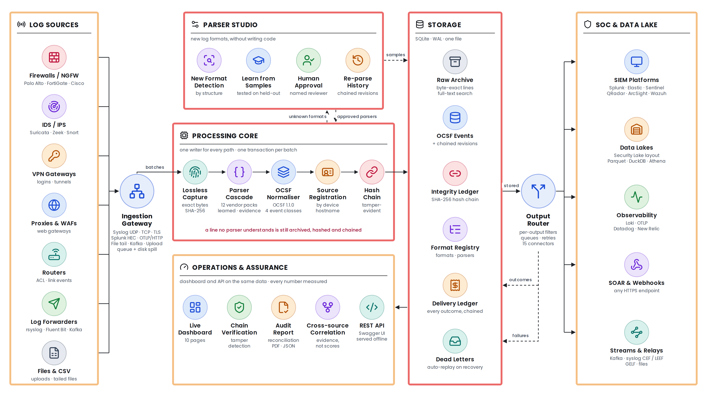
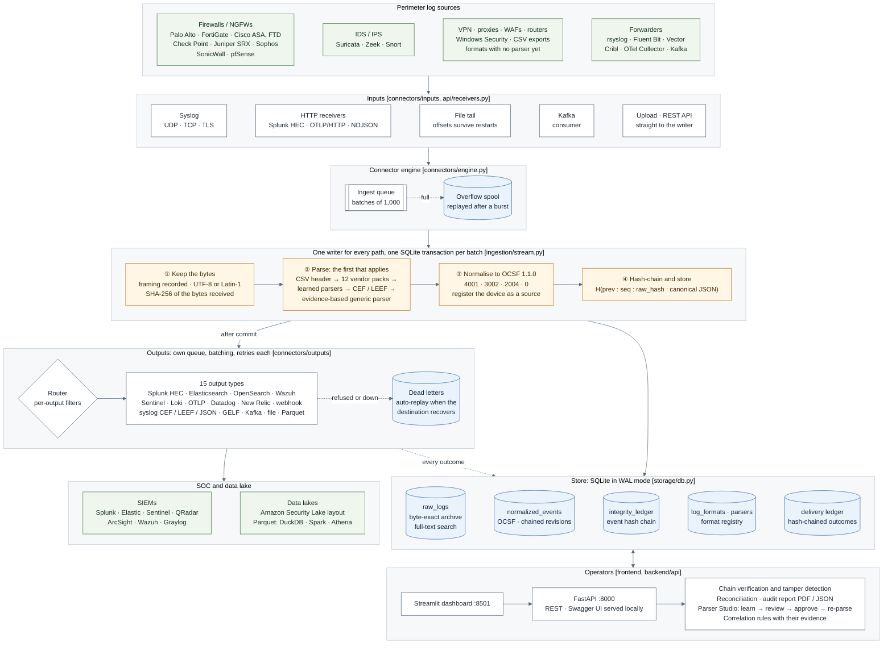

# TRACELOG architecture

TRACELOG sits between the devices on a network's perimeter and the tools a security operations
centre already runs. It receives logs from firewalls, IDS/IPS, VPN gateways, proxies and anything
else that can send them; keeps every line byte for byte; parses it; normalises it to OCSF 1.1.0;
links it into a hash chain; and forwards it to SIEMs and data lakes. It runs on one machine, needs
no internet access and no cloud service, and ships as two containers from one image.

This page is the two-page overview. [SYSTEM_DESIGN.md](SYSTEM_DESIGN.md) explains each component
and the decisions behind it; [END_TO_END_FLOW.md](END_TO_END_FLOW.md) follows one real log line
from the wire to the SIEM.

## The diagram

For slides: [`diagrams/architecture-poster.png`](diagrams/architecture-poster.png) (3840 × 2160,
icons and panels; [SVG](diagrams/architecture-poster.svg)). The diagram below is the same system
as a Mermaid flowchart that renders on GitHub.

Mermaid version rendered for print: [`diagrams/architecture.png`](diagrams/architecture.png),
[`diagrams/architecture.svg`](diagrams/architecture.svg). Source:
[`diagrams/architecture.mmd`](diagrams/architecture.mmd). The other diagrams in these documents are
rendered next to it: [end-to-end sequence](diagrams/end-to-end-sequence.png),
[parsing order](diagrams/parsing-order.png), [delivery states](diagrams/delivery-states.png),
[learning a parser](diagrams/learning-loop.png), [data model](diagrams/data-model.png).

## The components

| Component | What it does | Code |
|---|---|---|
| Inputs | Syslog over UDP, TCP (framing detected per connection) and TLS; Splunk HEC and OTLP/HTTP receivers so existing forwarders point at TRACELOG unchanged; file tail that survives rotation and restarts; Kafka consumer; uploads and a REST API | `backend/connectors/inputs/`, `backend/api/receivers.py`, `backend/api/ingestion.py` |
| Connector engine | Collects records into batches of up to 1,000 (or 0.5 s); spools to disk when a burst overflows the 200,000-record queue; after a restart, re-sends from the archive what an output was still owed | `backend/connectors/engine.py` |
| Writer | The one code path every line takes: keeps the bytes, parses, normalises, registers the device, hash-chains, and writes the batch in one SQLite transaction | `backend/services/ingestion/stream.py` |
| Parsing | CSV header if the file has one, then 12 vendor packs (each result checked for impossible values), parsers learned from samples and approved by a person, CEF/LEEF, and an evidence-based generic parser that leaves a field empty rather than guess | `backend/services/parsing/`, `backend/services/vendors/` |
| Normalisation | OCSF 1.1.0: Network Activity (4001), Authentication (3002), Detection Finding (2004), Base Event (0); strict export and validator; the device's own field names kept under `unmapped` | `backend/services/normalization/` |
| Integrity | Every event linked into a SHA-256 chain; verification finds edits, deletions, insertions and reordering; re-parses are appended as revisions, never overwrites | `backend/services/integrity/` |
| Outputs | 15 output types, each with its own thread, bounded queue, batching, retries with backoff, dead letters and automatic replay; every outcome recorded in a second hash chain, the delivery ledger | `backend/connectors/outputs/`, `backend/services/integrity/delivery_ledger.py` |
| Reconciliation and audit | Proves every stored line is accounted for at every output (owed = delivered + filtered + dead-lettered + in flight; unaccounted must be 0) and issues a PDF/JSON report with a fingerprint | `backend/services/integrity/reconcile.py`, `audit_pdf.py` |
| Parser Studio | Groups lines no parser knows into formats, learns a parser from their samples, tests it on held-out lines, requires a person to approve it, then re-parses history as chained revisions | `backend/services/parsing/formats.py`, `backend/services/parser_generation/` |
| Correlation | Links events from different devices by shared address and time, and shows the evidence for each link; no confidence scores | `backend/services/correlation/engine.py` |
| API and dashboard | FastAPI (REST, receivers, Swagger UI served from the image) and a Streamlit dashboard whose every number is read from the database | `backend/main.py`, `backend/api/`, `frontend/` |

## The rules it is built on

**Nothing received is lost or rewritten.** The bytes are kept exactly, the line terminator is
recorded, and the stored SHA-256 is of the bytes received. A line no parser understands is still
archived, hashed and chained. A re-parse appends a revision; the original stays in the chain.

**A missing field beats a wrong field.** A field is filled only when there is evidence for what it
means and its value is valid for it. Two addresses with nothing saying which is the source stay
unassigned. On 13 formats no pack knows: 85 fields correct, 18 left empty, 0 wrong.

**Every number is measured.** Dashboard figures come from the database or the running server;
performance figures come from `scripts/benchmark.py` on stated hardware.

## Deployment

`docker compose up` runs the API and the dashboard as two containers from one image, as an
unprivileged user, with a read-only root filesystem and all capabilities dropped; `.dockerignore`
keeps secrets, databases and version control out of the image. `python run_app.py` runs both
without Docker. Nothing reaches the internet: Swagger UI ships in the image and the dashboard's
telemetry is off ([AIRGAP.md](AIRGAP.md)). Outputs connect only to the destinations configured in
`config/tracelog.yaml`, with secrets supplied as environment variables.

## Measured

| | Result | How to rerun |
|---|---|---|
| Real third-party logs, 43 sources | 17,768 lines: 0 crashes, 0 invalid OCSF events, all archived and chained, chain verified | `python scripts/evaluate_public_samples.py` |
| Against Elastic's parsers | 13,633 address/port fields: 8,693 agree, 4,229 left empty, 711 differ — all but 3 explained by evidence in the data | same, report in [PUBLIC_SAMPLES.md](PUBLIC_SAMPLES.md) |
| Formats with no parser | 85 correct, 18 missed, 0 wrong; learned parsers then fill 2,200 of 2,200 fields on new lines | `python scripts/evaluate_unseen_formats.py --learned` |
| Throughput | 2,300–2,700 events/s per process on 2 vCPUs, archive, parse, OCSF and chain included; 4,866 with two shards | `python scripts/benchmark.py -n 20000 -b 1000 [-w 2]` |
| Tests | 287 passing | `pytest -q` |
