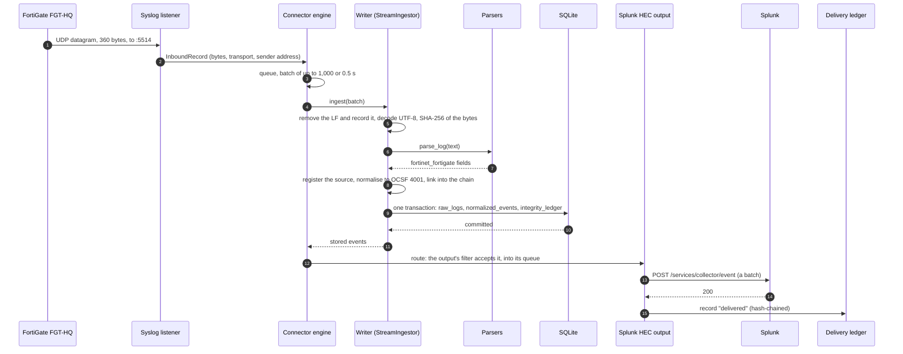
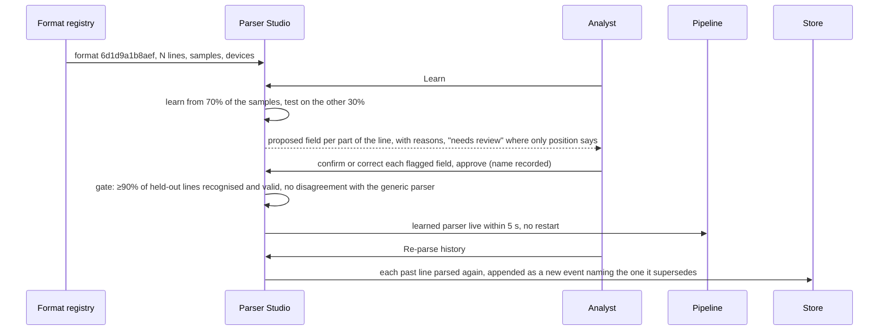

# End to end: one log line, from the firewall to the SIEM

This follows one real FortiGate traffic log through every stage of TRACELOG, with what each stage
produced. Nothing below was written by hand: `python scripts/trace_line.py` runs the same line
through the same code against a throwaway database and prints all of it, and
`tests/test_trace_line.py` fails if a stage stops producing what this page shows. Event ids and the
chain hash differ on every run (the event's id is part of what is hashed); the raw hash depends only
on the line. [ARCHITECTURE.md](ARCHITECTURE.md) has the component diagram;
[SYSTEM_DESIGN.md](SYSTEM_DESIGN.md) explains each component. The second half of this page covers
the other paths: a format nobody has a parser for, a destination that is down, a burst, a restart,
an upload, and a record someone edits.

## The whole trip



## 1. The device sends it

A FortiGate in India (`tz="+0530"`) denies an HTTPS connection and sends this over syslog UDP to
port 5514 — 360 bytes including the trailing newline:

```
<189>date=2026-09-21 time=15:50:00 devname="FGT-HQ" devid="FG100FTK19000001" logid="0000000013" type="traffic" subtype="forward" level="notice" vd="root" eventtime=1789986000000000000 tz="+0530" srcip=10.1.1.20 srcport=52211 srcintf="port2" dstip=198.51.100.25 dstport=443 dstintf="wan1" proto=6 action="deny" policyid=12 service="HTTPS" sentbyte=0 rcvdbyte=0
```

`<189>` is the syslog priority: facility 23 (local7), severity 5 (notice).

## 2. It is received and queued

`SyslogListener` (`backend/connectors/inputs/syslog.py`) wraps the datagram in an `InboundRecord`:
the raw bytes untouched, the transport (`syslog-udp`), the input's name and the sender's address
(`192.0.2.10`). It calls the engine's `submit`, which puts the record on the ingest queue. Had the
queue been full, the record would have gone to the spool on disk instead (see *A burst*, below).

The engine's worker (`backend/connectors/engine.py`) collects records until it has 1,000 or 0.5 s
have passed, and hands the batch to the writer.

## 3. The bytes are kept

The writer (`backend/services/ingestion/stream.py`) removes exactly one line terminator and records
which one it was, decodes the rest as UTF-8 (Latin-1 if it had not been valid UTF-8), and hashes the
bytes as received. The resulting `raw_logs` row, without the text:

```json
{
  "raw_hash": "3150bb1390e5e004b4dbc3b47d8bda43f39764c9d956889ff20f74b39c83595a",
  "format_detected": "fortinet_fortigate",
  "raw_encoding": "utf-8",
  "raw_framing": "LF",
  "raw_hash_of": "bytes",
  "transport": "syslog-udp",
  "peer_ip": "192.0.2.10",
  "received_at": "2026-09-24T10:24:15.814873+00:00"
}
```

`raw_text.encode(raw_encoding)` plus the recorded LF gives back the 360 bytes exactly, and anyone can
recompute the SHA-256 from them.

## 4. It is parsed

`parse_log` (`backend/services/parsing/dispatch.py`) tries the parsers in order. The line did not
come from a CSV file, so there is no header to read it by. The FortiGate pack recognises it
(`logid=` and `type=` with `devid=`, `devname=` or `eventtime=`) and reads it:

```json
{
  "vendor": "Fortinet", "product": "FortiGate",
  "_ocsf_class": 4001, "_activity_id": 5, "_activity_name": "Refuse",
  "src_ip": "10.1.1.20", "src_port": 52211, "dst_ip": "198.51.100.25", "dst_port": 443,
  "proto": "tcp", "action": "deny", "rule": "12", "bytes_in": 0, "bytes_out": 0,
  "timestamp": "2026-09-21T10:20:00+00:00", "original_time": "2026-09-21 15:50:00",
  "device_hostname": "FGT-HQ", "severity": "notice"
}
```

Three things to notice. The time comes from `eventtime`, which is UTC, so the device's local 15:50
at +05:30 becomes 10:20 UTC, and the local time the device wrote is kept as `original_time`.
Protocol 6 becomes `tcp`. And every value is checked before the pack's result is accepted — the
addresses are addresses, the ports are 0–65535 — which is how a firmware update that shifts a
column is caught instead of passed on.

## 5. The device is registered

The source resolver names the device from the hostname inside the log, not from the address it
came from, so devices behind a relay are told apart. A FortiGate the system had not seen before now
exists as a source, with no configuration:

```json
{"name": "Fortinet FortiGate (FGT-HQ)", "vendor": "Fortinet", "product": "FortiGate"}
```

## 6. It is normalised to OCSF

`OCSFNormalizer` (`backend/services/normalization/ocsf_normalizer.py`) builds the event, and
`to_ocsf` (`ocsf_export.py`) gives the strict form every output receives. Abridged — the full event
also carries `raw_data` and every field the device sent, under `unmapped.vendor_fields`, with the
device's own names:

```json
{
  "class_uid": 4001, "class_name": "Network Activity",
  "activity_id": 5, "activity_name": "Refuse", "type_uid": 400105,
  "severity_id": 2, "severity": "Low",
  "time": 1789986000000,
  "metadata": {
    "version": "1.1.0", "sequence": 1, "original_time": "2026-09-21 15:50:00",
    "log_name": "fortinet_fortigate",
    "product": {"vendor_name": "Fortinet", "name": "FortiGate"},
    "labels": ["tracelog.raw_id=…", "tracelog.raw_sha256=3150bb1390e5e004b4dbc3b47d8bda43f39764c9d956889ff20f74b39c83595a"]
  },
  "src_endpoint": {"ip": "10.1.1.20", "port": 52211},
  "dst_endpoint": {"ip": "198.51.100.25", "port": 443},
  "connection_info": {"protocol_name": "tcp", "protocol_num": 6, "direction_id": 0, "direction": "Unknown"},
  "traffic": {"bytes_in": 0, "bytes_out": 0},
  "action_id": 2, "action": "Denied", "disposition_id": 2, "disposition": "Blocked",
  "observables": [{"name": "src_endpoint.ip", "type": "IP Address", "value": "10.1.1.20"},
                  {"name": "dst_endpoint.ip", "type": "IP Address", "value": "198.51.100.25"}],
  "unmapped": {"device_hostname": "FGT-HQ", "rule": "12", "parser_pack": "fortinet_fortigate",
               "transport": "syslog-udp", "sender_ip": "192.0.2.10", "vendor_fields": {"…": "…"}}
}
```

The label `tracelog.raw_sha256` is how a SIEM user gets from this event back to the exact line: the
event API returns the raw line and whether its bytes still match that hash.

## 7. It is linked into the chain

The stored event is serialised once, as canonical JSON (sorted keys, compact separators), and that
string is what the chain hashes:

```
record_hash = SHA-256( prev_hash : sequence_num : raw_hash : canonical_json )
            = SHA-256( 0000…0000 : 1 : 3150bb13…595a : {"activity_id":5,…} )
```

This was the first event, so `prev_hash` is 64 zeros; the next event's `prev_hash` is this one's
`record_hash`. The `integrity_ledger` row holds all four inputs and the result, and the trace
recomputes the hash from the stored JSON and gets the same value.

## 8. The batch is committed

The whole batch — every `raw_logs` row, every `normalized_events` row, every chain link, the
source's counter and, for lines the generic parser handled, the format registry — is written in one
SQLite transaction. Either all of it is stored or none of it is. This line was read by a vendor pack,
so it is not counted as a new format.

## 9. It is routed

Only after the commit does the engine route the stored events. For each output, the router applies
its filter (OCSF classes, a minimum severity, sources); this event goes into the queue of every
output that accepts it, and the ones that exclude it are recorded as *filtered*, so it still counts
as accounted for.

## 10. It is delivered

Each output's thread takes a batch from its queue (200 events or 1 s by default) and sends it. The
Splunk HEC output sends:

```
POST https://splunk.example:8088/services/collector/event
Authorization: Splunk <HEC token>

{"time": 1789986000.0, "host": "FGT-HQ", "source": "tracelog", "sourcetype": "ocsf:tracelog",
 "event": { …the OCSF event above… }}
```

The token comes from an environment variable named in `config/tracelog.yaml`. The same event to an
ArcSight-style syslog output, as CEF:

```
CEF:0|TRACELOG|TRACELOG|1.0|400105|Network Activity: Refuse|3|rt=1789986000000 src=10.1.1.20 spt=52211 dst=198.51.100.25 dpt=443 proto=tcp act=Denied in=0 out=0 dvchost=FGT-HQ externalId=… cat=Network Activity cs1Label=ocsfClass cs1=Network Activity cs2Label=sourceVendor cs2=Fortinet cs3Label=rawSha256 cs3=3150bb1390e5e004b4dbc3b47d8bda43f39764c9d956889ff20f74b39c83595a cs4Label=parser cs4=fortinet_fortigate
```

and to QRadar as LEEF 2.0 (tab-separated):

```
LEEF:2.0|TRACELOG|TRACELOG|1.0|400105|x09|devTime=Sep 21 2026 10:20:00  devTimeFormat=MMM dd yyyy HH:mm:ss  cat=Network Activity  sev=3  src=10.1.1.20  srcPort=52211  dst=198.51.100.25  dstPort=443  proto=tcp  action=Denied  identHostName=FGT-HQ  ocsfClassUid=4001  ocsfTypeUid=400105  eventId=…  sourceVendor=Fortinet
```

Every format carries the raw line's hash or the event's id, so any SIEM record leads back to the
archive.

## 11. The outcome is recorded

When Splunk accepts the batch, the output writes the outcome to the delivery ledger, a second hash
chain:

```json
{
  "output": "splunk", "outcome": "delivered", "trigger": "live", "count": 1,
  "events_hash": "fefc4c81…",
  "prev_hash": "0000000000000000000000000000000000000000000000000000000000000000",
  "batch_hash": "93a3d56b…"
}
```

`events_hash` covers the batch's `sequence:uid` pairs; `batch_hash` chains this record to the
previous one. Reconciliation reads these records to show, for every output, that everything it was
owed is delivered, filtered, waiting in dead letters or in flight — and that nothing is unaccounted.

## 12. It can be checked, now or later

- **Chain verification** (Integrity page, `GET /api/integrity/verify`) recomputes every raw hash and
  every record hash and checks that sequence numbers and `prev_hash` links are unbroken.
- **The event API** (`GET /api/events/{id}`) returns the OCSF event, the raw line, its encoding and
  framing, and whether the stored bytes still match their hash.
- **The audit report** (`GET /api/audit/report.pdf` or `.json`) states the verdict for both chains
  and every output's reconciliation, with a fingerprint: the report's SHA-256 and both chain heads.

---

## Other paths

### A format nobody has a parser for

Take a line from a firewall with no pack:

```
<134>Sep 21 10:00:00 gw01 edgefw[311]: conn src_host=10.0.0.5 peer=203.0.113.9 dport=443 proto=tcp verdict=blocked
```

No pack claims it, no learned parser matches, it is not CEF or LEEF, so the evidence-based generic
parser reads it. It fills `src_ip` (the key `src_host` names a source address and the value is
one), `protocol` (`proto`), `action` (`verdict`, value `blocked` → denied), and time and severity
from the syslog header. It does **not** fill the destination: `peer` does not say which side it is.
And because there is then no destination address, it holds back `dport=443` too — a port with no
address is not half an endpoint. Each decision and its reason is in the event's
`unmapped.tracelog_parse`, marked `verified: false`. The same values in a line that says
`10.0.0.5:51514 -> 203.0.113.9:443` get both endpoints, because the arrow says which is which.

The line is archived, hashed and chained like any other. Its structure — `kv (' ') keys: src_host,
peer, dport, proto, verdict` — becomes a format in the registry, counted and sampled as more lines
arrive. In Parser Studio's *New log formats* tab:



New lines of that format are now read by the learned parser, `verified: true`, with the approver's
name. The old events are not changed: the revisions sit after them in the chain, and the dashboard
shows the current version.

### A destination is down

The Splunk output's `send` fails with a connection error. The output retries with exponential
backoff; when the retries run out, the batch goes to that output's dead-letter file with the reason,
the kind (`undeliverable`) and the attempts, and the delivery ledger records `dead_lettered`. Other
outputs are not affected: each has its own thread and queue. The output keeps checking the
destination, with backoff; once it accepts events again, the dead letters are re-sent automatically,
on the output's own thread, and the ledger records them as delivered with the trigger `auto`. An
event Splunk *refused* (a 4xx other than 408 or 429) is dead-lettered as `rejected` and re-sent only
on request, to Splunk or to another output. Reconciliation shows each stage: owed, delivered, waiting
in dead letters.

### A burst

Lines arrive faster than the writer can store them. When the ingest queue (200,000 records) is
full, the engine writes the overflow to `data/spool/overflow.ndjson` and feeds it back through the writer once
the queue has drained below half. If a batch's transaction ever fails, the whole batch is spooled
and retried the same way. `tests/test_engine_spool.py` holds both.

### A restart

TRACELOG stops with events still in an output's memory queue. On the next start, the engine asks
the delivery ledger which stored events each output has no outcome for and re-queues them from the
archive; the file-tail input resumes from its stored offsets. If the process stopped after a
destination accepted a batch but before the ledger recorded it, that batch is sent again: the
Elasticsearch family writes with the event's id as the document id, so it cannot duplicate; other
destinations may see those events twice, which is the safe side of the trade.

### An upload or an API call

A file uploaded on the Sources page, or lines posted to `/api/ingest/batch`, skip the queue and go
straight to the same writer, with the source already known. If the file's first line is a CSV
header, it is archived and marked as the header, and every row after it is read by column name.
The stored events are routed to the outputs exactly as streamed ones are.

### Someone edits a stored record

The Integrity page's tamper demonstration changes one stored event's disposition directly in the
database. Verification recomputes that record's hash, finds it no longer matches, and names the
first broken sequence number; `prev_hash` links after it still point at the original hash, so the
edit cannot be hidden by recomputing one record. The demonstration then restores the record. The
same checks catch a deleted record (a gap in the sequence) and a reordered one. The delivery ledger
is verified the same way.
