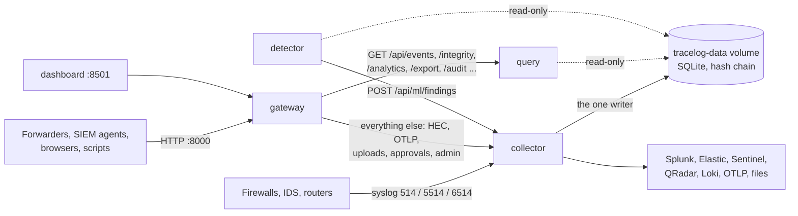

# TRACELOG as services

`docker compose up -d --build` runs TRACELOG as five services, each in its own container, all from
one image except the gateway. The same containers run on Linux, macOS and Windows (Docker
Desktop): the code always runs on Linux with Python 3.11, whatever the laptop has installed, which
is what makes a test result on one machine hold on another.



| Service | Runs | Can write the archive | Published ports |
|---|---|---|---|
| `gateway` | nginx: the one address for HTTP; sends each request to the service that answers it | no | 8000 |
| `collector` | syslog, HEC, OTLP, file and Kafka inputs; the writer that archives, parses, normalises and chains every line; the outputs; every request that changes data (uploads, parser approval and re-parse, dead-letter replay, the tamper demo) | **yes, the only one** | 514/udp, 514/tcp, 5514, 6514 |
| `query` | the read-only API: search, event detail, chain verification, ledger, analytics, exports, audit reports, RCA incidents, ML contract and features | no: its database connection is read-only | none (through the gateway) |
| `detector` | the ML baseline: scores each 5-minute window as it closes and sends its flags to the collector | no: read-only; its findings are written by the collector | none |
| `dashboard` | the Streamlit UI; talks to the gateway only and has no database | no | 8501 |

Two more are started only when asked for: `tests` (`docker compose run --rm --build tests`) and the live
sensor (`docker compose --profile sensor up -d`: a web server, Suricata watching it and a traffic
generator attacking it).

## Why it is split this way, and not further

The split follows the one rule the evidence depends on: **the hash chain has exactly one writer.**
Each batch reads the chain head and appends to it inside one SQLite transaction
(`backend/services/ingestion/stream.py`); two processes appending at once would each read the same
head and fork the chain. So every path that adds to the archive goes through the collector: device
logs, HTTP senders, uploads, re-parsing after a parser is approved, and the detector's findings,
which arrive over `POST /api/ml/findings` and are chained like any device's alert.

Everything that only reads is outside it. A chain verification over a million events, an audit
report, a CSV export or a feature table for a data scientist no longer shares a process with
ingestion, so it cannot slow ingestion down, and it runs on a connection SQLite opens read-only:
the service analysts talk to cannot alter the evidence, even with a bug in it. The query service
can be scaled (`docker compose up -d --scale query=3`) without touching the writer.

Splitting further, for example parsing in one service and hashing in another joined by a message
bus, would put a network hop and a second copy of each event between receiving a line and chaining
it, and the chain would then depend on the bus delivering in order and exactly once. The single
transaction per batch is what makes "every line archived, chained and accounted for" simple to
prove; it stays in one process.

## Running it

```bash
cp .env.example .env                      # optional: tokens for outputs, settings
docker compose up -d --build              # builds tracelog:latest, pulls nginx:alpine, starts the five services
docker compose ps                         # each should say "healthy" (about a minute on the first start)
```

- Dashboard: http://localhost:8501
- API and Swagger UI: http://localhost:8000/docs (through the gateway)
- Devices: syslog to the Docker host on 514 (UDP or TCP), 5514, or 6514 for TLS
- Forwarders: Splunk HEC at http://host:8000/services/collector, OTLP at http://host:8000/v1/logs

Every response from the gateway carries `X-TRACELOG-Service`, naming the service that answered, so
`curl -si http://localhost:8000/api/events | grep X-TRACELOG` shows a search being served by `query`.

Common operations:

```bash
docker compose logs -f collector                       # what the writer is doing
docker compose restart collector                       # after editing config/tracelog.yaml (mounted read-only)
docker compose run --rm detector python -m backend.services.ml.worker --once --hours 24
docker compose --profile sensor up -d                  # add the live Suricata sensor
docker compose down                                    # stop; the archive stays in the tracelog-data volume
docker compose down -v                                 # stop and delete the archive
```

`BASELINE_EVERY_MINUTES` in `.env` sets how often the detector scores (5 by default).

## Tests in a container

```bash
docker compose run --rm --build tests                                              # the whole suite
docker compose run --rm --build tests python -m pytest -q tests/test_unseen_formats.py
```

`--build` matters: the test image holds a copy of the code, so it is rebuilt after every change
(only the last layer, a few seconds). The test image (`docker/tests.Dockerfile`) uses the same base
image, Python and requirements as the services, runs as an unprivileged user on a read-only copy of the code, with no network. The result
is the same on a Linux laptop and a Windows one, because in both cases the tests run on Linux.

## Linux and Windows

Running natively (`python run_app.py`, `python -m pytest`) also works on both, and the code is kept
free of the differences that broke tests before (`tests/test_portability.py`):

- **Line endings.** `.gitattributes` checks every text file out with LF on every OS, so git for
  Windows no longer turns scripts, Suricata rules and pinned files into CRLF. Logs themselves may
  arrive with CRLF (files written on Windows, many Windows senders): every input keeps each line's
  terminator and the writer records it (`raw_framing`), so the event text is the same either way.
  A Windows clone made before `.gitattributes` existed is refreshed once with
  `git rm -r --cached . -q && git reset --hard`.
- **Encodings.** Every text file is read and written as UTF-8, never in the machine's locale
  (cp1252 on Windows); a test reads the source to keep it that way.
- **The database volume.** The archive is a named Docker volume, not a folder of the host: SQLite's
  locking and memory-mapped files are only reliable on the container's own file system, and a
  Windows folder mounted into a Linux container is not that.

## Health and failure

Each service has a health check (the image's `scripts/healthcheck.py`, or `wget` for the gateway),
and `depends_on` starts them in order: collector, then query and detector, then the gateway, then
the dashboard. What happens when one stops:

| Stopped | Effect |
|---|---|
| query | searches and reports fail; ingestion and forwarding carry on |
| detector | no new findings; nothing else changes. When it returns it scores the last two windows again and each flag is written once |
| gateway | the API and HTTP senders are cut off; syslog still reaches the collector directly |
| dashboard | nothing but the UI |
| collector | nothing is received or written. Senders with their own queue (Kafka, an OpenTelemetry Collector, Splunk forwarders) hold their data until it returns; UDP syslog sent meanwhile is lost, as with any receiver. On restart the outputs resume from the delivery ledger |

The dashboard never falls back to running the backend itself in the containers
(`DASHBOARD_DIRECT_MODE=false`): with no database of its own it says the API is not answering
instead of becoming a second writer.

## Settings that shape the services

| Setting | Where | Meaning |
|---|---|---|
| `SERVICE_ROLE` | collector, query | `all` (default: one process, as `python run_app.py` runs it), `collector` or `query` |
| `DB_READ_ONLY` | query, detector | open the database read-only |
| `COLLECTOR_URL`, `COLLECTOR_TOKEN` | detector | where findings are sent, and the HTTP input token if the collector requires one |
| `DASHBOARD_DIRECT_MODE` | dashboard | `false`: never run the backend in the dashboard's process |
| `BASELINE_EVERY_MINUTES` | detector | minutes between scoring runs (5) |

The routes the query service answers are `QUERY_ROUTERS` in `backend/main.py`, and the gateway's map
in `docker/gateway/nginx.conf` sends exactly those GET requests to it; `tests/test_services.py`
checks the two against each other, and checks every query route against a read-only database.
