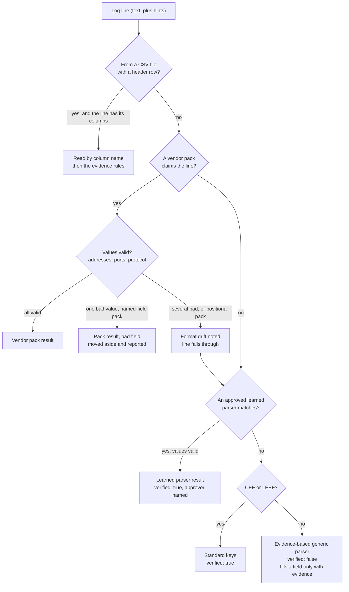
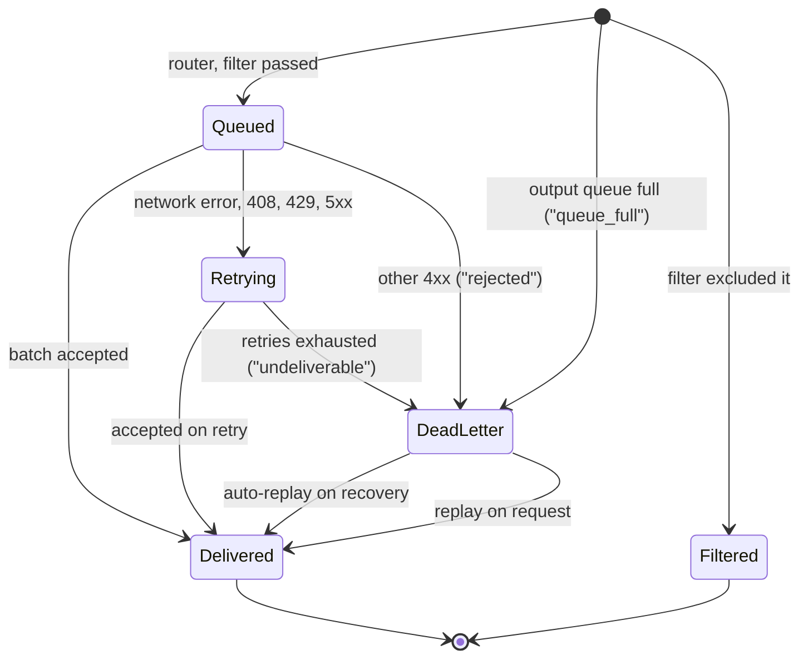
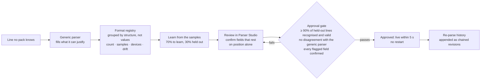
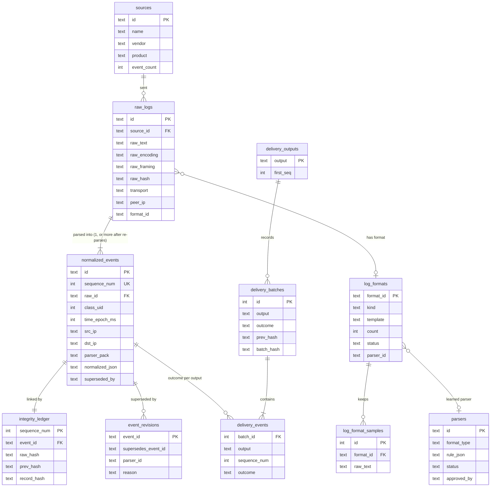

# TRACELOG system design

This document explains how TRACELOG is put together and why: each component, the data it keeps,
the decisions that shaped it and what they cost, how it behaves when something fails, and what it
does not do yet. [ARCHITECTURE.md](ARCHITECTURE.md) is the two-page overview with the diagram;
[END_TO_END_FLOW.md](END_TO_END_FLOW.md) follows one real log line through every step described
here. Paths are relative to the repository root.

## 1. What the system has to do

Problem statement 26156 asks for a framework that takes logs from perimeter devices in whatever
format they arrive and makes them usable by the tools an organisation already runs. Its expected
outcomes, and where TRACELOG meets each:

| PS item | What it asks | How TRACELOG does it |
|---|---|---|
| (a) | Preserve complete raw event data | Every line kept byte for byte, framing recorded, SHA-256 of the bytes received (§3.3) |
| (b) | Extract source-specific attributes | 12 vendor packs plus CEF/LEEF; the device's own field names kept under `unmapped.vendor_fields` (§3.4) |
| (c) | Normalise into a common taxonomy | OCSF 1.1.0, four classes, strict export and validator (§3.5) |
| (d) | Traceability between normalised and original events | Every event carries its raw line's id and hash and sits in a hash chain (§3.6) |
| (e) | Plug-and-play onboarding of new sources | Devices register themselves by hostname; unknown formats are detected and a parser is learned from their samples (§3.3, §3.8) |
| (f) | Unified visibility | One OCSF shape for every source; a dashboard whose numbers come from the database (§3.10) |
| (g) | SIEM and data lake integration | 15 output types with delivery guarantees, Amazon Security Lake layout for Parquet (§3.7) |
| (h) | AI/ML-ready analytics | A typed Parquet row per event that says where each value came from; per-entity 5-minute features; a baseline detector whose flags are written back as chained Detection Findings; evaluated on synthetic days with injected attacks (§3.11, [ML_DATA.md](ML_DATA.md)) |
| (i) | Reduced parser development effort | Evidence-based generic parser, then learning a parser from samples instead of writing one (§3.4, §3.8) |
| (j) | Deployable in an air-gapped network | No outbound connections except configured outputs; checked with the network cut off ([AIRGAP.md](AIRGAP.md)) |
| (k) | Packaged in a container | Two-stage image, non-root, one process per container, read-only compose (§8) |

## 2. Constraints that shaped the design

**Logs are evidence.** A SOC or an investigator may need to show that a line is what the device
sent and that nothing was removed or altered afterwards. That rules out normalising in place,
decoding with replacement characters, or dropping lines a parser does not understand.

**No network beyond the site.** An air-gapped deployment has no cloud API, no hosted model and no
CDN. Everything that decides what a field means has to run locally and be explainable, which is
also why there is no LLM in the parsing path.

**Unknown formats are normal.** A perimeter has devices nobody wrote a parser for, and firmware
updates change formats that had one. The system has to handle a line it does not recognise without
losing it and without inventing fields for it.

**Wrong data is worse than missing data.** A SIEM trusts what it is given. A source address that is
really the destination sends an analyst after the wrong host. Every parser here is built so that
when the evidence is not there, the field stays empty.

**One commodity machine first.** The deployment target is a single server or VM that a SOC team can
run without a database administrator or a cluster. Scale-out is designed for (§6) but not built.

## 3. Components

### 3.1 Inputs

`backend/connectors/inputs/syslog.py` listens for syslog over UDP (RFC 5426), TCP (RFC 6587) and TLS
(RFC 5425). TCP framing is detected per connection: octet counting (`<len> <msg>`, used by rsyslog
and syslog-ng) or newline/NUL delimited (used by most network devices). Syslog listens on 5514
rather than 514, so nothing runs as root; compose publishes the host's 514 onto it.

`backend/api/receivers.py` mounts HTTP receivers at the API's root so existing forwarders can point
at TRACELOG unchanged: Splunk HEC (`/services/collector/event`, `/raw`, `/health`, gzip accepted),
OpenTelemetry OTLP/HTTP logs in JSON (`/v1/logs`) and plain lines or NDJSON
(`/api/ingest/stream`). When tokens are configured they are enforced; an empty token list is for a
lab only.

`backend/connectors/inputs/pollers.py` has a file tail that follows glob patterns, survives rotation
and truncation, and stores its offsets so a restart neither re-reads nor skips a line; and a Kafka
consumer. Uploads and the REST endpoints (`backend/api/ingestion.py`) go straight to the writer with
the source already known.

Every input produces the same thing: an `InboundRecord` with the raw bytes, the transport, the
input's name, the sender's address and hints (a hostname a forwarder attached, a CSV header).

### 3.2 Connector engine

`backend/connectors/engine.py` owns the inputs, one ingest worker and the outputs. Inputs submit
records to a bounded queue (200,000 records). The worker takes up to 1,000 records, or whatever
arrived within 0.5 s, and hands the batch to the writer. When a burst fills the queue, the overflow
is written to `data/spool/overflow.ndjson` and fed back when the queue has drained below half; a
batch whose transaction fails is spooled the same way. So a burst costs latency, not lines.

After the writer commits a batch, the engine routes the stored events to the outputs. On startup it
also asks the delivery ledger which stored events each output never finished with (queued in memory
when the process stopped, or stored while outputs were not running) and re-queues them from the
archive.

### 3.3 The writer

`backend/services/ingestion/stream.py` is the only code that writes log data. Streams, uploads and
the API all use it, so they all get the same guarantees. For each record:

1. **Keep the bytes.** Exactly one line terminator is removed and recorded (`raw_framing`: LF, CRLF
   or none). The body is decoded as UTF-8 when valid and otherwise as Latin-1, which maps every byte
   to one character, and the encoding is stored, so `raw_text.encode(raw_encoding)` gives back the
   bytes received. `raw_hash` is SHA-256 of those bytes. The rule and its one exception are in
   [adr/0002-raw-preservation.md](adr/0002-raw-preservation.md).
2. **Parse** (§3.4). A parser that raises does not lose the line: it becomes a Base Event carrying
   the error.
3. **Register the source.** The device is identified by the hostname inside the log, so devices
   behind a relay (rsyslog, Fluent Bit, Cribl, an OTel Collector) are told apart; the sender's
   address is the fallback. A new device appears as a source without configuration. Uploads and API
   calls name their source instead (`FixedSource`).
4. **Normalise** to OCSF (§3.5).
5. **Chain** (§3.6).

The whole batch is then written in one transaction: three `executemany` statements (archive,
events, chain links), the per-source counters and the format registry. The chain head is read once
per batch and carried in memory, under a lock, so events are linked in order without a query per
line. [PERFORMANCE.md](PERFORMANCE.md) records what each of these choices is worth.

### 3.4 Parsing

`backend/services/parsing/dispatch.py` tries, in order, and the first that applies wins:



**Vendor packs** (`backend/services/vendors/`): Palo Alto PAN-OS, Fortinet FortiGate, Cisco ASA and
FTD, Check Point Log Exporter, Juniper SRX, Sophos Firewall, SonicWall, pfSense filterlog, Suricata
EVE, Zeek JSON, Snort (fast, full, CSV and JSON alerts) and Windows Security XML events. Each pack's
output is checked: an "address" that is not an IP or a port outside 0–65535 means the format has
drifted — a firmware update inserted a column, typically. One odd value from a pack that reads named
fields is set aside and reported; anything more, or any odd value from a pack that reads by
position, sends the line on down the chain with the drift recorded, rather than passing misaligned
fields on.

One pack keeps state across lines. Cisco ASA writes the outside end of a connection first in both
its Built and its Teardown message, and only the Built message says who opened it; a Teardown
takes its direction from its own Built message, matched by device, connection id and both ends, and
leaves source and destination empty when that message was not seen. Real sample logs showed that
reading the first address as the source made every outbound DNS lookup's teardown come *from* port
53; Elastic's own pipeline does the same.

**The generic parser** (`backend/services/parsing/inference.py`) reads structure first — JSON,
XML, CEF, LEEF, key=value with any delimiter, delimited, or free text — and then decides what each
value means from evidence: a key that names it (`srcIP`, `ip_client`, `destination-ip`, split into
words against a vocabulary), a value that is valid for it, or the line's own wording (`a:p -> b:q`,
`from a to b`). Each kind of evidence has a fixed weight and a field is filled at 0.7 or above; the
dashboard calls these *evidence scores* because they are rule weights, not measured probabilities.
Two addresses with nothing saying which is the source are listed as unassigned, not guessed. Every
event it produces carries `unmapped.tracelog_parse`: `verified: false`, each field's value and
reason, the fields it did not fill and why. Details: [PARSING.md](PARSING.md).

XML is flattened into dotted paths (`xmlpairs.py`) and refused if it has a DOCTYPE or entity
declarations or exceeds 64 KB. A CSV file whose first line is a header is read by column name
(`csvheader.py`), ahead of the packs, because the file's own header says what its columns are.

### 3.5 Normalisation

`backend/services/normalization/ocsf_normalizer.py` turns parsed fields into an OCSF event of one
of four classes: Network Activity (4001), Authentication (3002), Detection Finding (2004), or Base
Event (0) when nothing more is known. A pack says which class and activity it produced; the generic
parser's class follows from the fields it could justify. Everything the device sent that has no OCSF
place is kept under `unmapped.vendor_fields` with the device's own names.

`ocsf_export.py` produces the strict form that outputs send, with `metadata.version`, the product,
the event's sequence number, and labels carrying the raw line's id and SHA-256, and `validate()`
checks each class's required attributes. The version is a setting, 1.1.0 by default, with 1.2.0 and
1.3.0 also verified; why 1.1.0 is in [adr/0001-ocsf-version.md](adr/0001-ocsf-version.md). In short,
Amazon Security Lake accepts OCSF up to 1.3 for custom sources, which makes it the strictest
consumer.

### 3.6 Integrity

`backend/services/integrity/ledger.py` links every event into a chain:

```
record_hash = SHA-256( prev_hash : sequence_num : raw_hash : canonical_json )
```

`canonical_json` is the stored event with sorted keys and compact separators. The first record's
`prev_hash` is 64 zeros. Verification recomputes everything: each raw line's hash against its bytes,
each sequence number against its predecessor (a deletion or reordering leaves a gap), each
`prev_hash` against the previous record, and each `record_hash` against a fresh computation (an edit
to any field changes it). The Integrity page includes a controlled tamper demonstration that edits
one stored event, shows the verifier catching it, and restores it.

Events are never updated in place. When an approved parser re-reads old lines, each new parse is
appended as a new event for the same raw line, with `unmapped.tracelog_revision` naming the event it
supersedes; `event_revisions` records the link and `superseded_by` marks the old one as not current.
The original stays in the chain.

The preimage format is frozen: changing it would invalidate every existing chain, so
`tests/test_throughput.py` pins it. What the chain does not do yet is prove anything to someone who
controls the database: nothing is signed or anchored outside it (§9).

### 3.7 Delivery

Each output (`backend/connectors/outputs/`) runs in its own thread with a bounded queue, takes
batches (200 events or 1 s by default), sends them, and retries with exponential backoff. A network
error, a timeout, 408, 429 or a 5xx is retried; any other 4xx means the destination refused the
events, and retrying unchanged would not help. The router
applies each output's filter (by class, severity, source) and records what it excluded.



Dead letters are files per output (`data/dead_letter/`) recording the event, why it failed, the kind
of failure and the attempts. Undeliverable and queue-full entries are re-sent automatically once the
destination accepts events again, checked with backoff while it is still down; rejected ones only
on request, because sending them again unchanged would be refused again. Replays run on the output's
own thread, between live batches, so a destination is never written to from two threads; a replay
interrupted by a crash resumes without re-sending batches that were delivered. The Elasticsearch
family writes with the event's id as `_id`, so a replay cannot create duplicates.

Every outcome — delivered, dead-lettered, filtered, delivered through another output — is written
to the delivery ledger (`delivery_ledger.py`), a second hash chain:

```
batch_hash  = SHA-256( prev_hash : output : outcome : trigger : at : count : events_hash )
events_hash = SHA-256 of the batch's "sequence:uid" lines, in sequence order
```

Reconciliation (`reconcile.py`) uses it to prove, per output, that
*owed = delivered + delivered through another output + filtered + waiting in dead letters + in
flight*, with *unaccounted* required to be 0, where *owed* means every event stored since that output
was first configured. The audit report (PDF and JSON) carries the verdict, both chains' checks, the
per-output reconciliation, dead letters and a timeline, and a fingerprint: its own SHA-256 and the
heads of both chains.

Fifteen output types: Splunk HEC; Elasticsearch, OpenSearch and the Wazuh indexer (bulk API);
Microsoft Sentinel (Logs Ingestion API); Grafana Loki; OTLP/HTTP; Datadog and New Relic (HTTPS
intake); a generic webhook; syslog in CEF (ArcSight and most SIEMs), LEEF 2.0 (QRadar) or JSON;
GELF (Graylog); Kafka; NDJSON files; and Parquet, with a layout Amazon Security Lake accepts for
custom sources (`region=/accountId=/eventDay=` partitions, one OCSF class per file, zstd).
[CONNECTORS.md](CONNECTORS.md) has each one's settings.

### 3.8 New formats and learned parsers



The format registry (`backend/services/parsing/formats.py`) fingerprints every line the generic
parser handles by its structure — kind, delimiter, key names, or the message's words with values
masked — so lines of one format share an id whatever addresses and times they carry. It counts them
in the same transaction that stores them, keeps samples and which devices send them, and flags a
known device whose format drifted.

The learner (`backend/services/parser_generation/learner.py`) works out, from many lines of one
format, which parts vary, what each varying part always is (an address, a port, a protocol, an
action word, a time), the words around it, and how its values are distributed (a destination port
has a few well-known values, a source port many high ones). A learned parser is data — which part of
the line holds which field — not code. It cannot be approved until it passes the gate above and a
named person has confirmed every field that rests on position alone. On three generated formats it
filled 2,200 of 2,200 fields on lines it had not seen (`scripts/evaluate_unseen_formats.py --learned`).

Parser Studio also has an older "generate and test" tab that builds regex and key-value rules from
pasted samples. Its candidates are stored in the parser registry, but the pipeline applies only
learned parsers approved through the flow above.

### 3.9 Correlation

`backend/services/correlation/engine.py` looks at the recent events around an address and reports
two things kept apart: observed facts (stored events, each with its raw line's hash) and
relationships (rules that matched, each with the evidence that made it match). Three rules: a
successful login followed within 30 minutes by activity from a different device sharing one of its
addresses; an allowed connection followed within 10 minutes by a detection finding on the same
address pair from a different device; and one source reaching at least 10 destination ports within
60 seconds. There are no confidence scores. The rationale of each relationship says what its
evidence does not prove.

### 3.10 API and dashboard

The API (`backend/main.py`, `backend/api/`) serves REST endpoints for sources, ingestion, events,
integrity, the audit, connectors, formats and parsers, correlation, analytics, ML features and the
baseline detector, export, the HTTP
receivers, and Swagger UI from files in the image. The dashboard (`frontend/`, Streamlit) has
pages for the overview, sources and onboarding, Parser Studio, the processing pipeline, the log
explorer, integrity and lineage, correlation, the OCSF schema, connectors (outputs, dead letters,
reconciliation and audit) and settings. It calls the API and falls back to calling the same
functions in-process when the API is not reachable. Every figure it shows is read from the database
or the running server; `tests/test_dashboard_truth.py` checks that.

### 3.11 Analytics and ML

`backend/services/ml/` has three parts, described in full in [ML_DATA.md](ML_DATA.md).
`rows.py` is the data contract: one flat, typed row per OCSF event, which the Parquet output writes
and the features are built from. A null means the device did not say; every row carries the parser
that read it, whether its fields were verified or inferred, whether its time is the device's, and
its chain position and raw hash. `features.py` computes per source address, user and device, for
each 5-minute window, counts such as denied connections, distinct destination ports, bytes sent and
failed logins, each from its own window and earlier ones only, so a row is the same computed live
or from the archive. `baseline.py` compares each window with the entity's own last 24 hours, or its
peers' when it has too little history, flags values at least 3.5 robust standard deviations and a
fixed minimum above the median, and writes each flag as one JSON line through the writer. A small
pack reads that line into a Detection Finding, so a flag is archived, chained, delivered to the
outputs and lists the events it came from, and the same flag is never written twice. There is no
probability anywhere in it. On synthetic days ([ML_EVALUATION.md](ML_EVALUATION.md)) it caught the six
attacks a per-window baseline can see, missed the two built to stay under it, and flagged one benign
nightly backup a day.

## 4. Data model

SQLite in WAL mode (`backend/services/storage/db.py`), one file under `data/`, schema created and
migrated on startup.



`normalized_events` repeats a few fields of the OCSF JSON as columns (addresses, ports, class,
severity, user, parser) so the explorer and dashboard filter by index instead of parsing JSON; the
JSON is the record of truth and the one the chain hashes. A full-text index over `raw_logs`
(SQLite FTS5, an index over the table rather than a copy) makes "every line mentioning this
address" a lookup. It costs about a quarter of the ingest rate, so `SEARCH_INDEX` turns it off for
deployments that only forward. `incidents` (correlation results) and `audit_tamper_backup` (the
tamper demonstration's undo record) complete the schema.

## 5. Key decisions and their trade-offs

| Decision | Why | What it costs |
|---|---|---|
| SQLite, one file, WAL | Runs anywhere with no server to operate; one transaction covers archive, events and chain, so they can never disagree | One writer at a time; the per-process rate is bounded by it (§6) |
| One writer for every ingest path | Streams, uploads and the API get identical lossless handling and hashing; a fix lands everywhere | Uploads and API calls share the writer's lock with streams |
| Hash chain, not a blockchain | Tamper evidence without consensus or other nodes; verifiable with a script | Someone who can rewrite the database can rebuild a consistent chain until checkpoints are signed and sent outside (§9) |
| OCSF 1.1.0 | Accepted by the strictest consumer (Security Lake ≤ 1.3); SIEMs map fields themselves | Newer OCSF attributes are not used |
| Empty rather than wrong | A SIEM trusts its input; a wrong address costs an analyst hours | More fields are left empty on formats no pack knows, until a parser is learned |
| Learned parsers are data and need a person's approval | Nothing changes what the pipeline writes without someone accountable; no code to review or deploy | A new format is parsed generically until someone approves its parser |
| No LLM in the pipeline | Air-gapped sites, reproducible output, explanations a person can check | Formats have to be learned from their own samples |
| Latin-1 fallback for non-UTF-8 bytes | Maps every byte, so any line is stored and rebuildable | The stored text of such a line can look odd; the bytes are exact |
| Streamlit dashboard | One language, fast to build, reads the same code the API runs | Less control over the interface than a separate web front end |

## 6. Performance and scale

Measured with `scripts/benchmark.py`, which replays a mixed corpus (80 % lines the packs know, 15 %
formats with none, 5 % lines nothing parses) through the whole writer — archive, parse, OCSF,
chain, commit — on a 2-vCPU machine:

| | Result |
|---|---|
| One process, 20,000 events, batches of 1,000 | 2,300–2,700 events/s across runs |
| Two ingest shards (`-w 2`), each with its own chain | 4,866 events/s |
| Newest 50 events, search the archive for an address | 9.5 ms, 3.2 ms at 100,000 events |
| Verify the whole chain | 3.8 s at 100,000 events |

One billion events a day is 11,574 events/s sustained. The per-process ceiling is the single
SQLite writer. The design scales out by running more writers, each with its own database and chain,
fed from partitions of the input — the benchmark's `-w N` mode measures exactly that — and Kafka is
the natural feed, since several instances in one consumer group divide its partitions. What exists
today is the benchmark's sharding, not a sharded runtime; the Kafka input also commits offsets once
records reach the in-memory queue rather than once they are stored, which has to change before it
can be the feed (§9). The optimisations already made to the hot path, and the next ones with their
measured cost, are in [PERFORMANCE.md](PERFORMANCE.md).

## 7. When things fail

| Failure | What happens | Where it is tested |
|---|---|---|
| A line no parser understands | Archived, hashed, chained as a Base Event; its format appears in Parser Studio | `test_unseen_formats.py`, `test_format_learning.py` |
| A parser raises | The line is stored as a Base Event carrying the error | `test_lossless.py` |
| Bytes that are not valid UTF-8 | Stored as Latin-1 with the encoding recorded; the hash is of the bytes received | `test_lossless.py` |
| A vendor changes its format | Impossible values are caught; the line is parsed generically and the drift recorded | `test_unseen_formats.py` |
| A burst bigger than the queue | Overflow spooled to disk and replayed | `test_engine_spool.py` |
| A batch's transaction fails | The batch is spooled and retried; nothing is half-written | `test_engine_spool.py` |
| A destination is down | Retries with backoff, then dead letters; automatic replay when it recovers | `test_dead_letters.py` |
| A destination refuses events | Dead-lettered as rejected; re-sent only on request, to it or another output | `test_dead_letters.py` |
| TRACELOG restarts | Owed events re-queued from the archive using the delivery ledger; file-tail offsets resume | `test_audit.py`, `test_connectors.py` |
| A stored record is edited, deleted or reordered | Chain verification names the first broken sequence number | `test_integrity_chain.py` |
| Delivery records are edited | Delivery ledger verification fails; reconciliation shows it | `test_audit.py` |

## 8. Security

In place: secrets come from the environment (`${VAR}` in `config/tracelog.yaml`), never from files
in the repository or the image; `.dockerignore` keeps `.env`, databases and version control out of
the image; the container runs as an unprivileged user with the code read-only, a read-only root
filesystem, no capabilities and no privilege escalation; HEC and HTTP receivers enforce tokens when
configured; XML with DOCTYPE or entity declarations is not parsed; nothing is fetched from the
internet at run time.

Not yet in place: authentication on the REST API and the dashboard; a CORS policy narrower than any
origin; Streamlit's XSRF protection is off; the tamper-demonstration endpoint is open and belongs
behind a demo switch; the syslog receivers accept any sender. These are listed in the project's
audit and are the next security work.

## 9. Limitations

- **The chain is not anchored.** Signing a checkpoint (sequence number and chain head) every N events
  and sending it to the outputs would make each SIEM an outside witness. Not built.
- **Kafka offsets are committed before the batch is stored.** A crash between the two loses what was
  in memory. The fix is to commit after the writer's transaction.
- **No sharded runtime.** Only the benchmark runs several writers.
- **The baseline sees one 5-minute window at a time, with 24 hours of memory.** Attacks spread thin
  over hours, daily jobs and a device going quiet are outside what it can flag, and it has only been
  evaluated on synthetic traffic ([ML_DATA.md](ML_DATA.md), §6).
- **Four OCSF classes.** HTTP, DNS and DHCP activity (4002, 4003, 4004) land as Base or Network
  events; services that run on a firewall host have no packs yet.
- **Coverage gaps seen on real logs.** Cisco FTD connection events (430002/430003), WatchGuard,
  Cisco IOS, ModSecurity and Squid come out with most fields empty ([PUBLIC_SAMPLES.md](PUBLIC_SAMPLES.md)).
- **No retention setting and no NetFlow/IPFIX receiver.**
- **Three correlation rules.** They report evidence, not probabilities; more rules are more coverage,
  not more certainty.
- **A CSV header is known only where a file's first line is seen.** Re-parsing stored lines later
  reads them without it.
